# Machine Learning Exercise Assistance

## Exercise Session 1

### 1.1 Generality

### 1.2 Version spaces

In the field of artificial intelligence (AI), a version space is a representation of the set of possible hypotheses or theories that are consistent with a given set of data. It is a way of representing uncertainty about the underlying structure or relationships in the data, and can be used to make inferences or predictions based on new data.

In general $h_i>_gh_j \iff P_j \subset P_i \and N_i \subset N_j $

Where $h_i$ is hypotheses $i$ and $h_j$ is hypotheses $j$, $P$ are the positive instances of that hypotheses and $N$ are the negative instances of that hypotheses. In words this mean that hypothese $i$ is more general than $h_j$ if all the positive instances of $j$ are a subset of $i$ and all the negative instances of $i$ are subset of $j$.

Now an example to demonstrate when an instance will be positive, negative or we don't know

Given: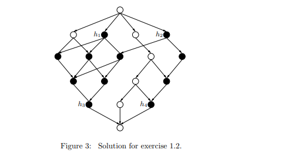

To classify a positive instance we start at the most general side and work our way to the most specialized side.

An instance will be positive when $h_3$ and $h_4$ classify it as positive because each hypotheses in the VS is more general than $h_3$ and $h_4$ as you can see in the image so that means that every hypotheses has classified the instance as positive. So the VC classifies them as positive.

To classify a negative instance we start the most specialized side and work our way to the most general side.

In instance will be negative when $h_1$ and $h_2$ classify it as negative because each hypothese in the VS is more specialized than $h_1$ and $h_2$ as you can see in the image so that means that every hypotheses has classified the instance as negative. So the VC classifies them as negative.

All remaining instance are classified as "Don't know".s The remaining instances are classified as negative by $h_3$ or $h_4$, and since this $h_i$ might in principle be the correct one (since it is in VS), each such instance might be negative. Similarly, these instances are classified as positive by $h_1$ or $h_2$, so each such instance might also be positive.

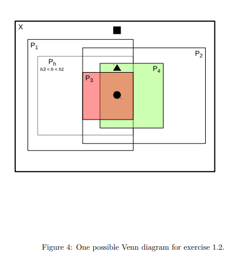

In Figure 4, instances in the region marked by the black square are classified as negative

 					Instances in the region marked by the black circle are classified as positive.

​					 instances in the region marked by the black triangle are classified as positive by h1, h, 						h2, and h4, but as negative by h3.

### 1.3 Decision trees

A decision tree is a type of machine learning algorithm that is used to make predictions or decisions based on a set of data. It works by constructing a tree-like model of decisions and their possible consequences, including chance events and costs.

The tree consists of a set of branches and nodes, with the branches representing different decisions or choices, and the nodes representing the resulting outcomes or consequences. The root node of the tree represents the initial data or state, and each subsequent node represents the outcome of a decision made based on the data at that point in the tree. The goal of the decision tree is to determine the optimal sequence of decisions that will lead to the most desirable outcome.

### 1.6 Entropy and information gain

Entropy is the measure of the amount of uncertainty or randomness in a set of data. It is often used to evaluate the quality of a split in a decision tree.

$Entropy ~ E(D) = - ∑^c_{i=1} (p_i(x) * log_2(p_i(x)))$

$Information~Gain ~ G(D,a) = E(D) - \sum_{v \in values(a)} \frac{|D_v|}{|D|}*E(D_v)$

Where $p(x)$ is the probability of a data point belonging to a particular class.

For example, if a set of data is perfectly classified, with all data points belonging to one class, the entropy will be zero, because there is no uncertainty or randomness in the data. On the other hand, if the data is evenly split between two classes, the entropy will be at a maximum, because there is an equal probability of a data point belonging to either class.

In machine learning, entropy is often used in conjunction with information gain, which is a measure of how much a split reduces uncertainty (or entropy) in the data. The goal is to find the split that maximizes information gain, or minimizes entropy. This can be used to build more accurate and robust machine learning models.

### 1.7 ID3 algorithm

The ID3 algorithm or iterative dichotomiser 3 is a decision tree learning algorithm. It is used to build decision tree classifiers from data. It works by trying to find the split that maximize the information gain and then splitting the data on that attribute.

The algorithm is a simple and effective way to build a decision tree classifier but it is limited. It can only handle categorical attributes, it is also prone to overfitting.

### 1.8 Regression Tree

A regression tree is a type of decision tree that is used for predicting a continuous target variable.

## Exercise Session 2

### 2.1 Rule Induction

The LearnOneRule algorithm is machine learning method that is used to learn a single rule from a given dataset. The algorithm works by selecting a candidate literal(variable) from the possible candidate literals and splitting the data based on that literal. It does this for every literal and then chooses the one that leads to the greatest information gain. This process is repeated until a stopping condition is reached. 

The top down variant of the algorithm start with a maximally general rule that has high coverage but low accuracy. We then start adding literals one by one to gradually increase the accuracy. 

The bottom-up approach the algorithm starts with maximally specific rule that has high accuracy but low coverage and then removes literals on by one to gradually increase the coverage. This algorithm is prone to overfitting.

For the following table a candidate literal would be temp=mild or hum = norm.

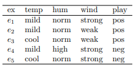

There is a variant called example-driven 

### 2.3 Voronoi Maps

A voronoi map is construct that divides a plane into regions based on the distance of a set of points (seed points) . Each region is defined by the nearest point and consists of all the points that are closest to that seed point. Below an example.

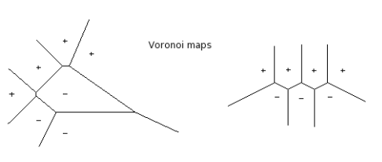

A decision surface is similar to a Voronoi map but instead of working with singular seed points it sets a boundary or hyperplane to separate classes of points, in the following example it separates positive and negative points in space.

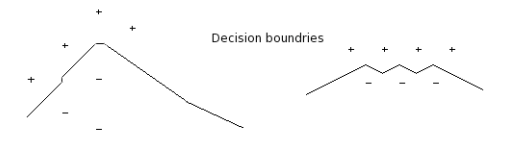

### 2.4 Clustering

Clustering is an example of unsupervised learning because we are just grouping similar data together and not trying to make predictions about new data. We have 2 kinds of clustering

1. **Flat or parititional clustering** returns a partition of data, each element belongs to exactly one group 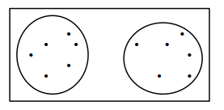

2. **Hierarchical clustering** returns a hierarchy of clusters (**taxonomy**). So a point belongs to a large group but also to a subgroup of that larger group.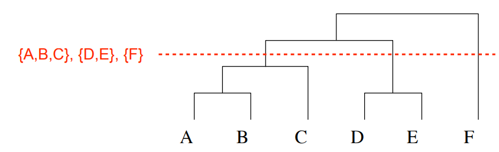

   We can still turn a taxonomy into flat clustering by cutting along one level as you can see above.

Within these 2 kinds of clustering we also have different approaches to clustering.

- **Extensional clustering** is a type of clustering that we all know where we base the clustering on actual attributes of the data points. For example you are given the age, income and spending habits and now want to cluster the customers based on the values of their age and income. K-means could be used for this. Not to be confused with kNN which is supervised learning.
- **Conceptual learning** is a type of clustering that is based on the underlying concept or structure of the data. For example you are given the names of the products that customers by in a store. You want to use this data to cluster the customers into groups based on their purchasing habits. Example: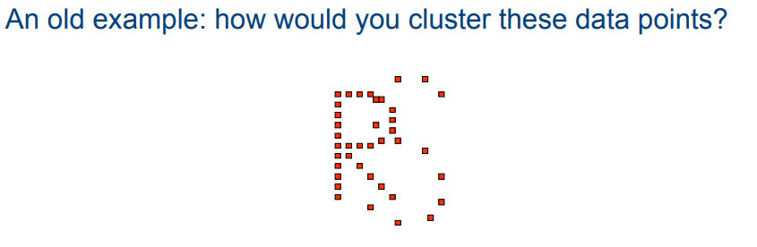

**K-means clustering** is an example of flat extensional clustering. Given k, attempts to form k-clusters such that the sum of mean squared distances within the clusters is minimized. It works as follows:

Given dataset X, k numbers clusters

1. Choose k random seeds (points in X)
2. Assign each instance to the cluster of its closest seed
3. redefine the seeds to the center of the current cluster
4. Repeat this until nothing changes anymore

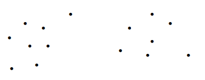

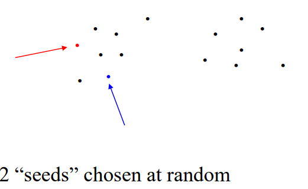

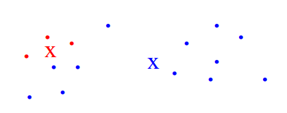

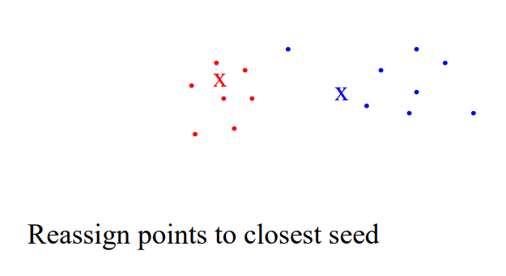

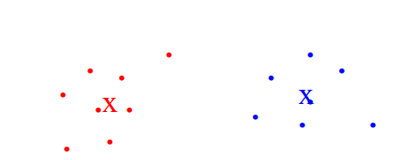

**Hierarchical extensional clustering** has another subdivision methods

Top-down (divisive) methods

- Start with 1 cluster
- divide into subsets
- subdivide subets

Bottom-up (agglomerative) methods

- Start with singleton clusters
- join closest clusters together
- repeat until 1 cluster
- Example
  - **Single Linkage**: distance between clusters = distance between closest points
  - **Complete** **linkage**: cluster distance = distance between furthest points

#### **Similarity measure**

Clustering relies strongly on defining an appropriate similarity measure. This can be hard because we can recognize similarity when we see it but we cannot always define it in terms of features. For example: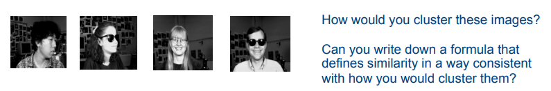

**Solution?** Semi-supervised learning

Computers learn the similarity from examples of pairs of instance that should be in the same/different clusters.

## Exercise Session 3

### 3.1 Confidence Intervals

**1.**

A confidence interval is a range of values that is likely to contain the true value of a population parameter, based on a sample estimate.

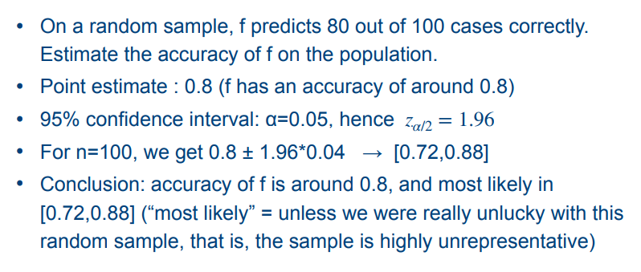

We get 0.04 by (0.8 * (1-0.8))/100

This only works for independent sets

**2.**

In this exercise we calculate σ~p̂~ using the following formula σ~p̂~ = sqrt(p̂(1 - p̂) / n)

σ~p̂~ = sqrt(15.4%(1 - 15.4%) / 65)

= sqrt(15.4% * 84.6% / 65)

= sqrt(0.154 * 0.846 / 65)

= sqrt(0.0130924 / 65)

= sqrt(0.00020144)

= 0.0447

= 4.475%

### 3.2 ROC Curves

A receiver operating characteristic (ROC) curve is a useful tool for comparing the performance of different binary classifiers, as it allows you to visualize the trade-off between the true positive rate and the false positive rate. The curve is created by plotting the true positive rate (TPR) on the y-axis and the false positive rate (FPR) on the x-axis at various classification thresholds.

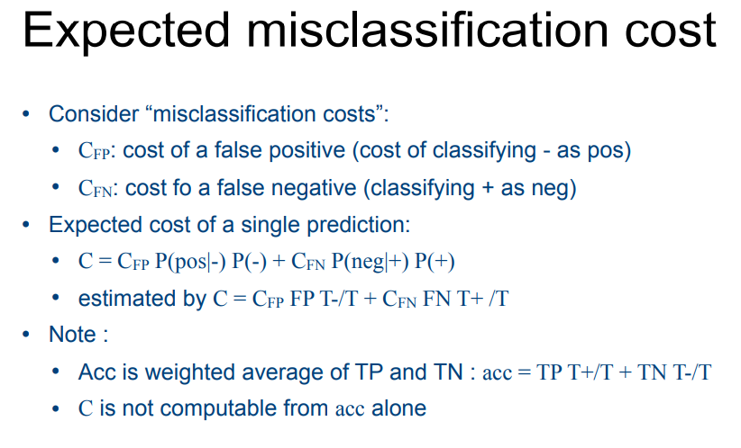

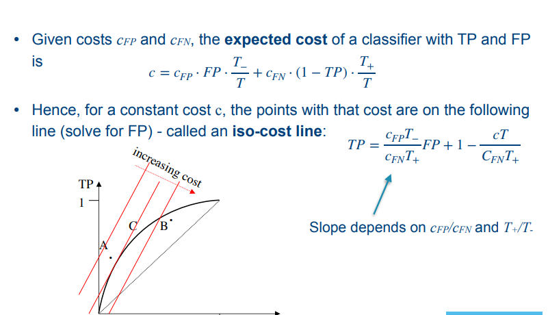

The **convex hull** of the set is the line is hard to explain so just look at the image.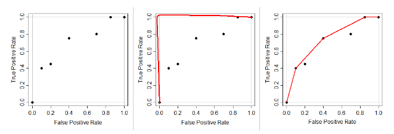

A sort of rubber band that spans the best classifiers of the set. [Click here](https://stats.stackexchange.com/questions/120361/what-is-the-convex-hull-in-roc-curve)

### 3.3 VC Dimension

The VC-dimension of a hypothesis space **H** defined over instance space **X**, is the size of the largest finite subset of X shattered by **H**. For example, in case of linear separators (straight lines) in $\R^2$ (two dimensional euclidean space), the VC-dimension is 3. To understand this, consider a straight line in $\R^2$ that is used to divide the space into two regions. The line can be defined by two points on the line. Given three points, it is always possible to find a straight line that passes through two of points and correctly separates the third point from the other two points. 

However if a fourth point is added, it may not be possible to find a straight line that correctly separates all four points. In general for $x \in R^d$, the VC dimension for a linear classifier is $d+1$

For example consider the points (0,0),(0,1),(1,0),(1,1) with label [+,-,-,+]. We cannot draw a single line to correctly classify all points. If we only had the first three points we could.

The VC dimension of a hypothesis space is a measure of the capacity of the classifier. It is defined as the maximum number of points that can be separated into two classes by the classifier in all possible ways. A hypothesis space with a high VC dimension is more flexible and can "memorize" the training data better, but it is also more prone to overfitting. A hypothesis space with a low VC dimension is less flexible and may not be able to capture the underlying patterns in the data, leading to underfitting. The VC dimension is a useful concept in understanding the bias-variance tradeoff in supervised learning.

In this case, we are considering a hypothesis space consisting of all hypotheses of the form "everything inside rectangle R is positive and everything outside it is negative", where R can be any axis-parallel rectangle. This means that we can use a rectangle R to classify any set of points in the 2-dimensional instance space into two classes: positive and negative.

To show that the VC dimension of this hypothesis space is at least 3, we need to find a set of 3 points in the instance space such that for any subset of these points, there exists a rectangle R in the hypothesis space that can perfectly classify these points.

Consider the following 3 points in the instance space:

A = (0,0) B = (1,1) C = (1,0)

For any subset of these points, we can find a rectangle R in the hypothesis space that can perfectly classify these points:

- For the subset {A}, the rectangle R = [(0,0), (0,1), (1,1), (1,0)] can perfectly classify the point A.
- For the subset {B}, the rectangle R = [(0,0), (0,1), (1,1), (1,0)] can perfectly classify the point B.
- For the subset {C}, the rectangle R = [(0,0), (0,1), (1,1), (1,0)] can perfectly classify the point C.
- For the subset {A, B}, the rectangle R = [(0,0), (0,1), (1,1), (1,0)] can perfectly classify the points A and B.
- For the subset {A, C}, the rectangle R = [(0,0), (0,1), (1,1), (1,0)] can perfectly classify the points A and C.
- For the subset {B, C}, the rectangle R = [(0,0), (0,1), (1,1), (1,0)] can perfectly classify the points B and C.
- For the subset {A, B, C}, the rectangle R = [(0,0), (0,1), (1,1), (1,0)] can perfectly classify the points A, B, and C.

Therefore, the VC dimension of this hypothesis space is at least 3, because we were able to find a set of 3 points in the instance space that can be perfectly classified by any subset of these points using a rectangle R in the hypothesis space.

**Shattering:** The concept of shattering refers to the ability of a model to perfectly classify a dataset. A set of instances S is shattered by hypothesis space H if for each possible +/- labeling of the instances there is a hypothesis that predicts exactly theses labels.

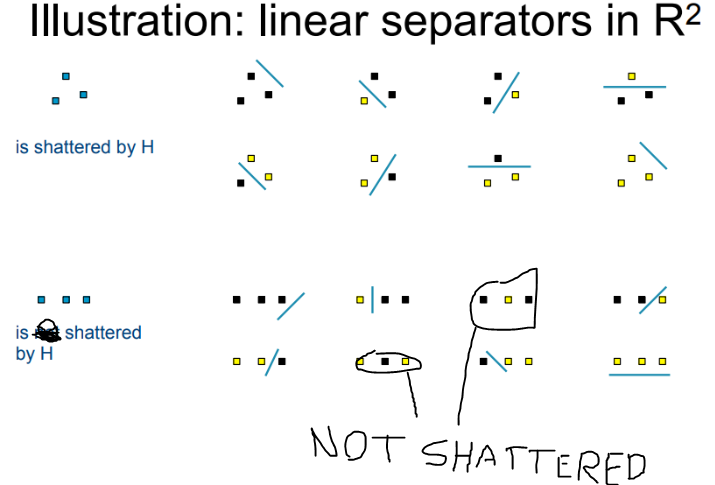

### 3.4 Sample complexity

Sample complexity is the amount of training examples or data points is required to learn a good model. Some models will be able to become good with a relatively smalle number of examples while others may require an enormous amount of examples.

### 3.5 Perceptrons

A perceptron is an **artifical neural network** but with only a few neurons, so very basic in design. These can be used to create "AND", "OR" operators.

- **k-input perceptron** is perceptron with k-inputs so it will create a hyperplane in k-dimensional space. This means that if the class are not linearly separable, the perceptron cannot learn to separate them but we have a solution:
- **Multi-layer perceptrons** can separate them because we are connecting multiple neurons. Because of thise we are no longer restricted to linear separations. The image below is a 2 layer perceptron because the input layer is seen as the 0th layer.
  - 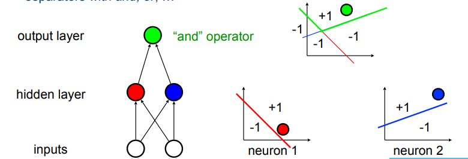
  - Any boolean function can be represented by a 2-layer network
- **Artifical neural networks** are most powerful form of things above. You can see the decision surfaces of the ANN's below
  - 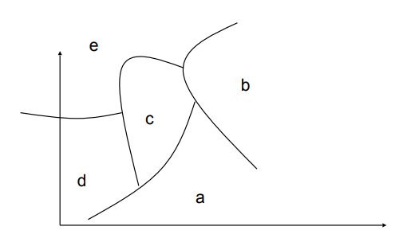
  - If you compare these non-linear decision surfaces of those of decision trees, kNN. It's a very powerful representation

For the exercise, you have to create a perceptron given some logical gate. Keep in mind that an input is **multiplicated** with the weights of the connection to the next neuron. I will explain this with the example given in the exercise session.

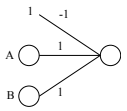

So say for example that A = 1 & B=-1. if you multiply these with the weights you will still have the same numbers. In the output neuron these numbers will be **summed** so we will get 0. We only have 1 or -1 as possible so solution so we add an extra -1 that is always added. This is always correct because say A and B are both 1. After the **summation** we will have 2 which is also not a solution but given the -1 we will get 1 which is the solution. This will become even clearer in the next solution

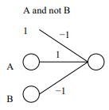

Say A=1 and B=-1, if we then multiply it with its weights and will get 1 for both A and B  because $1~ . 1=1$ and $-1~. -1 = 1$. After the summation we will again end up with 2 so we again alwaus add the $-1$.

##### Convolutional neural networks

2-layer feedforward networks have long been very popular but recently networks with many more layers (**deep networks**) have become very popular. A common type of such a deep network is the convolutional network. This CNN excels at processing visual data. 

### 3.7 Support Vector Machine (SVM)

A support vector machine is a supervised learning algorithm that can be used for classification tasks. It tries to find a hyperplane in a high-dimensional space that maximally separates the two classes. This also works on non linearly separable data. 

What we mean by that is the data can't be be completely divided into 2 separated classes by a single line. The solution to this is what we call the **kernel trick**. This technique transforms the data into higher-dimensional data where be might be able to find plane that separates the data.

For example, consider the following two classes of data points in a 2-dimensional feature space:

Class 1: (1,2), (2,3), (3,4) Class 2: (5,6), (6,7), (7,8)

These data points are not linearly separable in the original 2-dimensional space because no single straight line can completely separate the two classes. However, if we apply a kernel function to transform the data into a higher-dimensional space, the data may become linearly separable.

For example, suppose we apply the following kernel function:

k(x, y) = (x1 * y1 + x2 * y2)^2

where x = (x1, x2) and y = (y1, y2) are two data points in the original 2-dimensional space. This kernel function maps the data into a 3-dimensional space, where the inner product of the data points is computed as the square of their original inner product.

In the higher-dimensional space, the data points become:

Class 1: (1,2,4), (2,3,9), (3,4,16) Class 2: (5,6,36), (6,7,49), (7,8,64)

Now, the data points are linearly separable because there exists a plane in the higher-dimensional space that perfectly separates the two classes. The SVM algorithm can then find this plane and use it to classify new, unseen examples.

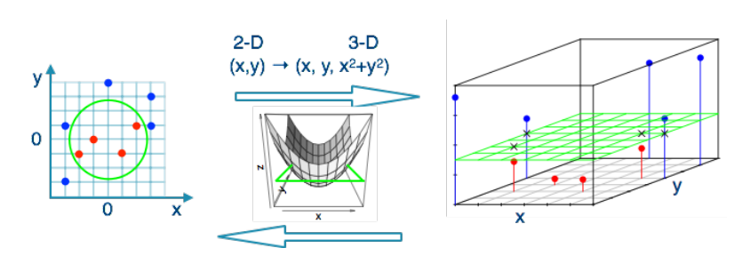

## Exercise Session 4

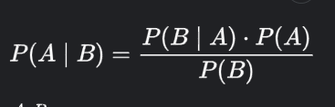

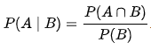

### 4.1 Naive Bayes

In this exercise we use the Bayes rule in model learning. if we start with a prior belief about which models are more or less likely. After seeing the data, we update those beliefs. We end up with a distribution over possible models. If we need to return one model, we can return the one with the **maximal a posteriori probability** or **MAP** model

$h_{map}= argmax P(h|D) = argmax \frac{P(D|hP(h))}{p(D)} = arg max (D|h)P(h)$

we can drop $P(D)$ in the second term because it is constant

with

D = observed data

H = hypothesis space

If we have no prior reason to prefer one model over the other. We use the maximum likelihood.

$h_{ML}= arg max P(D|h)$

**we can use the bayes' rule for classification**

$c = argmax P(c|x_1,...,x_n) = argmax P(x_1,...,x_n|c)P(c)$

Since we are using naive bayes we can make some assumptions. For example we assume that attributes are independent given the class (a.k.a **conditionally independent**)

so this means: $P(x_1,...x_n|c)=P(x_1|c)...P(x_n|c)$

**What if attribute value x~i~ is never observed for class c?**

For example, none of the swans I've seen were black, so anything black cannot possibly be a swan.
Solution: use m-estimate with non-zero prior q
$\hat{P}(x_i|c)=\frac{\#(x_i,c)+mq}{\#c+m}$ 

### 4.2 Text Classification

Naive bayes turns out to work reasonably well for text classification. There is an algorithm in 2 parts:

1. Learn_naive bayes_text(E:set of articles, V:set of classes)
   - Voc = all words and tokens occuring in E
   - For all w in E and c in C:  \\\ estimate P(c) and P(w|v)
     - N~c~=number of articles of class c
     - N = total number of articles
     - P(c) = N~j~/N
     - n~w~=number of times word w occurs in text of class c
     - n = total number of words in class c
       - P(w|c)=(n~c~+1)/(n+|Voc|)
2. Classify_naive_bayes_text(A:article)
   - remove from A all words/token that are not in Voc
   - return argmax P(c)$\prod_iP(w_i|c)$ with $w_i$ the i'th word in A

### 4.3 Bayesian Networks

Bayesian networks have been seen extensively in uncertainty in ai. Quick reminder. Given a network, create the probability tables and calculate what you're looking for.

Example from exercise session

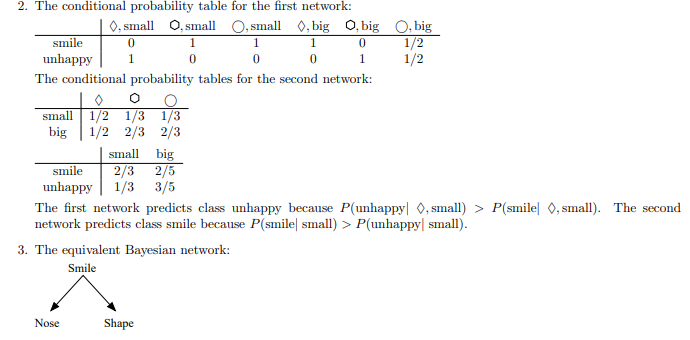

### 4.4 Reinforcement Learning

Reinforced learning is a type of machine learning where there is no example data. The agent learns by interacting with its environment and receiving feedback in the form of rewards or penalties. The goal of reinforcement learning is to maximize the cumulative reward over time.

The bellman equation is an equation used to determine the best course of action to take in particular situation. It does this by computing every possibility and going with the one that is expected to give the greatest value.

The general form of the Bellman equation is:

**V(s) = max$[R(s, a) + \gamma V(s')]$**

where:

- V(s) is the value of the current state (s)
- R(s, a) is the reward associated with taking action (a) in state (s)
- γ is a discount factor that determines the importance of future rewards relative to immediate rewards
- V(s') is the value of the next state (s')

Another well known form:

If we want to find the optimal policy

V(s~t~) = $$\sum_{i=0}^{\infty} \gamma ^i r_{t+i}$$

V^*^(s) = $\sum_{s ∈S} P_δ(s, π(s), s') [r(s ') + γV^∗ (s')]$

### 4.5 Q-learning

Q-learning is a reinforcement learning algorithm that is used to learn the optimal action-selection policy for a given environment. It is a value-based algorithm, which means that it tries to maximize the expected long-term reward by learning a function that maps situations (states) to actions that are most likely to lead to the highest reward.

**Convergence:**

Convergence is the term we give to point where the policy or value function stops changing significantly. This means that the agent has learned the optimal policy given the environment. Important here is the balance between exploration and exploitation. Exploration is trying out different actions to learn more about the environment. Exploitation is choosing the action that is currently believed to best. 

If the agent spends too much time exploring to may take too long to converge. On the other, if it focuses too hard on exploitation it may not learn the optimal policy.

## Exercise Session 5

### 5.1 Theta-Subsumption

Is the concept of a simple, specialized system taking control over from a more complex, general purpose system. This can occur when the simple system is able to perform a specific task more efficiently or effectively that the complex system.

**For example:** 

robots could be designed with multiple layers of control, with each layer responsible for a different aspect of the robot's behaviour. The lower layers would be responsible for simple, specialized tasks (such as obstacle avoidance), while the higher layers would be responsible for more complex, general tasks (such as navigation). The lower layers could take over control from the higher layers when needed, allowing the robot to respond more quickly and efficiently to its environment.

Now for the exercise. The theta-subsumption is way of ordering logical clauses or rules in artificial intelligence and logic programming. It based on the idea that one clause subsumes another if it is more general and can be used to derive all the conclusions of the subsumed clause.

If a set 1 can be turned into set 2 by replacing some variables, then set 2 subsumes set 1.

Now for the exercise

1. First write everything as disjunctions (A <= B <=> A $\or \neg$B )
2. Take every part and put it in {}
   - For example: $f(j,p) \or \neg m(j)$ -> ${f(j,p),\neg m(j)}$
3. Then check for every item if it is $\theta$-subsumed (theta-subsumption)by another item and vice versa.

### 5.2 LGG (Least general generalisation)

LGG is the concept of finding the most specific solution or rule that can still solve most problems. So we get specifics solutions and try to find the most specific generalisation that covers all solutions. This is to avoid overfitting. Which is when a model becomes too closely tied to the specific details of the training data and may not generalize well.

### 5.33 RLGG (Relative least general generalisation)

The principle of relative least generalization (also known as relative minimal generalization or relative minimal commitment) is a variant of the principle of least generalization that takes into account the context or background knowledge available when making inferences or generalizations.

In the context of machine learning, the principle of relative least generalization suggests that when making predictions or decisions based on data, one should aim to make the least generalizations necessary given the available context or background knowledge. This can help to avoid overfitting the data by making overly broad or general conclusions that may not be applicable in other contexts or settings.

## Important terms and concepts]

- **Inductive inference:** inductive inference is the process of using data about something to be able to make generalisations or predictions about a larger population.
- **Predictive learning:** Predictive learning is a type of learning that involves building a model to predict certain things given some input data. 
- **Descriptive learning:** Descriptive learning is a type of learning that instead of trying to predict something we are going to be describing or summarizing the characteristics of large data sets
- **Supervised learning: ** Supervised learning is a type learning where we are gonna build a model based on labeled training data. The goal is to be able to make accurate predictions given some input.
- **Unsupervised learning:** Unsupervised learning is a type of learning where the model is given data but it is not labeled. The goal is not be able to make predictions but to find patterns or relationships in data.
- **Semi-supervised learning:** Semi-supervised learning is similar to supervised learning except that we are building a model based on both labeled and unlabeled data. The goal is to be able to make predictions given some unseen data. It is used when it's hard to get a large labeled dataset.
- **Classification:** classification is a type of machine learning where the goal is to able to predict a label for a given input data. Labels are categorical values that represent different classes. Example, classification task to predict the type of animal in photo, cat, dog, bird.
- **Regression:** regression is a type of machine learning task in which the goal is to predict a continuous numerical value based on a set of input data.
- **Clustering:** clustering is grouping data points with similar attributes into clusters. (ex. k-means clustering)
- **Multi-instance learning (MIL):** MIL is a type of machine learning where instead of predicting labels for individual data points, we are predicting it for a set of data points
- **Reinforcement learning:** Reinforcement learning is instead of giving some data to model we are letting an agent loose in an environment and rewarding where we see good behaviour and punishing it if we see bad behaviour. The goal of the agent is to learn the best possible policy.
- **Decision trees:** Decision trees are a type of machine learning model that is used for classification and regression. We call it trees because it resembles a tree-like structure. 
- **Rule learning:** Rule learning is a type of machine learning that involves learning a set of rules from the given dataset to be able to make predictions about new data.
- **Association rules:** association rules are a type of machine learning that searches for patterns or relationships between items in a dataset. Commonly used in market basket analysis, finding items that are frequently purchased together in a store.
- **Neural networks:** A neural network is a type of machine learning model that is designed to process and analyze large amounts of data. A neural network is a complex structure of neurons.
- **Support vector machines:** A support vector machine are a type of machine learning used for classification and regression. It works by finding the hyperplane, the plane that maximally divides the separate classes. Because this might not always be possible in the current dimension, the old points could be converted to a higher dimension by a kernelfunction where a plane might exist.
- **Nearest neighbour methods:** this is a type of machine learning where new data points are classified based on what the nearest neighbours are classified as.
- **Q-learning:** is a type of reinforcement learning where we add a Q-function which estimates the maximum expected future rewards for each possible action. So less the environment rewards and more Q-function
- **Inductive logic programming:** is a type of machine learning that tries to learn logical rules from the given data set and then tries to makes predictions about new data given those rules.
- **Lazy vs eager learners**
  - Lazy learners such as kNN don't build a model during training, merely store data. Start doing the hard work when asked a question (usually unsupervised learning)
  - Eager learners such as regression generalize before knowing the question. They try to build a global model that will work under all circumstances
- **Mean squared error (MSE)** is a measure of difference between a set of predicted values and the corresponding actual values. It is commonly used in regression, where the goal is to predict a continuous output value based on a set of input features. The MSE is calculated as the average of the squared difference between the predicted values and the true values. It is defined as :
  **MSE =** $\frac{1}{n}*\sum^n_{i=0}(y_i-\hat{y}_i)^2$
  Where $y_i$ is the true value of $i$-th data point, $\hat{y}_i$ is the predicted value of the data point and n is the total number of data points.
- **Accuracy** = the probability of a correct prediction on a randomly drawn instance; **Error** = 1 - accuracy
- Review exercise 3.1 of the exercise session 3
- Review exercise 3.2 of the exercise session 3
- **PAC-learnability (Probably Approximately Correct learnability)** is a concept that refers to the ability of a learning algorithm to accurately learn the underlying structure of a dataset with a high probability.
- **Explainable AI (XAI)** means that the decisions of an AI system can be explained. 
- **Black-box model** is a model that has been built but is not straightforward to interpret.
- **Transductive learning:** transductive learning is a type of learning where the outcome is the predictions themselves
- **Inductive learning:** inductive learning is a type of learning where the outcome is a function that can predict the label of unlabeled instances.
  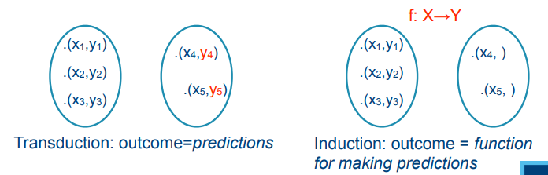
- **Conjunctive concepts:** A conjunctive concept is expressed as a set of conditions, all of which must be true.
  - Example: Accept application for mortgage if and only if:
    salary $\ge$ 3*monthly payback and no other mortgage running
- **Candidate Elimination** is a version space algorithm
- **Curse of dimensionality** is that learning in high-dimensional spaces is very hard. Because data points may be distributed sparsely in high-D. 

### Supervised learning

- **Regression** is supervised learning because it needs an input and output for each instance so it can learn from it. This allows it make predictions about new data for which the output is not known. The "output" in this case will be the "label". For example, you give it houses with the amount of rooms, bathrooms and size, you also give it the price of the house. Given a few examples of those, when we apply regression we will now be able to make predictions of the price of new houses. The price in this case would be the label.
- **Classification** is supervised learning because we are also given labeled data and we want to make predictions about new data. For example given a few data points labeled + and -, we could use kNN to classify new data points.

### Unsupervised learning

- **Clustering** is unsupervised learning because we aren't trying to make predictions about new data but just putting similar data in groups.

### Loss functions

Consider learning a function $f$ from the data. We make $f$ fit the training data, in the hope that it will "fit" the whole population but what do we mean by "fit". We express this using **loss** and **risk**.

The loss function $l$ expresses the quality of a prediction: the higher the loss, the worst the prediction. In practice we optimize the fit on a training set T, not on the population so minimizing the loss during training may cause overfitting. That's why we use a variant that guards against overfitting, we call this **regularization**.

### Linear regression

### Classification

#### Multi-label classification

Predict for each instance a set of labels

**3 approaches:**

1. (**Binary relevance**) Learn one binary decision tree for each label
2. (**Label powersets**) Considers each set of labels as a separate label
   - Example: say we have labels a,b,c. We learn all the trees for each part of the powerset, so a tree for *a*, a tree for *ac*, a tree *abc*, ...
3. (**Vector encoding**), encode each set as a 0/1 vector e.g. {a,b,d} = [1,1,0,1,0]. Use a learner that can learn models that predicts vectors

### Decision trees

**Types** of trees:

- When Y is nominal, the tree is called a **Classification tree**
- When Y is numerical, the tree is called a **Regression tree**

**CART** stands for **classifications and regression trees**

Main **reasons** to use trees:

- learning and using trees is very **efficient**
- Good predictive accuracy
- **Interpretable** (we can understand predictions)

Two important details need to be filled in for trees

- How to choose the **best** test
  - A good test is a test that reduces the **entropy** the most and maximizes **information gain** (A test in a tree is also a split)
- When to stop splitting nodes (stopcondition)
  - Keep splitting until all instances have the same Y value (risk of **overfitting**)

When we are talking about classification trees we use **information gain**, if we are talking about regression trees we use **variance reduction**.

**Side notes:**

- learning decision trees is **NP-hard**

#### **Oblique trees**

Oblique trees are a different type of trees which are a bit harder to understand because in a normal tree, splits are based on a single feature. While in oblique trees the splits are based on linear combinations of the input variables.

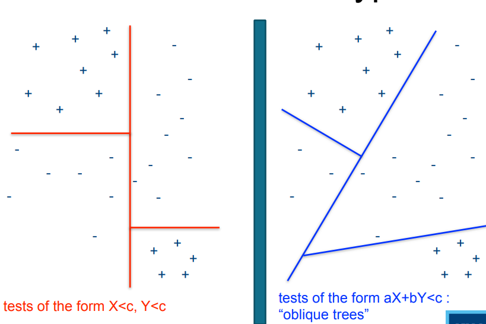

These kinds of trees are much harder to learn so aren't used much but they are more expressive.

#### **Multi-target trees**

Very similar to **multi-target classification** but now applied to trees

**Trees vs linear regression**

Which method will perform best largely depends on your problem. Each approach has a bias. Learns whose bias fits your problem will perform better.

### Rule sets

separate and conquer

A rule set is a set of rules of the form "if ... then ..." or "if... then ... else ..."

**Note:** a decision tree can be turned into a set of rules so this is a way to learn a set of rules.

Another approach could be:

#### Sequential covering

The principle: 

- sequential covering is learn one rule at a time, ideally the rule has:

  - **High accuracy**

  - **Reasonable coverage**

- Mark the examples covered by the rule

- Repeat for unmarked examples, until all have been done.

**LearnOneRule**

The LearnOneRule algorithm is machine learning method that is used to learn a single rule from a given dataset. The algorithm works by selecting a candidate literal(variable) from the possible candidate literals and splitting the data based on that literal. It does this for every literal and then chooses the one that leads to the greatest information gain. This process is repeated until a stopping condition is reached. 

The top down variant of the algorithm start with a maximally general rule that has high coverage but low accuracy. We then start adding literals one by one to gradually increase the accuracy without sacrificing coverage (using some **heuristic**). 

The bottom-up approach the algorithm starts with maximally specific rule that has high accuracy but low coverage and then removes literals on by one to gradually increase the coverage without sacrificing accuracy (using some **heuristic**). This algorithm is prone to overfitting.

For the following table a candidate literal would be temp=mild or hum = norm.

There is a variant called example-driven top-down rule induction. This works like regular top-down approach, except for that it picks a not yet covered example from the training set instead of taking the most general rule. It more efficient but less robust to noise.

#### RIPPER

Most effective rule set learner to data.

#### Heuristics for rule learners

The accuracy of a rule that predicts class C is p/(p+n), with p = #positives, n=#negatives

The m-estimate of a rule is m-estimate = $\frac{p+mq}{p+n+m}$ with p = #positives, n = #negatives, q a prior estimate of accuracy and m a weight for that prior estimate.

 

### Entropy

entropy is the measure of uncertainty. 

- High entropy = many possibilities, all equally likely
- Low entropy = few possibilities or many possibilities but most are highly unlikely

### Overfitting

Overfitting happens when a model goes too far with its specificity so it doesn't generalize well.

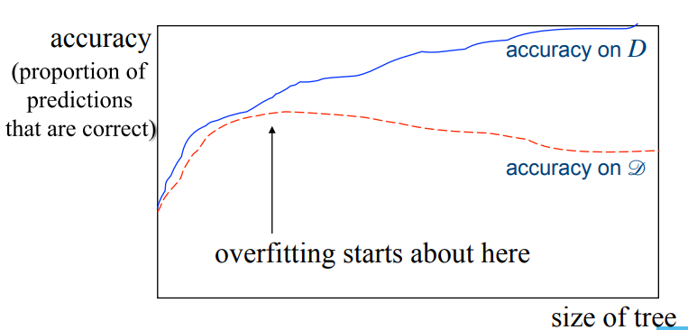

How do we avoid it?

1. **Cautious splitting:** Do not split a node unless you are certain that the split meaningful. A simple approach to this is to have a validation set and to check with that set if the accuracy has gone down when you've added a new branch
2. **Post-pruning:** Don't think about overfitting but once the tree has been built, prune branches that do not contribute much. Post-pruning requires more effort.

### Expressiveness

An expressive model is a model that effectively can represent complex concepts. This is often desired but it is important to balance this with other factors because a highly expressive model may be very hard to train and very complex.

### Association rules

It might look similar to classification rules but they are descriptive rules and not predictive rules.

**General format:**

Rule "if <this> then <that> " is characterized by

- **Support:** % of all clients that buy <this>
  - Low support means not important
- **Confidence:** % of buyers of <this> that also buy <that>
  - Confidence doesn't need to be close to 100%, any increase over normal leleve indicates an association.

The **APRIORI** algorithm is an example for association rules.

### Instance based learning

Instance based learning is learning where we just save the training data and then when we are given a new instance, we classify it based on its similarities to other data points. A good example of this is **k-nearest-neighbors (k-NN)**. A user chooses a k and then given a new instance it searches k nearest data points and classifies it based on those.

**Properties of k-NN**

- "Learning" is fast because there is no learning
- Slow at **prediction time**
- relies on have a good **similarity** measure

Influenced greatly by the curse of dimensionality. k-NN does not perform well in high dimension.

### ROC (Receiver operating characteristic) analysis

Evaluation based on accuracy is not always appropriate. What we mean by that is take for example a 99% correct prediction. Is this good? If we have 50% + and 50% - then yes. If we have 99% + and 1% - this is actually quite bad because our model wouldn't predict anything.

A solution to this is **correlation** .

**ROC diagrams**

Shows us how well a classifier performs given certain misclassifications costs and class distribution. A **ROC** diagram plots **TP versus FP** for a classifier

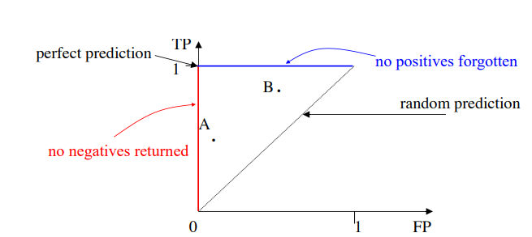

Sidenote: This is evalution for nominal values but what do we do for numerical values? Can't really say right or wrong. That's why will use things likes **Mean squared error**.

### Sample complexity and VC-dimension

How many examples needed for learning? depends on how they are chosen, some options:

1. learner proposes instances (x), teacher classifies them (provides f(x))
2. teacher provides both x and f(x)
3. instances x are provided randomly, teacher provides f(x)

H is PAC-learnable <=> VC(H) is finite

### Artificial neural networks

Aritifical neural networks or ANNs for short are a complex numerical mode built out of relatively simple neurons. We have 3 layers:

- Input layer
- "Hidden" layer
- Output layer

The connections between these neurons have a **weights**. The ANN learns to associate input with output by adapting the weights.

**A single neuron (perceptron)**

The neuron when the sum of weighted inputs > some threshhold

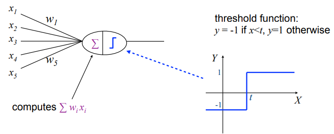

**k-input perceptron**

In general a perceptron constructs a hyperplane in k-dimension to split the data (+ on one side and - on the other) but if the class is not linearly separable the perceptron cannot separate it. Our solution: **multi-layer perceptrons**. By connections multiple neurons we get more complex models. An MLP is not restricted to linear separations. MLPs are universal approximators, they can approximate any function.

The **Threshhold** function we saw before in a single neuron is often replaced by a **sigmoid** function. The changes are continuously instead of a jump as before. This has advantages in multi-layer networks.

**Layered feedforward neural networks** is a neural network where output from one layer is input for the next layer. Each neuron connects to all neurons in previous layer.

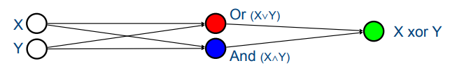

#### Deep neural nets

the 2-layer feedforward network that we saw before has been very popular but now we have networks with a lot more layers (deep networks).

A common type are **Convolutional Neural Networks (CNNs)**. These excel at processing visual data. They have 2 types of layers

- **Convolution** layer
  - Extracting features from input data like edges, textures, patterns
- **Pooling** layer
  - Pooling layers **reduce dimensionality** and increase **granularity** (level of detail/resolution) of the signal

**Recurrent artificial neural nets (RANNs)**

Given our feedforward networks we can add recurrence which means a neuron might feed information back into itself. A common type of a RANN is the **LSTM (Long Short-Term memory**.

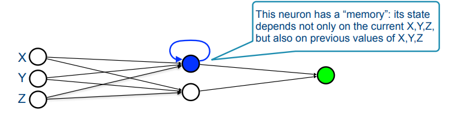

#### **Training ANNs**

Training relies on the numerical optimization of the weights. It works like this.
**Repeat until happy or tired:**

1. Take a new instance (x,y)
2. Compare the network prediction f(x) to y
3. change the ANN parameters so that f(x) becomes closer to y

#### **When to use **ANNs

Useful for modelling complex, non-linear functions of numerical inputs & outputs. Robust to noise. All inputs have some effect but the weights are adapted very gradually so some noise will barely make a difference. ANNs can accurately model complex things which means it has a high expressiveness but the there is a risk of overfitting.

Useful when learning from raw data but the model itself is hard to explain since it's just a lot of neurons with some weights and function. Training can also be very expensive.

### Support vector machines

Support vector machines are linear separators with maximal margin, in other words, they find a linear separator that separates + from - with as much margin as possible. 

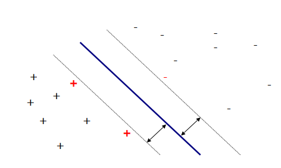

Since it's hard to linearly separate most things we make use of a kernel function. The kernel function transforms the data to a higher dimension where a hyperplane that separates the data might be easier to find. After we've found the hyperplane transform its back to the original space, we use that to predict the class of new data.

### Naive bayes

**Bayes' rule:** $P(A|B)=\frac{P(B|A)P(A)}{P(B)}$

#### MAP model

Let $D$ observed data. $H$ a hypothesis space.

$h_{MAP} = arg max P(D|h)P(h)$

$h_{MAP}$ is the model that has the highest probability of being correct (starting out from prior probabilities). But what if we have no prior reason to prefer one model over the other: maximum likelihood.

#### **Maximum Likelihood (ML)**

$h_{ML} =argmax P(D|h)$

#### Occam's razor

Occam's razor means that we prefer the simplest hypothesis because the simplest is usually the best.

#### Bayes' rule for classification

$argmax P(c|x_1,...,x_n) = argmax P(x_1,...,x_n|c)P(c)$

and since naives bayes assumes attributes are independent given the class (conditionally independent):

$P(x_1,...,x_n|c)=P(x_1|c)P(x_2|c)...P(x_n|c)$

**What if attribute value x~i~ is never observed for class c?**

For example, none of the swans I've seen were black, so anything black cannot possibly be a swan.
Solution: use m-estimate with non-zero prior q
$\hat{P}(x_i|c)=\frac{\#(x_i,c)+mq}{\#c+m}$ 

**Generative vs discriminative models**

**Generative** models are models that define **P(X,Y)**

**Discriminative** models define only **P(Y|X)**

Naive bayes is generative

Logistic regression is a discriminative

### Ensembles

Combining classifiers can be done with the following methods

- **Voting**
- **Bagging**
- **Boosting** 
- **Stacking**

Can we combine hypothesises into something works better than each of them separately?

Yes

#### Voting

Compute the hypothesis for each classifier in the ensemble and output the most popular prediction.

#### Bagging (bootstrap aggregating)

Bagging, or Bootstrap Aggregating, is a method of combining classifiers in machine learning. The idea behind bagging is to take different subsets of the dataset and give one to each classifier in the ensemble. This can help to improve the performance of the classifiers because each one will be trained on a different subset of the data, and therefore, they will be less likely to make the same mistakes as each other. 

#### Boosting

Instead of resampling data we are giving weights to example. We learn a hypothesis from a weighted data set and then give higher weights to examples predicted incorrectly by that hypothesis so new hypotheses will focus on these examples.

Very good results

Example: Adaboost

#### Stacking

Stacking is a method for combining multiple classifiers or models to improve performance. It involves training several base models, and then using the output of these models as input to a "meta" model. The meta model learns how to best combine the outputs of the base models to make predictions. 

### Reinforcement learning

Three ways in which we can learn a policy

- **Planning**
- **Behavioral cloning**
- **Reinforcement learning**

#### Planning

Given a model of the environment, we build a plan that reaches desired state. This unfortunately requires a full model of the environment.

#### Behavioral Cloning

The agent learns how to traverse the environment from an example from the teacher. The problem here is that the agent will probably only do slightly better than the teacher.

#### Reinforcement learning

The principle here is based on letting the agent run free in the environment but we reward good behaviour and punish bad behaviour.

More formally, find the policy $\pi$: $S \rarr A$ 

such that $V=(s_t) \equiv \sum^\infin_{i=0} \gamma^ir(t+i)$ is maximized

where $\gamma$ is the discount factor. We use this so that our agent will try to find the shortest route so that the reward is maximized.

**The complete algorithm: Policy Iteration**

For example: iteratively, by using the bellman equation.

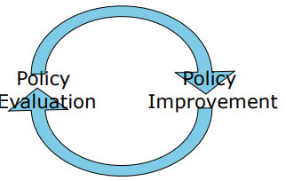

#### Q-learning

A popular algorithm for reinforcement learning. It computes the optimal Q-values for all state-action pairs. The problem is that for an average game there are too much state-action pairs to ever store. the solution can be read below.

**Generalization in reinforcement learning.** 

Most learners generalize from examples, given labeled examples, find general rule to label new examples. Reinforcement learning is concerned with assigning the labels themselves to examples. Combination of both is possible. So what we do. We do the Q-learning, we take some actions and see where that leads, you get some Q-values. We let that go from a few million times and now we have some state-action pairs with some Q-value. This data we can feed into a new learner that can learn from it and then create a model to make predictions.

### Inductive logic programming (IPL)

**Deduction vs induction**

**Deduction** = reasoning from general to specific

- Is truth preserving
- Example: All men are mortal -> Socrates is a man -> Socrates is mortal

**Induction** = reasoning from specific to general

- Not truth preserving but there may be statistical evidence
- Example: Socrates is mortal -> Socrates is a man -> All men are mortal

**Some terminology**

**Terms:** refers to objects in the world

- variables (X,Y,...), constants (a,b,5,..), or composite terms, e.g. f(a,b) (f=functor)

**Predicates:** properties of/ relationships between objects

- predicate: human/1
- atom = predicate with terms filled in for its arguments
  - human(X), father(lei, kim)
- literal = possibly negated atom
