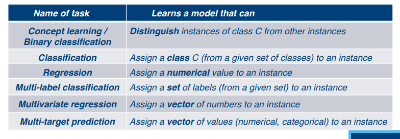
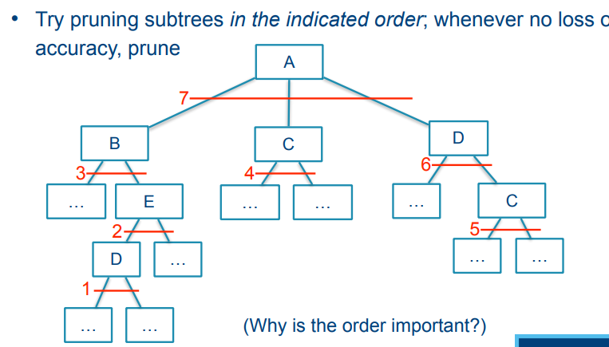

# Machine Learning and inductive inference

## Lecture 1

### Machine learning vs other AI

In machine learning, the key is data

- Examples of questions & their answer

Inductive inference = reasoning from specific to general

- Statistics: sample -> population
- In accordance with the philosophy of science: concrete observations -> general theory

### Basic concepts and terminology

#### Typical tasks in ML

- **Function learning:** learn a function X -> Y that fits the given data (with X and Y sets of variables that occur in the data). 
  - Such a function will obviously be useful for predicting Y from X
  - Linear regression: determine a and b such that Y = aX+b best fits the data
  - "Best fits the data": as expressed by a so-called loss function
- **Distribution learning:** Given a data set drawn from a distribution estimate this distribution
  - Several unimportant options here

#### Explainable AI

**Explainable AI (XAI)** means that the decisions of an AI system can be explained. We have two different levels here: 

- We understand the (learned) model
- We understand the individual decision

A learned model that is not straightforward to understand, is called a black-box model

#### Predictive vs descriptive

**Predictive learning:** learn a model that can predict a particular property/attribute/ variable from inputs. Ex: face recognition, spam filtering

**Descriptive learning:** given a data set, describe certain patterns in the dataset, or in the population it is drawn from. Ex: analyzing large databases

A very large part of machine learning focuses on predictive learning. The prediction task, in general:

- Given: a description of some instance
- Predict: some property of interest

**Examples:**

- classify emails as spam/non-spam
- classify fish as salmon/bass

#### Terminology

- Training set: a set of examples, that include the target property (labeled instances)
- Prediction set: a set of instance descriptions that do not include the target property ("unlabeled" instances)

#### Inductive vs transductive learning

We can consider as outcome of the learning process, either

- the predictions themselves: transductive learning

- a function that can predict the label of any unlabeled instance: inductive learning

  

#### Supervised, semi-supervised, unsupervised learning

- **Supervised learning:** learning a model form labeled instances
- **Unsupervised learning:** learning a model from unlabeled instances
  - Such models are usually not directly predictive but could be useful indirectly.
- **Semi-supervised learning:** learn a predictive model from a few labeled and many unlabeled examples.

#### Format of input data

- **Tabular**

- **Sequences**

- **Trees**

- **Graph**

- **Raw data**
  - Often needs to be processed in a non-trivial way to obtain meaningful features; on the basis of these features, a function can be learned.

- **Knowledge**
  - This can consist of facts, rules, definitions, ...

## Lecture 2

### Decision Trees

A decision tree represents a sequence of decisions where the answer to the question determines which question you get next and so on, until you reach a decision

**Ex: Do I want to play tennis or not?**

The tree is actually a representation the function **Outlook x Humidity x Wind -> Tennis**

#### Continuous input attributes

What if one of the input attributes is a continuous attribute ie. A number between 0 and 1. We use comparative tests, e.g. X < 0.5 (two possible outcomes, yes or no).

#### Types of trees

- When Y (outcome) is nominal, the tree is called a classification tree
- When Y is numerical, the tree is called a regression tree

#### 

#### Learning decision trees

A decision tree represents a function **T: X -> Y**. Learning decision trees is NP-hard.

#### Example cocktail drinking

**Rules representation of tree**

- Trees can be written as if-then-rules
- Rules can be simplified

#### Two main questions

- How to choose the "best" test
- When to stop splitting nodes

**What's a good criterion for choosing the questions?**

#### Classification (Y is nominal)

We focus on classification trees. A good test is a test that carries much information about the class, that we divide the data in the two biggest pieces possible, otherwise our function might be very bad.

#### Class entropy

The class entropy of a set S of object (x,y), where y can be any of k classes c~i~, is defined as

It measures how much uncertainty there is about the class of a particular instance.

Example:

- High entropy = "many possibilities, all equally likely"
- Low entropy = "few possibilities", or possibly: "many possibilities, but most are highly unlikely"
- Entropy measures uncertainty

#### Variance reduction

Try to create subsets such that examples in one subset have similar Y values

#### When to stop splitting nodes?

Keep splitting until all instances in a subset have the same Y value.

#### Overfitting: effect on generalization

Overfitting (asking too many questions) improves consistency of the tree with the given data set D, but may decrease accuracy for instances outside D.

**How to avoid overfitting?**

Two options

1. "**Cautions splitting**": do not split a node unless you are certain that the split is meaningful
2. "**post-pruning**": don't both about overfitting while splitting nodes, but once the tree has been built, prune away branches that turned out not to contribute much.

#### Cautions splitting

How do we know when not to split a node any further? Multiple criteria possible. (dumb approach) try to guess when accuracy on unseen data is going down.

We don't have to guess this turning point if we use a validation set. A subset of data on which the model is not trained. This is not used for growing the tree, only for estimating accuracy on "unseen" data.

#### Post-pruning

What if the red curve has a dip, then rises again? This is the risk of ending the growth phase too early. We can negate this by computing the whole red curve in advance and then find the highest point.

- **Post-pruning principle:**
  - Grow the tree to its full size, then cut away branches that did not contribute to getting better predictions

**Post-pruning vs Cautions splitting**

Post-pruning requires more effort but tends to give more accurate trees. Not pruning at all is usually a bad idea.

#### Oblique trees

Oblique trees are more expressive but are much harder to learn

- more tests
- optimal test is harder to find

#### Computational complexity of tree learning

Given a data set D consisting of N instances (x,y), where x has m components. How do N and m influence the computational effort required to learn a tree?

For each node, we need to "find the best test":

- For each possible test, evaluate its quality
  - partition the dataset according to this test
  - compute quality based on this partition
- for the test with highest quality:
  - partition data according to that test

