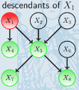

# Uncertainty in AI

## Probability and probabilistic reasoning

To be able to write the independent sign ($\indep$)you should add the following command in $$ to your file.
$\newcommand{\indep}{\perp \!\!\! \perp}$

$\newcommand{\indep}{\perp \!\!\! \perp}$

$\newcommand{\dep}{\not{\perp \!\!\! \perp}}$

### **Discrete probability**

Values between 0 and 1 represent the degree of certainty of state occupancy. The domain ($dom(x)$) denotes the states x can take. For example, $dom(c) =$ {heads, tails}.

$\sum_{x \in dom(x)}p(x)=1$

Discrete probability distribution of a loaded dice:

### **Continuous probability**

The probability distribution always adds up to one, in symbols:

for $f(x) \ge 0,$     $\int_{-\infin}^{+\infin} f(x)dx = 1$

and the probability that x falls in an interval $[a,b]$ is given by:

$p(a\le x \le b)= \int_a^b f(x)dx$

**remark:**

$f(x)$ can be greater than 1!!

### Marginal and conditional probability

**AND:**

$p(x $ and $y) \equiv p(x,y) \equiv p(x \cap y )$ 

**OR:**

$p(x$ or $y) \equiv p(x\cup y)$

$p(x$ or $ y) = p(x)+ p(y)-p(x,y)$

**NOT:**

$p($ not $x) = 1-p(x)$

### Marginalisation

$p(x) = \sum_yp(x,y)$

### Conditional probability and Bayes' rule

**Definition (condition probability)**

$p(x|y) \equiv \frac{p(x,y)}{p(y)}$

Consequence of the above: $p(x,y)\equiv p(x|y)p(y)$

**Theorem (Bayes' rule)**

$p(x|y)= \frac{p(y|x)p(x)}{p(y)}$

 **Arbitrary rule:**

$p(b=false|a,c) = 1-p(b=true|a,c)$

### Conditional Independence

**Conditional independence**

$X \indep Y|Z$ means that the two sets of variables $X$ and $Y$ are independent of each other given the state of the set of variables $Z$. This mean that

$p(X,Y|Z) = p(X|Z)p(Y|Z) \equiv p(X|Y,Z)=p(X|Z)$

for all states of $X,Y,Z$

**Independence**

In case the conditioning set is empty we may also write $X \indep Y$ for $X \indep Y|\empty) $ in which case $X$ is (unconditionally) independent of $Y$

**(Conditional) dependence**

if $X$ and $Y$are not conditionally independent, they are conditionally dependent. This is written $X$$Y|Z$ 

**Prior**

The initial probability of a hypothesis before any evidence is observed.

**Likelihood**

The probability of the observed evidence given the hypothesis

**Posterior**

The updated probability of the hypothesis after the evidence has been taken into account.

For example, you got a coin and you say that the prior probability of the coin landing on heads is $0.5$. You then observe the coin being flipped and landing heads 10 times in a row, the likelihood of this outcome given the hypothesis of fair could would be $0.5^{10}=0.00097$

Using Bayes' theorem, you compute the posterior probability of the hypothesis. In this case you see that the coin is not fair because your posterior probability is lower than your prior.

**The Max Likelihood assignment**

## Introduction to graphs and Bayesian networks

### Basic graph concepts

- **Path** is a path from node A to B is a sequence of nodes that connect A to B
- **Directed path** is path that follows the direction of the arrows
- **Cycle** is a directed path that starts and ends at the same node
- **Loop** is path that starts and ends at the same node but does not care about the direction of the edges
- **Direct Acyclic Graph** is a graph in which by following the directions of the arrows, a node will never be visited more than once 
  
- **Ancestors** of a node X are the nodes with directed path ending at X
  
- **Descendants** of X are the nodes with a directed path beginning at X
  
- **Parent** of X are the nodes with a directed link to X
  
- **Children** of X are the nodes with a directed link ending in them coming form X
  
- **Markov blanket** of a node is its parents, children and the parents of its children but not does not include the node itself
  
- **Neighbours** of X are the nodes directly connected to X
  
- **Clique** is a fully connected subset of nodes
  
- **Maximal clique** is a clique which is not a subset of a larger clique
  
- **Connected graph** means that there is path between every pair of vertices
- **Singly-connected graph (tree)** means that there is only one path from any node to another node
- **Multiply-connected (loopy)** means that the graph is not singly-connected 
- **Belief network** is a DAG in which each node has associated the conditional probability of the node given its parent. The joint distribution has structured factorization: product of the conditional probabilities
  
- **Factorization:** The process of representing a joint probability distribution over multiple random variables as a product of smaller conditional probability distributions

### Belief networks

**Conditional independence **$\indep$ **in belief networks**

- In (a),(b) and (c), $A, B$ are conditionally independent given $C$

- In (d) the variables $A,B$ are conditionally dependent given $C$

**(Unconditional) independence ** $\indep$ **in belief networks**

 

- In (a), (b) and (c), the variables $A,B$ are marginally dependent
- In (d) the variables $A,B$ are marginally independent

## Bayesian networks

### Belief networks

**Collider:**

A collider contains two or more incoming arrows along a chosen path.

- If $C$ has more than one incoming link, then $A \indep B$ and  $A \dep B |C$. In this case C is called a collider
  
- If $C$ has at most one incoming link, then $A \indep B|C$ and $A \dep B$. In this case $C$ is called non-collider
  

**Influence of marginalization of a collider**

- Given the image below one would find the following factorization $p(A,B,C) = p(C|A,B) p(A)p(B)$
  
- **Marginalising** over $C$ makes $A$ and $B$ independent. As can be seen below.
  
- **Conditioning** on $C$ makes $A$ and $B$ dependent. As can be seen below.
  
- **Conditioning** on $D$, a descendant of a collider $C$ makes $A$ and $B$ dependent
  

**Influence of conditioning of a collider**

- Given the image below $A$ and $B$ are dependent and $C$ is a non-collider
  
- **Marginalising** over $C$ makes $A$ and $B$ dependent
  
- **Conditioning** on $C$ makes $A$ and $B$ independent
  

Given three set of nodes $X,Y,C$ , if all paths from any element to $X$ to any element of $Y$ are blocked by $C$, then $X \indep Y|C$. We can also say that any node in $X$ is d-separated from any node in $Y$ given all nodes in $C$

**Blocked path**

A path $P$ is blocked by $C$ if at least on the following conditions is satisfied:

1. There is a collider  in the path $P$ such that neither the collider nor any of its descendants are in the conditioning set $C$
2. There is a non-collider in that path $P$ that is in the conditioning set $C$

### **Markov equivalence**

Two graphs are **Markov equivalent** if they both represent the same set of conditional independence statements

**Skeleton:** formed from a graph by removing the directions on arrows

**Immorality**: An immorality in a **DAG** is a configuration of three nodes $a,b,c$ such that $c$ is a child of both $a$ and $b$, with $a$ and $b$ not directly connected.

### Uncertain evidence

**Hard evidence:** We are certain that a variable is in a particular state. For example dom(y)={red, blue, green}, the vector (0,0,1) represents hard evidence that y is in the state green

**Soft/uncertain evidence:** The variable is in more that one state, with the strength of our belief about each state being given by probabilities. For example, dom(y) = {red,blue,green}, the vector (0.6,0.1,0.3) represents probabilities of respective states 

## Markov Nets, Independence maps

### Looking for I-, D- and P maps

**Method:**

1. For proving that the given graph is not a **dependence** map, we need to find if an element from $L_p$ that does not belong to $L_g$, $L_p \not\subseteq L_g $
2. For proving that the given graph is not a **independence** map, we need to find if an element from $L_g$ that does not belong to $L_p$, $L_g \not\subseteq L_p$
3. For proving that the given graph is not a perfect map, it is sufficient to prove either of the above.

## Learning from fully observable data

**Maximum likelihood (ML)**

The maximum likelihood is method to estimate the parameters given some observation. So it estimates the parameters that are most likely to give the given observation

The Max Likelihood assignment

- $\theta_* = argmax_{\theta}p(D|\theta,M)$

**Maximum a posteriori (MAP)** estimation is a method for estimating the para

The MAP assignment (mode of posterior)

- $\theta_* = argmax_{\theta}p(\theta|D,M)$

**Important to know**

(can be found on exercise session 5)

The MAP estimates for a binomial with Beta priors are computed as

$\theta_{MAP} = arg~max_{\theta} p(\theta|D) = \frac{\#H+ \alpha -1}{\#H+\#T + \alpha + \beta -2}$

## Logic and probability

**Decomposable**

A circuit is said to be decomposable if the conjuncts do not share any variables (conjuncts = and).

**Deterministic**

A circuit is said to be deterministic if the disjuncts are logically disjoint, meaning the two children of an **OR** node cannot be true at the same time (XOR basically)

**Smooth**

A circuit is said to be smooth if the disjuncts have the same set of variables, not considering the $\theta$ ones.

## Lecture 10 Approximate inference

### Sampling

Sampling is the process of picking out random samples of a group to make predictions about a popu

## Recheck exercises

- Exercise 4,6,7, exercise session 1
- Exercise 2.2, exercise session 2
- All exercises of session 4
- All exercises of session 5
- 