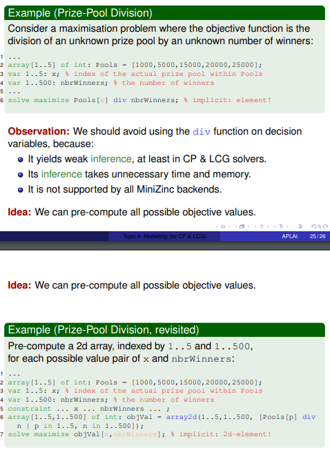

# Advanced Programming Languages for AI


### **Modelling Concepts**

- **Decision variables (also just variable)** are implicitly existentially quantified: the aim is to find satisfying (optimal) values in their domains.
- **Domain** of a variable x, usually denoted by dom(x), is the set of values that x can take.
- **Variable expression** takes a value that depends on the value of one or more decision variables.
- **Parameter** has a value from a problem description
- **Constraint** is a restriction on the values that its variables can take conjointly; equivalently, it is a Boolean-valued variable expression that must be true
- **Objective function** is a numeric variable expression whose value is to be minimized or maximized.
- **Consistency:** refers to the property of a constraint being satisfied by the current variable assignments. It ensures that the constraints are not violated and that the model is in a valid state.


**Types available in Minizinc:**

- ```int:``` integer
- ```bool:``` boolean
- ```enum:``` enumeration
- ```float:``` floating-point number
- ```string:``` string
- ```set of T:``` set of elements of type T 
- ```array[P] of T:``` possibly multidimensional array of elements of type T, which is not an array.


**Constraint predicates** are predicates that already exist such as ```all_different(), count,etc... ``` . They also go by the name, **global-constraint predicates**.


- **all_different(A)** holds iff all elements of A take different values
- **nvalue(m,A)** holds iff all elements of A take m different values
- **global_cardinality(vars,values,card)** hold iff vars contains all the elements of values with the corresponding amounts in card.
- **circuit(s)**: holds iff the arcs $v \rightarrow S[v]$ form a **Hamiltonian circuit**: each vertex is visited exactly once.
- **subcircuit(s)** holds iff circuit($S$') for exactly one possibly empty but non-singleton subarray $S'$ of $S$, and $S[v]=v$ for all the other vertices. 
- **lex_lesseq(A,B)** holds iff A is lexicographically at most equal to B


### **Viewpoints**

A viewpoint is a choice of decision variables

- This choice has a big impact on the way the constraints are/can be formulated
- Good practice: investigate alternatives and try to formulate the constraints
- Can have an impact on performance and readability


#### **Permutation problem**

In a permutation problem, we have as many values as decision variables and each variable takes an unique value. This <X,D> with X the set of decision variables and D the domain of decision variables such that X and D have the same number of elements, say n. If we then switch the role of values and variables: <D,X> is also a viewpoint

**Example**

In a tournament scheduling: find a permutation of the games to fit into the timeslots, or find a permutation of the timeslots to fit into the games.


### Implied constraints

An implied constraint, also called a redundant constraint, is a constraint that logically follows from other constraints.

**Benefit:**

- Solving may be faster, without losing any solutions


### Redundant decision variables

A redundant decision variable is a decision variable that represents information that is already represented by some other decision variables. It reflects a different viewpoint.

**Benefit:**

- Easier modelling of some constraints or faster solving, or both


### Channelling constraint

A channelling constraint establishes the coherence of the values of mutually redundant decision variables.

Channeling constraints in MiniZinc are used to establish a relationship or correspondence between variables from different domains or collections. They ensure that the values assigned to one set of variables are consistent with the values assigned to another set of variables. The code below is an example of channeling constraint
```
int: n;
array[1..n] of var 1..n: A;
array[1..n] of var 1..n: B;

constraint forall(i in 1..n) (
    A[i] = B[i]
);
```

The channeling constraint here ensures that each element in 'A' is equal to the corresponding element in 'B'.


#### Global inverse constraint

An **inverse(f,invf)** constraint on two arrays of int variables holds off f and invf represent inverse functions.


### Pre-computation

Some problems are solved more efficiently if we pre-compute all possible objective values.



### Symmetry

Symmetry refers to the existence of redundant or equivalent solutions in a constraint satisfaction problem. Symmetry occurs when multiple solutions to a problem are essentially the same, except for some permutation or rearrangement of values or variables


**Full symmetry:** any permutation preserves solutions. The full symmetry group $S_n$ has $n!$ symmetries over a sequence of $n$ elements. So full symmetry refers to a situation where multiple solutions of a problem are essentially the same but with different permutations or assignments of values to variables.

**Partial symmetry:** any piecewise permutation preserves solutions. This often occurs in instances. partial symmetry refers to a situation where only a subset of the variables or values in a problem exhibit symmetry.

**Index symmetry:** any permutation of slices of an array of decision variables preserves solutions.

**Conditional or dynamic symmetry:** a symmetry that appears while solving a problem. 

#### Symmetry Breaking

While solving, keep ideally one member per symmetry class, as this may make a problem "less intractable"

We can do this by:

- **Symmetry breaking by reformulation**: The elimination of symmetries detectable in model
- **Static symmetry breaking (SSB)**: the elimination of symmetric solutions by constraints
- **Dynamic symmetry breaking**: the elimination of symmetric solutions by search, this is beyond the scope of this topic

### Propagator

A propagator for a predicate $\gamma$, removes from the current domains of the variables of a $\gamma$-constraint the values that cannot be part of a solution to that constraint.

- **Domain-consistency propagator** deletes all impossible values from the domains
- **Bounds-consistency propagator** only deletes all impossible min and max values from the domains

So in human language, a propagator helps guide the search process by enforcing constraints and pruning inconsistent values, leading to efficient and effective problem solving.


Each CP solver and LCG solver has a default propagator for each available constraint predicate. It is possible to override the defaults with annotations:

- `::domain ` asks for a domain-consistency propagator
- `::bounds` asks for a bounds-consistency propagator


### Variable selection strategy

The variable selection strategy has an impact on the size of the search tree, especially of the constraints are processed with propagation at every node of the search tree or if the whole search tree is explored.

**First-fail principle**

To succeed: first try where you are most likely to fail.

In practice:

- Select a variable with the smallest current domain
- Select a variable involved in the largest #constraints
- Select a variable recently causing the most backtracks


**Best-first principle**

First try a domain part that is most likely, if not guaranteed, to have values that lead to solutions. This may be like how one would make the greedy choice in a greedy algorithm for the problem at hand.


### Extended search

```minizinc
solve::int_search( <variables>, <varchoice>, <constrainchoice>)
```

You might have seen the above a few item but aren't quite sure what it means. Here you can find an extensive explanation.

First of all we can use all kinds of search

- `int_search(<variables>,<varchoice>,<constrainchoice>)` where variables is a one dimensional array of `var int`.
- `bool_search(<variables>,<varchoice>,<constrainchoice>)`where variables is a one dimension array of `var bool`
- `set_search(<variables>,<varchoice>,<constrainchoice>)` where variables is one dimensional array of `var set of int`
- `float_search(<variables>,<precision>,<varchoice>,<constrainchoice>)` where variables is one dimensional array of `var float`.

The `varchoice` we have mentioned has the following options

- `input_order`: choose in order from the array
- `first_fail`: choose the variable with the smallest domain size
- `smallest`: choose the variable with the smallest value in its domain

The `constrainchoice` has the following options

- `indomain_min`: assign the variable its smallest domain value
- `indomain_median`: assign the variable its median domain value
- `indomain_random`: assign the variable a random value from its domain
- `indomain_split`: bisect the variables domain excluding the upper half

Since we ofcourse are using an older version of minizinc, we have to add another variable which is the search strategy. The only one we have is `complete` so just always add that one.