# Artificial neural nets and deep learning

## Lecture 2 **Multilayer feedforward networks and backpropagation**

### 2.1 Multilayer perceptrons

#### 2.1.1 Biological neurons and McCulloch-Pitts model

A simple and popular model for biological neurons is the McCulloch-Pitts model. Be aware that this is a strong mathematical abstraction of reality.

The neuron is modelled as a simple nonlinear element which takes a weighted sum of incoming signals. Biologically this corresponds to the firing of a neuron depending on gathered information of incoming signals that exceeds a certain threshhold value.

#### 2.1.2 Multilayer perceptrons

A single neuron is not very powerful. However, if organized into a layered network, you get a model that is able to approximate general continuous nonlinear functions. Such a network has one or more hidden layers and an output layer. A **multilayer perceptron (MLP)** with one hidden layer can be seen below.

Depending on the application we can choose the linear activation function. A linear activation function is a function that calculates the weighted sum of the input values and returns the same sum as output. Below you can see some non-linear activation functions.

#### 2.1.3 Radial basis function networks (RBF networks)

Radial basis function networks are a type of artificial neural network that use radial basis functions as **activation functions**. The radial basis functions used in RBF networks are typically Gaussian functions or other functions that have a peak at a particular points in space and decrease with distance from that point. RBF networks are particularly well-suited for problems where the data has a high degree of non-linearity, such as function approximation and pattern recognition.

### 2.2 Universal approximation theorems

#### 2.2.1 Neural nets are universal approximators

Don't know if the next part is important but I'm gonna try to explain it anyway.

**Kolmogorov's theorem,** also known as the universal approximation theorem. It states that a feedforward neural network with a single hidden layer and a finite number of neurons can approximate any continuous function.

A **feedforward neural network** is a type of artificial neural network in which the information only flows in one direction, from the input layer to the output layer without any loops or feedback connections. Each neuron in a feedforward neural network is connected to all neurons in the previous layer, and each connection is associated with a weight that determines the strength of the connection.

**Sprecher Theorem:** :upside_down_face: 

**Leshno Theorem:** A standard multilayer feedforward NN with logically bounded piece

#### 2.2.2 The curse of dimensionality

Neural networks avoid the curse of dimensionality in the sense that the approximation error becomes independent from the dimension of the input space, which is not the case for **polynomial expansions**.

Now what are polynomial expansions?

Polynomial expansion is a technique used to represent a nonlinear function as a linear combination of polynomial terms. For example, if we have a two-dimensional feature vector (x,y), we can create new features such as $x^2, y^2$ and $xy$ and use these as inputs to a linear model. The advantage of this is that it allows to model complex, nonlinear relationships between the input features and the output variable using a linear model. Unfortunately the number of features can grow rapidly with the degree of polynomial, which can lead to overfitting and computational challenges.

### 2.3 Backpropagation training

**Backpropagation algorithm**

The backpropagation algorithm used for training multi-layer networks. It is a supervised learning algorithm that is used to adjust the weights and biases of the network so that the network can learn to map inputs to outputs.

1. **Initialization:** Assign random weights to all the connections in the neural network.
2. **Forward pass:** Take an input sample and calculate the output of each neuron in the network by propagating the input through the network using the current weights.
3. **Calculate the error:** Compare the output of the neural network with the desired output and calculate the error.
4. **Backward pass:** Propagate the error back through the network, starting at the output layer and moving backwards towards the input layer. For each neuron, calculate the error contribution of its output and adjust its weights proportionally.
5. **Update the weights:** Adjust the weights of each connection in the network based on the error contribution calculated in the previous step, using a learning rate to control the size of the weight update.
6. **Repeat steps 2-5** for multiple input samples, adjusting the weights after each iteration, until the error is minimized to an acceptable level or a maximum number of iterations is reached.

Very computationally heavy.

**On-line** learning backpropagation: adapt weights each time after presenting a new pattern.

**Off-line** learning backpropagation: adapt weights after presenting all the training patters to the network.

#### 2.3.1 Generalized delta rule

### 2.4 Single neuron case: perceptron algorithm

belangrijk?

### 2.5 Linear versus non-linear separability

The perceptron has serious limitations. A simple example is the XOR gate, the perceptron is unable to find a decision line which correctly separates the two classes for this problem. By adding a hidden layer the XOR problem can be solved because nonlinear decision boundaries can be realized.

By means of a hidden layer one can realize convex regions, and furthermore by means of two hidden layers non-connected and non-convex regions can be realized. The universal approximation ability of neural networks makes it also a powerful tool in order to solve classification problems.

For ***N*** points there are 2^N^ possible dichotomies.

From perceptron to multilayer perceptron (MLP) classifier:

One neuron (perceptron): Linear **separation**

One hidden layer: Realization of **convex regions**

Two hidden layers: Realization of **non-convex regions**

**A convex region** is region where any two points within the region can be connected by a line segment that lies entirely within the region.

**Cover's theorem:** If a set of points is not linearly separable in the original space, it may be linearly separable in a higher dimensional space. i.e. if a problem is not solvable by a linear decision boundary in the original space, it might be solvable by a linear decision boundary in a higher dimensional space.

### 2.6 Multilayer perceptron classifiers

**Classification problems**

Popular approach: Solve classification problem as a regression problem with class labels as targets.

## Lecture 3 Training of feedforward neural networks

### 3.1 Learning and optimization

#### 3.1.1 From steepest descent to Newton method

In neural network training, the goal is to minimize a cost function that measures the difference between the network's output and the actual outputs. This is done using an optimization algorithm, which adjusts the network's weight iteratively to reduce the cost function. A cost function is a function that tells us how far off our predictions are from the actual values.

The **steepest descent algorithm (gradient descent)**  is a simple and widely used optimization method. It updates the weights in the direction of the negative gradient of the cost function. Unfortunately, it can be slow and inefficient for high-dimensional problems as it may require many iterations to converge to a minimum. To fix this we use more advanced methods such as **conjugate gradient** and **quasi-Newton**.

**Newton's** method is a powerful optimization method that uses second-order information about the cost function to find the minimum more quickly. It uses the cost function locally as a quadratic function and uses this to compute the direction and step-size for the weights updates. However this can be computationally expensive as this requires the inversion of the Hessian matrix, which can be large and dense in high-dimensional problems.

[Help]: https://www.youtube.com/watch?v=i62czvwDlsw

A **Hessian matrix** is a tool used in optimization to help understand how a function changes in different directions. It's like a table of numbers that tells you how quickly the function is changing. By analyzing the properties of the matrix you can determine whether a function has a maximum or minimum value.

#### 3.1.2 Levenberg-Marquardt method

The Levenberg-Marquardt algorithm is again a method for training neural networks by minimizing the difference between the predicted outputs and the actual outputs of the training data. The algorithm starts by computing the **Jacobian** matrix, which is a **matrix of partial derivatives** of the outputs. The matrix is used to calculate the gradient of the error which gives the direction of steepest descent for the error.

A **damping factor** is also applied to the gradient to balance the trade-off between fast convergence and stability. The algorithm then uses the damped gradient to update the weights of the neural network. The learning rate of this algorithm is not fixed like in previous methods. The learning rate is adjusted **dynamically** based on the **curvature of the error surface**. This allows the algorithm to converge faster while **avoiding overshooting** the optimal solution.

This method combines the benefits of gradient descent and Gauss-Newton methods.

#### 3.1.3 Quasi-Newton methods

Quasi-Newton methods are a class of optimization algorithms that approximate the Hessian matrix without computing its exact values. An example of such a method is the **Broyden-Fletcher-Goldfarb-Shanno (BFGS) algorithm**.

The **BFGS** algorithm maintains an approximation of the inverse Hessian matrix. Compared to the steepest descent and newton methods, the algorithm is more efficient and can converge faster. It has the advantage of avoiding the need to compute the exact Hessian matrix which is computationally expensive and difficult to compute.

We can improve on the **BFGS** by avoiding the direct inversion of the Hessian matrix by using the **Davidon-Fletcher-Powell formula**. This will result into a superlinear speed of convergence.

### 3.2 Methods for large scale problems 

The previous are all good and dandy for small optimization problems they quickly become infeasible on large scale problems. That is why they developed methods more suitable for solving large scale optimization problems.

One such method is the **conjugate gradient (CG)** method. It reduces the number of iterations required to converge by maintaining a set of conjugate search directions that are orthogonal to each other and have no information overlap. In each iteration the method selects a new direction that is a linear combination of the conjugate search directions and performs a line search to find the minimum along that direction. The step size is chosen such that the new direction remains conjugate to the previous directions.

Another method is the **limited memory BFGS method**. which is a method we previously mentioned but uses a limited amount of memory to approximate the Hessian matrix.

### 3.3 Overfitting problem

The overfitting problem we all know is especially severe in neural networks because they have many degrees of freedom, which makes it easy to memorize the training data instead of learning the underlying patterns.

We can use some techniques to prevent overfitting such as **regularization** or **ridge regression, cross validation and early stopping.** 

**Ridge regression** is a regularization technique used to prevent overfitting in linear regression models. It adds a penalty term to the cost function that shrinks the coefficients towards zero, which reduces the variance of the estimates and improves the model's generalization performance. The strength of the penalty is controlled by a hyperparameter called the regularization parameter, which can be tuned using cross-validation. 

[tutorial](https://www.youtube.com/watch?v=OEU22e20tWw)

### 3.4 Regularization and early stopping

#### 3.4.1 Regularization

This is a technique to prevent overfitting by adding a penalty term to the loss function during training in order to prevent the model from fitting the training data too closely and overfitting. By including this penalty term, the model is encouraged to generalize better to new, unseen data.

#### 3.4.2 Early stopping and validation set

Early stopping is another technique used to prevent overfitting in which the training of the neural network is stopped before it reach the global minimum of the cost function. The idea is to monitor the performance of the network on a validation set during training and to stop the training process when the validation error starts to increase.

#### **Effective number of parameters**

The effective number of parameters is a way to quantify the complexity of a model while taking into account the impact of regularization. Essentially, it measures the number of parameters that the model is actually able to learn from the data, rather than the total number of parameters in the model.

In a neural network, the effective number of parameters is often calculated using the concept of weight decay, which is common form of regularization. Weight decay involves adding a penalty term to the loss function that encourages the weights of the model to be smaller. 

## Lecture 4 Generalization

### 4.1 Interpretation of network outputs

I don't know what the point is of his random formulas under this title, they seem to barely hold any connection to the title.

### 4.2 Bias and variance

**Bias** refers to the difference between the expected prediction of a model and the true value that the model is trying to predict.

**Variance** refers to the amount by which the prediction of the model would change if the same model were trained on different subsets of the data.

The **bias-variance tradeoff** is an important concept in machine learning because it helps to explain the generalization error of a model. Models with high bias tend to underfit the data, meaning they are not complex enough to capture the underlying patters in the data, meaning they are too complex and capture the noise in the data as well as the underlying patterns.

That's why it important to choose an appropriate model complexity that matches the the underlying patterns in the data.

**Least squares regression** is a linear regression technique used to train neural networks by minimizing the sum of squared differences between the actual output and the predicted output. We do this by finding the weight and bias values that minimize the sum of the squared differences between the network's predicted output and the actual output for a given set of input data.

#### 4.2.1 Cross-validation

**Cross-validation** is a technique to evaluate the performance of a machine learning model. To explain this we first need to explain what validation is. Validation is splitting the available data into training and testing sets. The training set is used to train the model, while the testing set is used to evaluate its performance.

The problem lies in using only one training and testing split is that it may result in over- or underfitting. **Cross-validation** helps to address this issues by using multiple training/testing splits to evaluate the model's performance. The results are averaged to get a more accurate estimate of the model's performance.

### 4.3 Complexity criteria

Complexity criteria refers to the methods used to determine the optimal level of model complexity or size, in order to balance the tradeoff between model accuracy and model generalization. A complex model with too many parameters may fit the training data very well, but it may not generalize well to new, unseen data, leading to overfitting. Some common complexity criteria used in neural nets include:

- Early stopping
- Regularization
- Bayesian methods
- Information criteria

### 4.4 Pruning

In order to improve the generalization performance of the trained models one can remove interconnection weights that are irrelevant. This is called *pruning*. We will discuss 3 methods called, **Optimal brain damage, Optimal brain surgeon and Weight elimination**.

##### **Optimal Brain Damage (OBD):**

The optimal brain damage algorithm is a pruning technique used to reduce the complexity of a neural network by removing connections that have a small contribution to the network's overall performance.

It works like this

1. Train the neural network until some **stopping criterion** is satisfied
2. Compute the **saliencies** (The importance of certain weights in a neural network)
3. Sort weights by **saliency** and delete low-saliency weights
4. Go to 1 and repeat until some overall stopping criterion is reached.

The OBD algorithm is a more aggressive pruning algorithm than the **Optimal Brain Surgeon (OBS) algorithm**, which only prunes individual weights. The OBD algorithm can remove entire neurons or even entire layers from the network. This makes it more effective at reducing the complexity of the network, but it also requires more computational resources and can be more prone to overfitting.

##### **Optimal Brain Surgeon (OBS):**

As the brain damage algorithm before it is a pruning algorithm that removes unnecessary connections in a neural network.

1. Train the neural network to a **minimum** of the error function
2. Evaluate the inverse Hessian H^-1^
3. Check the impact of removing each neuron on the error and set the weights of the neuron with the **smallest impact **to 0.
4. Update the remaining weights using the inverse Hessian and the error

The performance of this algorithm is better than **optimal brain damage**

##### Weight elimination

TODO?

### 4.5 Committee networks and combining models

In this part we will introduce the concept of using multiple models to improve the overall performance of a system.

A common approach is to train several models and select the best individual model but one might be able to improve the results by forming a committee of networks and combining the models. It turns out that the performance of the committee network can be better than the performance of the best single network. One can take a simple **averaged committee network** or a **weighted average committee network**.

**Disadvantages:**

1. Many training efforts are wasted
2. Generalization on the validation set has a random component due to noise on the data.

$\newcommand{\H}{\mathfrak{H}}$

## Lecture 5 Bayesian learning of neural networks

### Bayes theorem

- Events $A,B$

- Model assumption $H$
- Bayes Theorem: $P(B|A,H)=\frac{P(A|B,H)P(B|H)}{P(A|H)}$

Bayes' theorem can be used to determine the most likely model given a set of data. This approach involves computing the posterior distribution of the model parameters, given the observed data and some prior knowledge about the parameters.

### Occam's razor principle

Occam's razor states that the simplest solution is the most preferred, in the context of neural networks this would mean that we prefer the simplest model. This is a useful principle because it helps to avoid overfitting. By selecting a simpler network architecture, one can avoid overfitting and improve the generalization ability of the model.

### Regression using a multilayer perceptron

The neural network is trained using input data and target data, and the neural network model is represented by interconnected weights. The objective is to minimize the training error while keeping the weights small, which is achieved through an objective function that combines the data error and a weight decay term.

### Parameters and hyperparameters

### Levels of inference

### Prior, posterior, likelihood, evidence

### Error bars and predictions

### Automatic relevance determination

### Other method: variational inference for neural networks.

## Lecture 6 Recurrent neural networks

For a small introduction [Introduction](https://www.youtube.com/watch?v=piF6D6CQxUw)

### Feedforward versus recurrent networks

A feedforward neural network is a static system

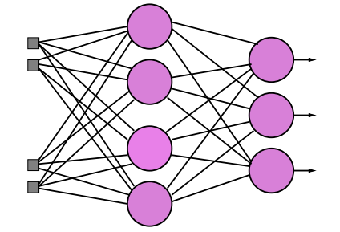

A recurrent neural network is a dynamical system with feedback connections. Meaning that once you use feedback connections as can be seen below you create a dynamical system.

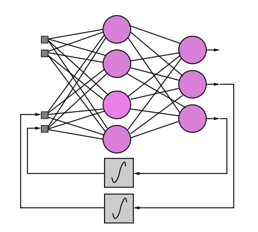

### Associative memories

What is said here is based on the fact that you have seen the video given at the start of this chapter.

Associative memory is a type of memory that stores and recalls information based on associations between patterns or features. In other, words, given a pattern as input, an associative memory can retrieve the associated pattern that was previously stored in the memory.

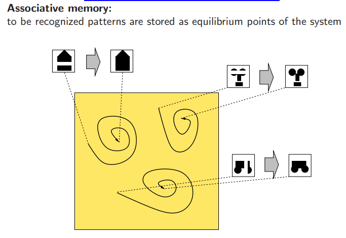

As said in the image above, patterns are stored as equilibrium points or stables states of the system. Meaning that given some input it will return to one of these states and stay that way.

#### Model

Since this associative memory is based on the weights of the connections between neurons and we pass a signal from neuron to neuron, we can clearly see that time plays a big part in this because as the time passes neurons will send signals to other neurons and these neurons will then be updated. The question now is how will this updating of the neurons be done. We have 2 options.

1. **Synchronously**: Like in a computer there is a central clock that updates all neurons simultaneously 
2. **Asychronously:** At each t, select a unit (neuron and typically at random) and apply the equation below to that unit.
   - $S_i(t+1)=sign(\sum^N_{j=1}w_{ij}S_j(t)), i = 1, ..., N$ with $N$ neurons
     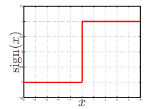

#### **Storing a pattern**

Storing a pattern in an associative memory model involves creating an **association** between a set of input patterns and set of output patterns. This association is often represented as a **weight matrix**, which is a set of numbers that represents the strength of the connections between input and output patterns.

When we add a new pattern for the memory to learn, the weights of the connections will be adjusted to allow it to become an **equilibrium** state of the memory. The output pattern will be the pattern that is most strongly associated with the input pattern.

The only learning rule for this that we barely saw in the slides is the **Hebbian learning rule**. I'll give a short overview. The Hebbian learning rule is based on the idea that "**neurons that fire together, wire together**". Specifically, the learning rule states that the weight between two neurons should be increased if both neurons are active at the same time and decreased if one neuron is active while the other is not. First we present the input pattern to the network and compute the output pattern. We then adjust the weight matrix according to the Hebbian learning rule so that the output pattern is associated with the input pattern.

#### Storage capacity

The storage capacity of associative memory is dependent on the specific type of associative memory being used but in general, the storage capacity of associative memories is limited by the ability to retrieve stored information **without errors**, and by the potential for interference between stored patterns. The means that as the number of stored patterns increases, the chances of overlapping patterns also increase, which can result in false associations.

#### Energy function

The energy function in associative memory represents the **total energy of the network**, which is minimized when the network reaches a stable state or a memory is retrieved. The energy function for the system **always decreases or remains constant** as the system evolves according to the dynamical rule. The memorized patterns are a local minima of the energy surface.

During the learning phase, the weights and biases of the network are adjusted to minimize the energy for the training patterns. During recall or retrieval, the network is initialized with a noisy or incomplete pattern, and the network dynamics converge to a stable state that corresponds to the closest stored pattern.

#### Spurious state

One of the problems we face with associative memory is that when we store a set of patterns, unfortunately additional unwanted patterns are also stored. These unwanted sorted patterns are called spurious states. They can be a problem because they can interfere with the retrieval of the stored patterns, causing the network to converge to an incorrect pattern or become stuck in a cycle of switching between different patterns.

### Hopfield networks

Hopfield networks are a type of recurrent artificial neural network that can be used for pattern recognition etc... They consists of neurons that are interconnected with each other in a symmetric^1^ manner, and their **activation levels** are updated based on an energy function. Hopfield networks are based on **associative memory** so they have the ability to converge to **stables states** that represent stored patterns, and can this also perform pattern completion by retrieving stored patterns from **partial or noisy input**.

(1) Symmetry here means that the weights between units are symmetric, meaning that if unit $i$ is connected unit $j$ with a weight, then unit $j$ is also connected to unit $i$ with the same weight.

#### Continuous-valued Units

Continuous-valued units refer to the type of neurons used in the network that can take on a range of continuous values rather than just binary values. These units are also known as analog neurons or graded reponse neurons.

#### Properties of a Hopfield network

- Should be symmetric (seen before)
- Energy function should stay the same or decrease during the working of the network.
- **TODO** add other properties?

#### Travelling Salesman Problem (TSP): Hopfield network

To solve TSP using a Hopfield network, we first need to define the energy function. In the case of TSP, the energy function is defined as the sum of the distances between adjacent cities along the route, where the route must visit every city exactly once.

We can then use the hopfield network to minimize this energy function by iteratively updating the network's neurons until it reaches a stable state, which corresponds to the shortest possible route that visits all cities.

### Cellular neural networks (CNN)

Cellular neural networks are similar to neural networks with the biggest difference between them that communication is only allowed between neighbouring units. Their structures allows for parallel processing and fast computation.

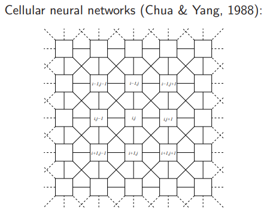

#### Connectivity

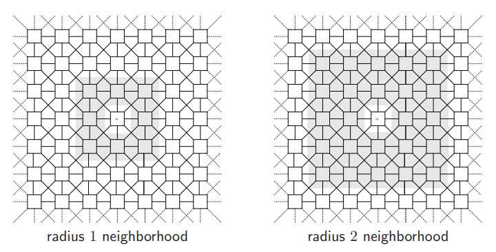

**TODO** explain this, prolly something with the radius.

### Gene networks

Gene networks are a type of neural network that models the interactions between genes and gene products. They are used to understand how genes and their products work together to regulate biological processes.

## Lecture 7 Unsupervised Learning

### 4.1 Dimensionality reduction and nonlinear PCA

Dimensionality reduction is very important because it reduces the number of variables or features in a dataset while retaining most of its relevant information. This is useful for many reasons, including reducing the computation cost of processing the data, improving the interpretability of the data, and avoiding the curse of dimensionality.

A well known method for reducing linear dimensionality is **principal component analysis (PCA).** **PCA** finds the most important patterns in a data set and transforms the data into a new set of variables, called principal components, that capture the essence of the original data.

**Nonlinear PCA (NLPCA)** is then introduced as an extension of **PCA** that can capture nonlinear relationships between the features.

### 4.2 Cluster algorithms

Cluster algorithms are an important class of unsupervised learning methods that aim to group data points based on their proximity to each other using a distance measure. **PCA** that we saw previously may not be bale to detect lower dimensionality in some cases, as adding noise can increase the dimensionality of the data. The **K-means** algorithm is a well-known cluster algorithm that we saw in another course.

### 4.3 Vector quantization

Vector quantization is a method related to clustering. It is a technique where a large set of data points is represented by a smaller set of prototype vectors. The goal is to find these prototype vectors that can best represent the original data points with the least amount of error or distortion.  This technique is often used in image and speech processing, as well as in clustering and pattern recognition algorithms. Essentially, vector quantization involves dividing a dataset into regions and representing each region by a prototype vector.

### 4.4 Self-organizing maps

**Self-organizing maps (SOMs)**, a type of unsupervised learning that aims to represent high-dimensional data on a low-dimensional map while preserving the most important relationships between the data points. **SOMs** use the vector quantization we saw earlier to represent the underlying density of the input data by means of prototype vectors and at the same time project the high dimensional data to a map of neurons. TODO

## Lecture 8 Nonlinear modelling

### Time-series prediction

Neural networks can be used for time-series prediction using a multi-layer perceptron with one hidden layer. The objective is to minimize the training error using backpropagation or other optimization techniques. A few model selection issues:

- number of lags $p$
- number of hidden nodes
- choice of the regularization constant

A validation can be used, one partitions the data then in a training, validation and test set part. A more sophisticated method would be the 10-fold cross-validation. Also avoid overfitting.

### System identification

System identification is the process of building a mathematical model of a physical system using input-output data. In the context of artificial neural networks, system identification involves training a neural network on input-output data in order to learn a model of the system that generated the data. As you can see below, we use the input and output of the system to train a model.

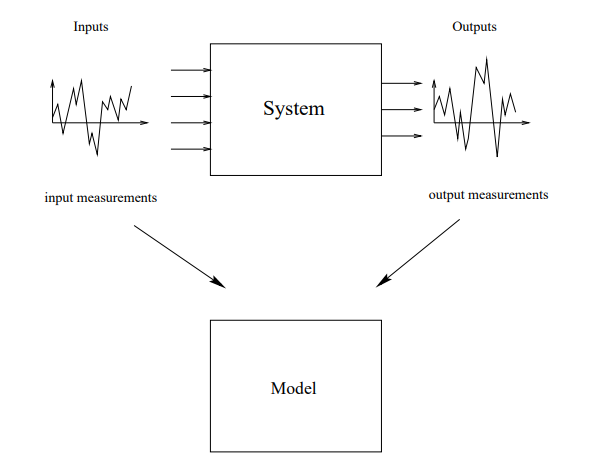

The process of system identification using neural networks involves choosing an appropriate network architecture, selecting appropriate input-output data, and training the network using an appropriate algorithm.

**3 different kinds of models:**

1. **White box models**
   - The model equations are obtained by applying physical laws. The model parameters that ones estimates have a physical meaning.
2. **Black box models**
   - The aim is to obtain a predictive model that is able to establish the relation between inputs and outputs of the system
3. **Grey box models**
   - Contains aspects of both white box and black box models (e.g. one relies on a physical model and one only represents an unknown nonlinear part in a black-box way)

**TODO** finish the rest

### Dynamic backpropagation

**Dynamic backpropagation** is modification of the standard backpropagation algorithm, which takes into account the time dependency of the data. It works by propagation the error derivatives **back in time through the network**, which allows the network to learn the **temporal dependencies** in the data.  Although it can be computationally intensive and may require more training data than standard backpropagation, The benefits in capturing the temporal dependencies in the data can outweigh these drawbacks.

### Long short-term memory (LSTM)

LSTM is a type of recurrent neural network (RNN) architecture that is designed to handle the issue of vanishing gradients in traditional RNNs. LSTM networks consists of **memory cells** that can store information for long periods of time and three types of gates **(input gate, forget gate and output gate)** that regulate the flow of information into and out of the cells. This allows the network to selectively remember or forget information over time, making it particularly useful for tasks such as **natural language processing and speech recognition**, where long-term dependencies are important.

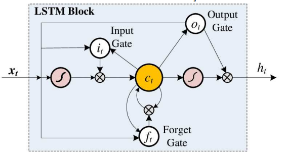

### Neural Control

What we mean by neural control is the application of neural networks in the field of controls systems. Neural networks can be used as **controllers for non-linear systems** by training them with data to accurately predict the desired output given the current input and feedback. 

To do this we introduce the concept of **inverse control**, a neural network is trained to approximate the inverse of a non-linear system. This inverse model can then be used to calculate the control inputs required to achieve a desired output. (Driving a car for example)

**Different approach are possible**

- Mimic an expert by collecting input/output data from the expert (e.g. learning to automatically drive a car (e.g. ALVINN system))
- Model-based control of a system: first estimate a model and then design a neural controller based on the estimated model
- Control a system without making use of a model for the system.

#### ALVINN example

**ALVINN: Autonomous Land Vehicle In a Neural Network**

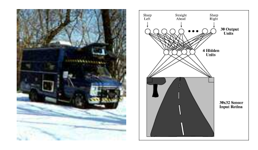

First learning to drive with a driver on-board of the car, then use the neural network instead of the driver for autonomously driving.

#### Inverted pendulum example

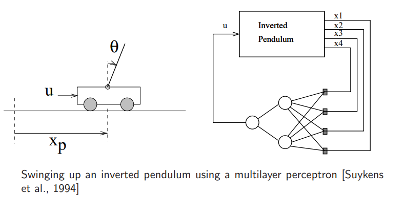

The inverted pendulum is a classical example in control theory, which involves balancing an inverted pendulum in the upright position by applying force to the pivot point. The neural network is trained to control the pendulum in real-time using sensor input. 

Training the neural network involves using a reinforcement learning algorithm, where the network learns by trial and error to find the optimal control policy. The algorithm provides feedback in the form of a reward signal, which is higher for keeping the pendulum balanced for longer periods of time.

#### **Reinforcement learning**

TODO

## Lecture 9  Support vector machines

### 6.1 Motivation

When using neural networks like we previously discussed we want to keep the cost function as low as possible but doing this opens us up to a lot of traps like local minima solution and the problem of choosing the number hidden units. 

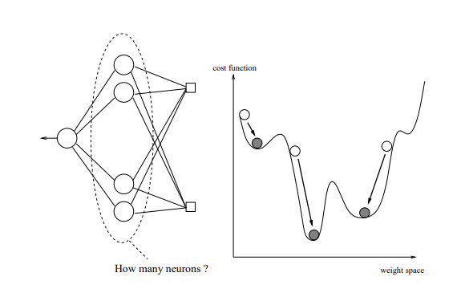

​				*Drawbacks of classical neural networks: (Left) problem of number of hidden units*;
​																					*(Right) existence of many local minima solutions*

**SVMs** which work with kernel-based representations don't have this problem. **SVMs** work well in high-dimensional input spaces and have been successfully applied to many real-life problem.

### 6.2 Maximal margin classifiers and linear SVMs

#### 6.2.1 Margin

In the figure below you can see a separable problem in a two-dimensional feature space. There exist several separating hyperplanes that separate the data. An **SVM** finds one unique separating hyperplane. This is done by maximizing the distance to the nearest points of the two classes. 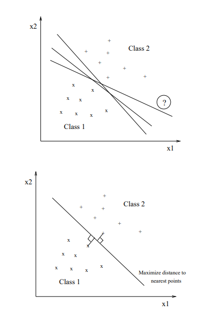

​			*(Top) separable problem where the separating hyperplane is not unique;*
​			*(Bottom) definition of a unique hyperplane which is maximizing the distance to the nearest 				point*

According to Vapnik (the guy from the VC Vapnik-Chervonenkis dimension), one can then do a rescaling of the problem. The scaling is done such that the point closest to the the hyperplane has a distance $1/||w||_2$. The *margin* between the classes is then equal to $2/||w||_2$. Maximizing the margin corresponds then to minimizing $||w||_2$.

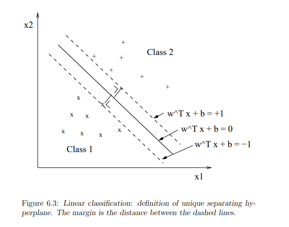

#### 6.2.2 Linear SVM classifier: separable case

The training set is defined as a set of input patterns and output patterns with class labels of either -1 or +1. The SVM classifier is formulated as an optimization problem with constraints that ensure the classifier correctly separates the two classes. The Lagrangian is introduced as a way to solve this optimization problem, with Langrange multipliers serving as support values. A drawback of this approach is that the problem matrix size grows with the number of data points, making it infeasible for large datasets.

#### 6.2.3 Linear SVM classifier: non-separable case

For most real-life problems, when taking a linear classifier, not all the data points of the training set will be correctly classified unless the true underlying problem is perfectly linearly separable.

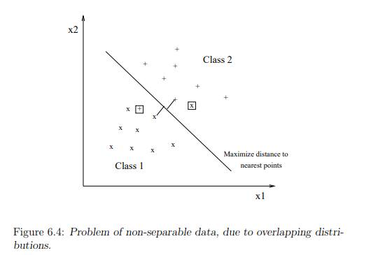

The optimization problem for the non-separable case is formulated as a minimization problem with a hinge loss function that penalizes misclassifications. The optimization problem now also includes a term that controls the degree of misclassification allowed, which is represented by a parameter C. This parameter controls the trade-off between achieving a large margin and tolerating misclassifications. A small value of C allows for more misclassifications but results in a larger margin, while a large value of C results in fewer misclassifications but a smaller margin.

### 6.3 Kernel trick and Mercer condition

Important progress in **SVM** theory has been made thanks to the fact that the linear theory has been extended to nonlinear models. In order to achieve this, one maps the input data into a high dimensional feature space.  This is achieved using the kernel trick, which states that there exists a mapping ϕ and an expansion if and only if the kernel is positive definite. By choosing a kernel function, computations in the huge dimensional feature space can be avoided. The RBF kernel has infinite dimensions while the linear and polynomial kernels have finite dimensions.

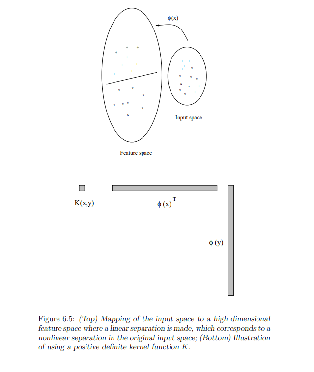

### 6.4 Nonlinear SVM classifiers

The non-linear SVM approach is based on the idea of mapping the input data to a higher dimensional feature space, where a linear decision boundary can be used to separate the classes. However, it is often difficult to find an appropriate mapping function that can accurately capture the underlying structure of the data.

To overcome this problem, we use kernel functions which allow for efficient computation of the dot product in high dimensional feature space without the need for explicit mapping. The most commonly used kernel functions are the **Gaussian radial basis function (RBF)** kernel and the polynomial kernel.

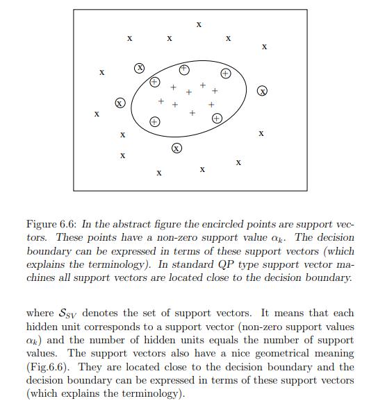

### 6.5 SVMs for function estimation

#### 6.5.1 SVM for linear function estimation

Same thing as we saw before. **SVMs** can be used to find a linear function that approximates the underlying relationship between input and output data. **SVMs** can be used to solve this problem bij finding the optimal hyperplane that maximizes the margin between the positive and negative examples.

#### 6.5.2 SVM for nonlinear function estimation

## Lecture 10 Deep learning: stacked autoencoders and convolutional neural networks

### Motivations for deep learning

There are two reasons for using deep learning

1. It is very similar to the deep architecture in the brain as you can see below. The deeper you go in the brain the more abstract the features become. This is principle is shared with neural networks

   - 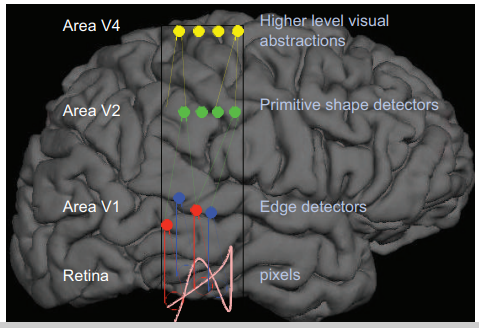

2. The second reason is related to mathematical foundation. Neural networks with one hidden layer are universal approximators but one can't say how many neurons may be needed in that hidden layer.

   - 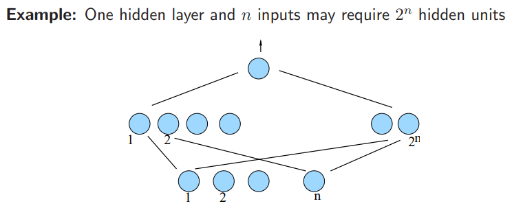
     

   $2^n$ is an astronomically number so in practice we might not be able to create that. Therefore new mathematical theories say we if we added one more hidden layer this amount would be more moderate. So maybe not exponential but rather polynomial. You would need a lot less neurons.

### Autoencoders and sparsity

An autoencoder is a type of neural network that is trained (unsupervised) to reproduce its input data as its output. It consists of two parts: an **encoder** and a **decoder**. The encoder transforms the input data into a compressed representation, with typically a lower dimensionality than the input. So it can be more efficiently used. The decoder attempts to reconstruct the original data from the compressed representation. The difference between the input and output data we call the **reconstruction error**.

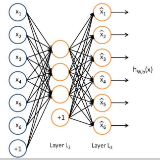

The connections from the layer $L_1$ to $L_2$ is what we call the encoding step. The connections from the layer $L_2$ to $L_3$ is what we call the decoding step. The step in the middle is called the ***information bottleneck*.**

We could strife to make the reconstruction error 0 by doing nothing to the data at all in the encoding step but this is not useful so we need to add some **sparsity**. So we create an **Information bottleneck**. We impose that the middle layers need to have a smaller dimensionality, this is what we call sparsity.

#### Using selected features within a classifier

**Step 1: pre-training phase:**

- Train a sparse autoencoder on the unlabeled data.
- Given a new example $x$, use the hidden layer to extract features $a$.
- Use the extracted features $a$ as new inputs to train a classifier. (ex linear regression)

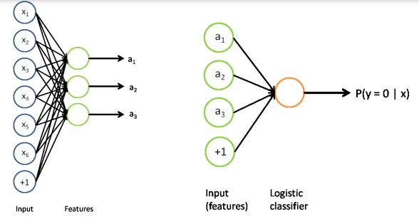

**Step 2: fine-tuning phase:**

- Consider the overall classifier and fine-tune by further supervised training

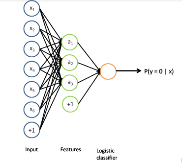

### Deep networks versus shallow networks

**Shallow network:** network consisting of an input, hidden and output layer, where the features are computed using only one layer.

**Deep network:** multiple hidden layers to determine more complex features of the input. It's important to use a nonlinear activation function here (multiple layers of linear functions would compute only a linear function of the input)

#### Deep networks: advantages

- Compactly represent a significantly larger set of functions
- There are functions which a k-layer network can represent compactly, that a (k-1)-layer network cannot represent, unless it has an exponentially large number of hidden units.
- See ppt, might not be useful

#### Deep networks: difficulty of training

- Supervised learning using labeled data by applying gradient descent on deep networks usually does not work well. Too many **bad local minima** occur.
- Gradients becoming very small in deep networks for randomly initialized weights. When using backpropagation to compute the derivatives, the gradients that are backpropagated rapidly decrease in magnitude as the depth of the network increases. We call this **diffusion of gradient problem**.
- Greedy layer-wise training works better

### Stacked autoencoders: greedy layer-wise training

**Example:** Train a stacked autoencoder with 2 hidden layers for classification. When talking about stacked autoencoders we of course mean the fact that we are applying an autoencoder to the data that just came from an autoencoder and so forth. (Can be seen in the image below)

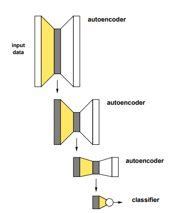

- **Step 1:** Train a sparse^1^ autoencoder on the inputs $x$ to learn primary features $h$ on the input.

  - 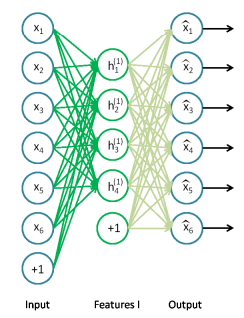

    

    (1) When we talk about a sparse autoencoder we are talking about an autoencoder with an additional constraint. The sparsity constraint encourages the network to learn a small subset of features that are most relevant to the input.

- **Step 2:** Use the primary features as the input to a following sparse autoencoder to learn secondary features $h^{(2)}$ on these primary features

  - 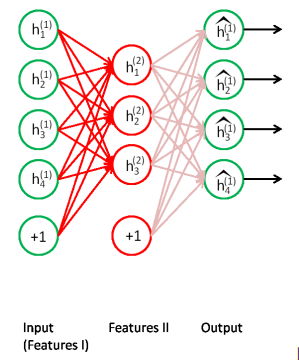

- **Step 3:** Take the secondary features as input to a classifier

  - 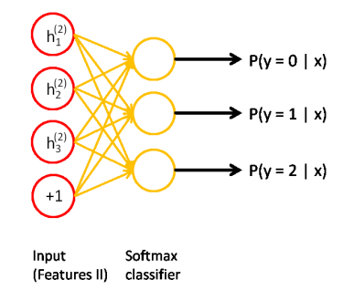

- **Step 4:** Combine all layers together to form a stacked autoencoder with 2 hidden layers and a classifier layer, and apply fine-tuning.

  - 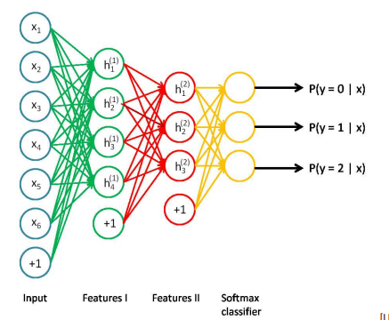

### Convolution neural networks

Convolutional Neural Networks (**CNNs**) are neural nets where the key feature is the use of convolution layers. This means that these layers each apply a set of learnable filters to small portions of the input data, resulting in feature maps that capture local patterns and structures in the data. The output of the convolutional layers is then fed into one or more fully connected layers, which perform the classification or regression task.

**CNN's** also typically incorporate pooling layers, which downsample the feature maps to reduce the computation complexity of the network, as well as activation functions such as **ReLU (Rectified Linear Unit)** that introduce non-linearity into the model.

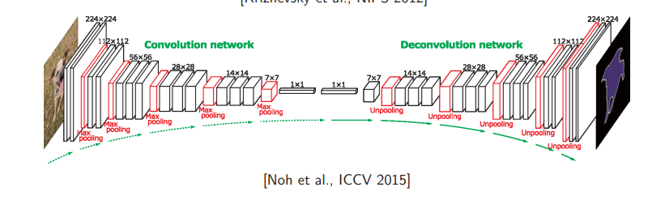

**Convolutional layers:**

Convolution layers apply filter to the input image to extract features, such as edges or patterns. Each filter produces a new feature map, which highlights a specific pattern in the input data. The size of the feature map is smaller than the input data, as the filter moves over the input, pixels are shared and produce smaller outputs.

**Pooling layers:**

Pooling layers downsample the feature maps by reducing their spatial dimensions, while retaining the most important information. This helps to reduce the number of parameters and computation required in the subsequent layers. This is done by taking small sub-regions of the feature map and summarizing their contents into a single value.

#### Limitations of fully connected networks.

- $28 \times 28$ images: Computationally feasible to learn features on the entire image. use of fully connected network is possible.
- $96 \times 96$ images: about $10^4$ inputs. Assuming learning 100 features, then about $10^6$ weights to learn. Need for locally connected networks!

#### Feature extraction using convolution and pooling

Natural images have the property of begin stationary (i.e. statistics of one part of the image are the same as any other part). This suggests that the features that we learn at one part of the image can also be applied to other parts of the image. 

**Example:** Having learned features over small ($8 \times 8$) patches sampled randomly from the larger $96 \times 96$ image, apply then the learned $8 \times 8$ feature detector anywhere in the image.

Take the learned $8 \times 8$ and convolve them with the larger image. **Pooled** convolved features (by max pooling or mean pooling operation over a region of the image) to limit the number of features.

#### Classical method for edge detection

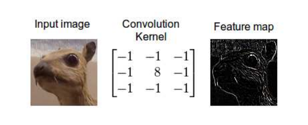

## Lecture 11 Deep generative models

### Boltzmann Machines

A Boltzmann machine is an **unsupervised** DL model in which every node is connected to every other node as can be seen below. This, unlike most other neural nets we have previously seen, is thus undirected. It's important note that our Boltzmann is also stochastic because it uses stochastic processes (e.g. Gibbs sampling) to update the states of the nodes. Training of Boltzmann machines is known to be very difficult.

Boltzmann machines can also be used in **generative** way, meaning that it can be used to generate new data points. This can be useful in image completion and data generation (Shocker)

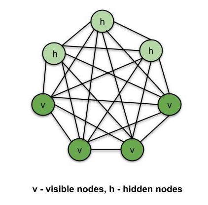

#### Restricted Boltzmann Machines (RBM)

Boltzmann machines can be very useful but because each node is connected to every other node and hence the connections grow **exponentially.** This is why we use **RBMs**. The restrictions in the node connections in **RBMs** are as follows:

- Hidden nodes cannot be connected to one another
- Visible nodes cannot be connected to one another?

If we follow these rules we will see we end up with a **bipartite**^1^ structure that only allows connection between the visible layer and the hidden layer. **RBMs** are used in unsupervised learning tasks such as dimensionality reduction, feature learning and collaborative filtering.

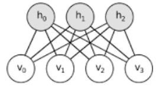

(1) A bipartite graph is a graph where the nodes can be divided into two distinct sets, such that each edge in the graph connections a node from one set to a node in the other set but never between nodes within the same set.

#### Deep Belief Networks (DBN)

In a deep belief networks we are gonna stack several **RBMs** on top each other so that the first RBM outputs are the input to the second RBM and so on. The connections within each layer are undirected (since each layer is an **RBM**). At the same, the connections between the layers are directed except for the top two layers, the connection between those is undirected. As can be seen below.

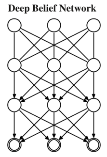

#### Deep Boltzmann Machines (DBM)

Deep Boltzmann machines are again a type of unsupervised deep learning models that are again made of multiple layers of **Restricted Boltzmann Machines**. This allows it to learn more complex hierarchical representations of the data. The difference between **DBMs** and **DBNs** is that the connections between the layers are also undirected in a **DBM**. In these machines, the lower layers represent simple, **low-level features** of the input data, while the higher layers represent more abstract, **high-level features**. The layers are trained on at a time. **DBMs** are used in image recognition, speech recognition and natural language processing.

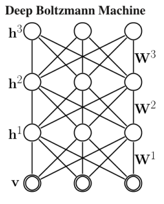

#### Energy Function

Boltzmann machines are stochastic neural networks with an underlying energy-based model. The **energy function** is used to assign an energy value to each **configuration** of the network. The energy function is used to compute the probability of each configuration of the network using a Boltzmann distribution. The higher the energy of a configuration, the less likely it is to occur and the lower the energy, the more likely it is to occur. By minimizing the energy of the system, the Boltzmann machine can learn to generate samples that are **similar** to the training data.

#### Explicit marginalization

Explicit marginalization in restricted Boltzmann machines (RBMs), is the process of summing over the hidden units in order to obtain the **probability** **distribution** of the visible units. This is possible due to the **bipartite** structure of **RBMs**, which ensures that the hidden and visible units are conditionally independent given each other's states. By explicitly marginalizing over the hidden units, one can obtain a tractable expression for the probability distribution of the visible units, which can be used for tasks such as classification and generation.

Simply said, because of the bipartite structure of RBMs we can apply marginalization and find the probability distribution of the visible units.

#### Multimodal Deep Boltzmann Machine (mDBM)

Multimodal deep Boltzmann machine is another variant of the boltzmann machine that can model multiple modalities of data, such as images and text. mDBMs can learn joint probability distributions over multiple modalities by integrating information from each modality.

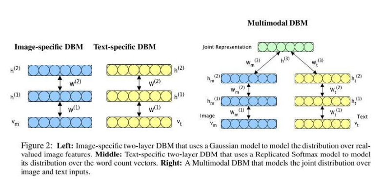

#### Wasserstein training of RBM

Wasserstein training is a training approach that uses the **Wasserstein distance** as a way to measure the distance between probability distributions. We use the method to to train RBMs to learn complex probability distributions over high-dimensional data, such as images. During the training, the RBM is trained to minimize the distance between the model distribution and the true distribution of the data. 

### Generative Adversarial Network (GAN)

A generative adversarial network is a type of neural network that is designed to generate new data samples that are similar to a given dataset. **GANs** consist of two main components: a generator network and discriminator network.

**Generator network**

The generator network takes in random noise as input and generates new data samples that are similar to the training data. 

**Discriminator network**

The discriminator network takes in both real and generated data samples and tries to label these fake or real.

The two networks are trained together in a game-like process where the generator tries to generate more realistic data to fool the discriminator, while the discriminator tries to correctly classify the real and generated data.

#### Deep convolutional GAN (DCGAN)

A deep convolutional GAN is a type of GAN that uses **convolutional neural networks (CNNs)** to generate realistic images. In this case, the generator network is a **CNN** that takes in random noise as input and outputs a synthetic image. The discriminator network is also a CNN that takes in an image and outputs a probability score indicating whether the image is real or synthetic.
