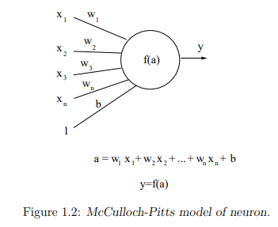
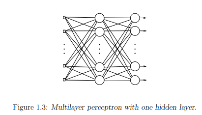
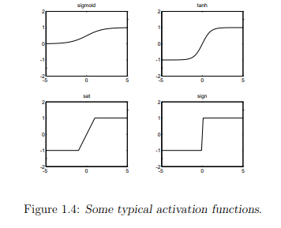
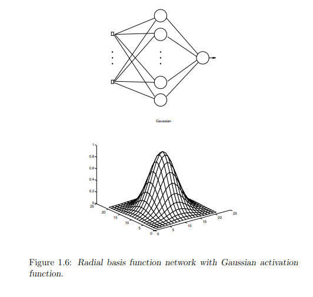
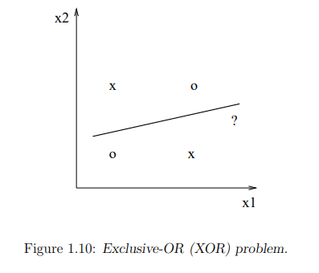
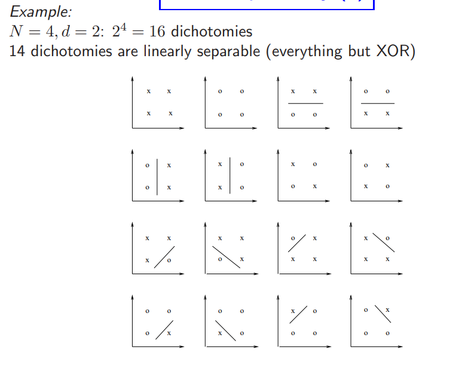
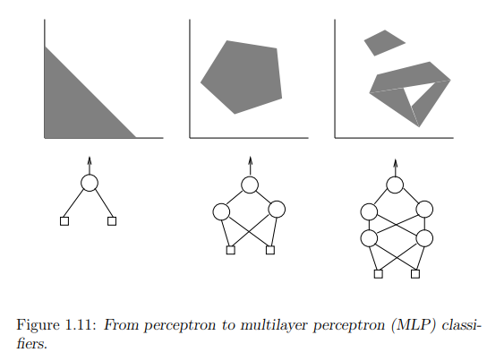
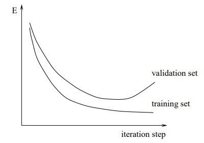
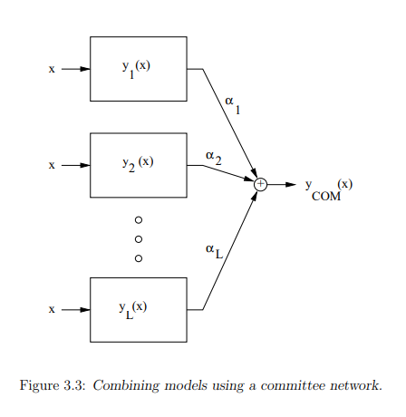
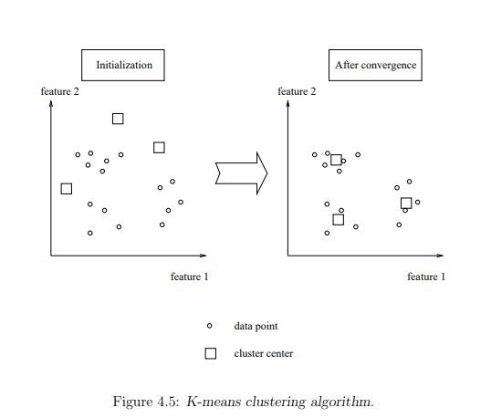

# Artificial neural nets and deep learning

## Chapter 1 **Multilayer feedforward networks and backpropagation**

### 1.1 Multilayer perceptrons

#### 1.1.1 Biological neurons and McCulloch-Pitts model

A simple and popular model for biological neurons is the McCulloch-Pitts model. Be aware that this is a strong mathematical abstraction of reality.

The neuron is modelled as a simple nonlinear element which takes a weighted sum of incoming signals. Biologically this corresponds to the firing of a neuron depending on gathered information of incoming signals that exceeds a certain threshhold value.

#### 1.1.2 Multilayer perceptrons

A single neuron is not very powerful. However, if organized into a layered network, you get a model that is able to approximate general continuous nonlinear functions. Such a network has one or more hidden layers and an output layer. A **multilayer perceptron (MLP)** with one hidden layer can be seen below.

Depending on the application we can choose the linear activation function. A linear activation function is a function that calculates the weighted sum of the input values and returns the same sum as output. Below you can see some non-linear activation functions.

#### 1.1.3 Radial basis function networks (RBF networks)

Radial basis function networks are a type of artificial neural network that use radial basis functions as **activation functions**. The radial basis functions used in RBF networks are typically Gaussian functions or other functions that have a peak at a particular points in space and decrease with distance from that point. RBF networks are particularly well-suited for problems where the data has a high degree of non-linearity, such as function approximation and pattern recognition.

### 1.2 Universal approximation theorems

#### 1.2.1 Neural nets are universal approximators

Don't know if the next part is important but I'm gonna try to explain it anyway.

**Kolmogorov's theorem,** also known as the universal approximation theorem. It states that a feedforward neural network with a single hidden layer and a finite number of neurons can approximate any continuous function.

A **feedforward neural network** is a type of artificial neural network in which the information only flows in one direction, from the input layer to the output layer without any loops or feedback connections. Each neuron in a feedforward neural network is connected to all neurons in the previous layer, and each connection is associated with a weight that determines the strength of the connection.

**Sprecher Theorem:** :upside_down_face: 

**Leshno Theorem:** A standard multilayer feedforward NN with logically bounded piece

#### 1.2.2 The curse of dimensionality

Neural networks avoid the curse of dimensionality in the sense that the approximation error becomes independent from the dimension of the input space, which is not the case for polynomial expansions.

### 1.3 Backpropagation training

#### 1.3.1 Generalized delta rule

### 1.4 Single neuron case: perceptron algorithm

belangrijk?

### 1.5 Linear versus non-linear separability

The perceptron has serious limitations. A simple example is the XOR gate, the perceptron is unable to find a decision line which correctly separates the two classes for this problem. By adding a hidden layer the XOR problem can be solved because nonlinear decision boundaries can be realized.

By means of a hidden layer one can realize convex regions, and furthermore by means of two hidden layers non-connected and non-convex regions can be realized. The universal approximation ability of neural networks makes it also a powerful tool in order to solve classification problems.

For ***N*** points there are 2^N^ possible dichotomies.

From perceptron to multilayer perceptron (MLP) classifier:

One neuron (perceptron): Linear **separation**

One hidden layer: Realization of **convex regions**

Two hidden layers: Realization of **non-convex regions**

**A convex region** is region where any two points within the region can be connected by a line segment that lies entirely within the region.

### 1.6 Multilayer perceptron classifiers

**Classification problems**

Popular approach: Solve classification problem as a regression problem with class labels as targets.

## Chapter 2 Training of feedforward neural networks

### 2.1 Learning and optimization

#### 2.1.1 From steepest descent to Newton method

In neural network training, the goal is to minimize a cost function that measures the difference between the network's output and the actual outputs. This is done using an optimization algorithm, which adjusts the network's weight iteratively to reduce the cost function. A cost function is a function that tells us how far off our predictions are from the actual values.

The **steepest descent algorithm (gradient descent)**  is a simple and widely used optimization method. It updates the weights in the direction of the negative gradient of the cost function. Unfortunately, it can be slow and inefficient for high-dimensional problems as it may require many iterations to converge to a minimum. To fix this we use more advanced methods such as **conjugate gradient** and **quasi-Newton**.

**Newton's** method is a powerful optimization method that uses second-order information about the cost function to find the minimum more quickly. It uses the cost function locally as a quadratic function and uses this to compute the direction and step-size for the weights updates. However this can be computationally expensive as this requires the inversion of the Hessian matrix, which can be large and dense in high-dimensional problems.

[Help]: https://www.youtube.com/watch?v=i62czvwDlsw

A **Hessian matrix** is a tool used in optimization to help understand how a function changes in different directions. It's like a table of numbers that tells you how quickly the function is changing. By analyzing the properties of the matrix you can determine whether a function has a maximum or minimum value.

#### 2.1.2 Levenberg-Marquardt method

The method is an again an optimization algorithm commonly used for nonlinear least square problems, including neural network training. It combines the advantages of both **steepest descent (gradient descent)** and the **Gauss-Newton** methods, making it more efficient that either method alone. The method is widely used in neural network training because it is efficient, converges quickly and is less sensitive to initialization conditions and local minima.

#### 2.1.3 Quasi-Newton methods

Quasi-Newton methods are a class of optimization algorithms that approximate the Hessian matrix without computing its exact values. An example of such a method is the **Broyden-Fletcher-Goldfarb-Shanno (BFGS) algorithm**.

The **BFGS** algorithm maintains an approximation of the inverse Hessian matrix. Compared to the steepest descent and newton methods, the algorithm is more efficient and can converge faster. It has the advantage of avoiding the need to compute the exact Hessian matrix which is computationally expensive and difficult to compute.

We can improve on the **BFGS** by avoiding the direct inversion f the Hessian matrix by using the **Davidon-Fletcher-Powell formula**. This will result into a superlinear speed of convergence.

### 2.2 Methods for large scale problems 

The previous are all good and dandy for small optimization problems they quickly become infeasible on large scale problems. That is why they developed methods more suitable for solving large scale optimization problems.

One such method is the **conjugate gradient (CG)** method. This only required the first-order derivatives and has low memory requirements. However it may converge slowly or even fail to converge. The advantages of conjugate gradient methods are that they are faster than backpropagation and that no storage of matrices is required.

Another method is the **limited memory BFGS method**. which is a method we previously mentioned but uses a limited amount of memory to approximate the Hessian matrix.

### 2.3 Overfitting problem

The overfitting problem we all know is especially severe in neural networks because they have many degrees of freedom, which makes it easy to memorize the training data instead of learning the underlying patterns.

We can use some techniques to prevent overfitting such as **regularization** or **ridge regression, cross validation and early stopping.** 

### 2.4 Regularization and early stopping

#### 2.4.1 Regularization

Regularization is a technique used to prevent overfitting by adding a penalty term to the cost function. This penalty term restricts the weight values, making them smaller and closer to zero. This results in a simpler model that is less likely to overfit the training data.

#### 2.4.2 Early stopping and validation set

Early stopping is another technique used to prevent overfitting in which the training of the neural network is stopped before it reach the global minimum of the cost function. The idea is to monitor the performance of the network on a validation set during training and to stop the training process when the validation error starts to increase.

## Chapter 3 Generalization

### 3.1 Interpretation of network outputs

I don't know what the point is of his random formulas under this title, they seem to barely hold any connection to the title.

### 3.2 Bias and variance

**Bias** refers to the difference between the expected prediction of a model and the true value that the model is trying to predict.

**Variance** refers to the amount by which the prediction of the model would change if the same model were trained on different subsets of the data.

The **bias-variance tradeoff** is an important concept in machine learning because it helps to explain the generalization error of a model. Models with high bias tend to underfit the data, meaning they are not complex enough to capture the underlying patters in the data, meaning they are too complex and capture the noise in the data as well as the underlying patterns.

That's why it important to choose an appropriate model complexity that matches the the underlying patterns in the data.

#### 3.2.1 Cross-validation

**Cross-validation** is a technique to evaluate the performance of a machine learning model. To explain this we first need to explain what validation is. Validation is splitting the available data into training and testing sets. The training set is used to train the model, while the testing set is used to evaluate its performance.

The problem lies in using only one training and testing split is that it may result in over- or underfitting. **Cross-validation** helps to address this issues by using multiple training/testing splits to evaluate the model's performance.

### 3.3 Complexity criteria

It's dangerous to do training solely on the basis of a training set without looking at the performance on independent sets, otherwise a bad overfitting solution will be the results.

The message of complexity criteria states that you should not only try to minimize training errors but also keep the model complexity as as possible. This is basically **Occam's razor**.

TODO? maybe?

### 3.4 Pruning

In order to improve the generalization performance of the trained models one can remove interconnection weights that are irrelevant. This is called *pruning*. We will discuss 3 methods called, **Optimal brain damage, Optimal brain surgeon and Weight elimination**.

TODO these methods, see if it's useful

### 3.5 Committee networks and combining models

In this part we will introduce the concept of using multiple models to improve the overall performance of a system.

A common approach is to train several models and select the best individual model but one might be able to improve the results by forming a committee of networks and combining the models. It turns out that the performance of the committee network can be better than the performance of the best single network. One can take a simple **averaged committee network** or a **weighted average committee network**.

## Chapter 4 Unsupervised Learning

### 4.1 Dimensionality reduction and nonlinear PCA

Dimensionality reduction is very important because it reduces the number of variables or features in a dataset while retaining most of its relevant information. This is useful for many reasons, including reducing the computation cost of processing the data, improving the interpretability of the data, and avoiding the curse of dimensionality.

A well known method for reducing linear dimensionality is **principal component analysis (PCA).** **PCA** finds the most important patterns in a data set and transforms the data into a new set of variables, called principal components, that capture the essence of the original data.

**Nonlinear PCA (NLPCA)** is then introduced as an extension of **PCA** that can capture nonlinear relationships between the features.

### 4.2 Cluster algorithms

Cluster algorithms are an important class of unsupervised learning methods that aim to group data points based on their proximity to each other using a distance measure. **PCA** that we saw previously may not be bale to detect lower dimensionality in some cases, as adding noise can increase the dimensionality of the data. The **K-means** algorithm is a well-known cluster algorithm that we saw in another course.

### 4.3 Vector quantization

Vector quantization is a method related to clustering. It is a technique where a large set of data points is represented by a smaller set of prototype vectors. The goal is to find these prototype vectors that can best represent the original data points with the least amount of error or distortion.  This technique is often used in image and speech processing, as well as in clustering and pattern recognition algorithms. Essentially, vector quantization involves dividing a dataset into regions and representing each region by a prototype vector.

### 4.4 Self-organizing maps

**Self-organizing maps (SOMs)**, a type of unsupervised learning that aims to represent high-dimensional data on a low-dimensional map while preserving the most important relationships between the data points. **SOMs** use the vector quantization we saw earlier to represent the underlying density of the input data by means of prototype vectors and at the same time project the high dimensional data to a map of neurons. TODO

## Chapter 5 Nonlinear modelling

### 5.1 Model structures and parameterizations

#### 5.1.1 State space models

Linear and nonlinear systems can be represented in state space form and how feedforward neural networks can be used to parameterize nonlinear functions to obtain recurrent neural networks. The stability of linear system can be easily understood by checking the eigenvalues of the system matrix, but nonlinear systems can have more complicated behaviour such as multiple equilibrium points, limit cycles, chaotic behaviour.

#### 5.2.1 Input/output models

TODO

#### 5.1.3 Time-series prediction models

The aim of time-series prediction models is to predict future values of a time series based on a past values. TODO

### 5.2 Recurrent networks and dynamic backpropagation

TODO

## Chapter 6 Support vector machines

### 6.1 Motivation

When using neural networks like we previously discussed we want to keep the cost function as low as possible but doing this opens us up to a lot of traps like local minima solution and the problem of choosing the number hidden units. **SVMs** which work with kernel-based representations don't have this problem. **SVMs** work well in high-dimensional input spaces and have been successfully applied to many real-life problem.
