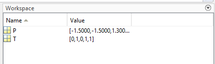
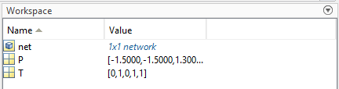

# Hulp

Ik ga hier gewoon wat dingetjes uitschrijven zodat ik dit later niet opnieuw moet gaan zoeken

### Oefenzitting 1

#### Command 1

Veel van de demos vragen om eerst punten te plotten, kga de notatie effe uitleggen hier.

```matlab
X = [ -0.5 -0.5 +0.3 -0.1;  ...
      -0.5 +0.5 -0.5 +1.0];

T = [1 1 0 0];

plotpv(X,T);
```

Dus de X hier is een de matrix met punten die op de grafiek gezet worden. De punten worden gelezen van boven naar onder, dus je hebt punten (-0.5;-0.5), (-0.5;0.5), (0.3;-0.5), (-0.1;1.0). De matrix T eronder zegt of het punt positief of negatief is. De eerste 2 punten dus positief en de laatste 2 negatief.

De command *plotpv* gaat dit dan op onze grafiek zetten.

Workspace na deze command



#### Command 2

```matlab
net = perceptron;
net = configure(net,P,T);
```

In de eerste command maken we een nieuw netwerk en gaan deze daarna configuren met de input data and target data wat resulteert in initiele waardes voor zijn gewichten en bias.

Workspace na deze command



#### Command 3

```
hold on
```

hold on retains the plots in the current axes so that new plots added to the axes do not delete existing plots. 

```
linehandle = plotpc(net.IW{1},net.b{1});
```

With this line we add the initial attempt at classification to the plot 


#### Command 4

The series of commands that 'trains' and returns a new network object that is better at classification

```
E = 1;
while (sse(E))
   [net,Y,E] = adapt(net,P,T);
   linehandle = plotpc(net.IW{1},net.b{1},linehandle);
   drawnow;
end
```


#### Command 5

```
hold on;
plotpv(X,T);
plotpc(net.IW{1},net.b{1});
hold off;
```

Add the old points back to the graph so we can see everything together.