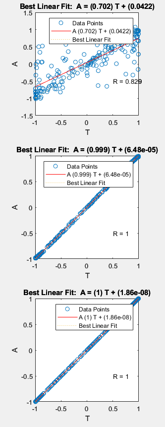
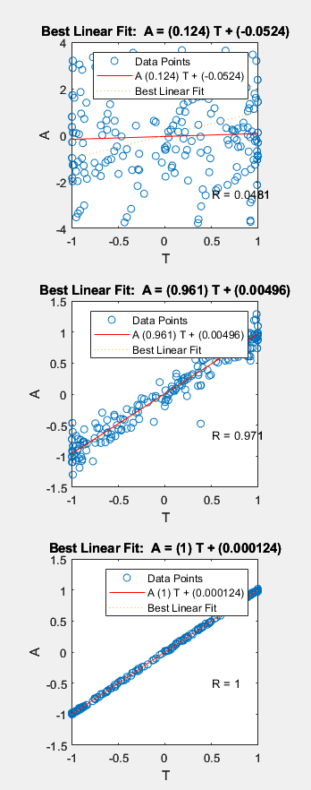
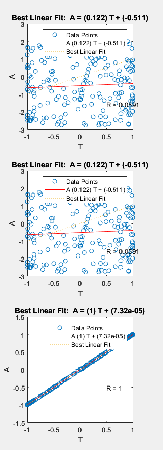
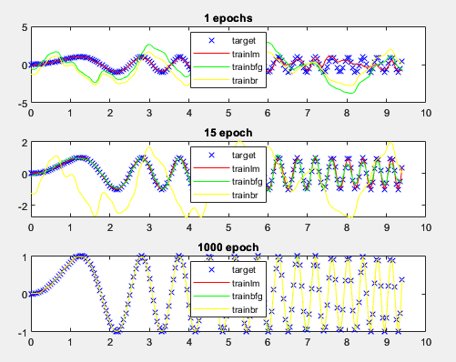

## Report 1

### Exercise 2 Backpropagation in feedforward multi-layer networks

| Training set                                                 | Test set                                                     |
| ------------------------------------------------------------ | ------------------------------------------------------------ |
|  |  |

Using the datasets that can be seen above, we will train and test 4 networks with 4 different training algorithms:

- Levenberg-Marquardt algorithm (trainlm)
- BFGS quasi Newton algorithm (trainbfg)
- Gradient descent (traindg)
- Gradient descent with momentum and adaptive learning rate (traingdx)

For each of these networks, we will use a hiddenlayer of size 2 with 20 and 10 neurons respectively. The networks are trained for 100 epochs. This seemed an adequate amount of epochs and neurons because the model complexity is relatively low and we would risk overfitting. Higher amounts of epochs seemed to pass a point of diminishing returns after 100.

#### Levenberg-Marquardt

The image above shows us the MSE over the amount of epochs. The algorithm quickly converges to a satisfactory error of $1.5569 * 10^{-6}$.

| Interpolated surface                                         | Output of the network using the test data                    | Test data                                                    |
| ------------------------------------------------------------ | ------------------------------------------------------------ | ------------------------------------------------------------ |
|  |  |  |

The network training appears successful as the output closely matches the test data. However, a drawback of the Levenberg-Marquardt algorithm is its reliance on the Hessian matrix, which can introduce computational complexity and memory requirements. Fortunately, this is not an issue for our relatively small dataset.

#### BFGS quasi Newton

Here the algorithm converges to an error of $0.00087467$. 

| Interpolated surface                                         | Output of the network using the test data                    | Test data                                                    |
| ------------------------------------------------------------ | ------------------------------------------------------------ | ------------------------------------------------------------ |
|  |  |  |

Again, this looks like a success because the output closely resembles the test data although if we take a closer look we can spot some differences. This could allow us to conclude that BFGS may not be the most optimal algorithm for the problem.

#### Gradient descent 

The algorithm converges to an error of $2.2828*10^{-6}$. 

| Interpolated surface                                         | Output of the network using the test data                    | Test data                                                    |
| ------------------------------------------------------------ | ------------------------------------------------------------ | ------------------------------------------------------------ |
|  |  |  |

Gradient descent also does very well, a small error and a good prediction. Since our model is relatively simple we also don't have the problem of the vanishing gradient.

#### Gradient descent with momentum and adaptive learning rate

The error is relatively large at $0.01882$

| Interpolated surface                                         | Output of the network using the test data                    | Test data                                                    |
| ------------------------------------------------------------ | ------------------------------------------------------------ | ------------------------------------------------------------ |
|  |  |  |

Of all the algorithms used, this is by far the worst. The reason that it is so much worse than it's counterpart Gradient Descent might be because of the fact that it has far more hyperparameters to tune and that it is overshooting the data because of the momentum used.

#### Summary

Based on the analysis, it can be concluded that the Levenberg-Marquardt (LM) algorithm demonstrates superior performance, closely followed by Gradient Descent (GD). However, it should be noted that in some instances, GD has shown better results compared to LM. It is worth mentioning that the performance of all algorithms may improve on larger datasets, but eventually, GD and GD with momentum and adaptive learning rate tend to outperform LM and BFGS. Therefore, it can be reasonably extrapolated that Gradient Descent is the most suitable algorithm for this specific problem.

### Exercise 5 

| **Levenberg-Marquardt**                                      | **BFGS**                                                     | **Bayesian regularization backpropagation**                  |
| ------------------------------------------------------------ | ------------------------------------------------------------ | ------------------------------------------------------------ |
|  |  |  |

