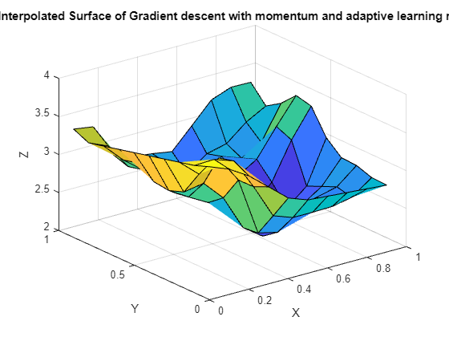

## Report 1

### Exercise 2 Backpropagation in feedforward multi-layer networks

| Training set                                                 | Test set                                                     |
| ------------------------------------------------------------ | ------------------------------------------------------------ |
|  |  |

Using the datasets that can be seen above, we will train and test 4 networks with 4 different training algorithms:

- Levenberg-Marquardt algorithm (trainlm)
- BFGS quasi Newton algorithm (trainbfg)
- Gradient descent (traindg)
- Gradient descent with momentum and adaptive learning rate (traingdx)

For each of these networks, we will use a hiddenlayer of size 2 with 20 and 10 neurons respectively. The networks are trained for 100 epochs. This seemed an adequate amount of epochs and neurons because the model complexity is relatively low and we would risk overfitting. Higher amounts of epochs seemed to pass a point of diminishing returns after 100.

#### Levenberg-Marquardt

The image above shows us the MSE over the amount of epochs. The algorithm quickly converges to a satisfactory error of $1.5569 * 10^{-6}$.

| Interpolated surface                                         | Output of the network using the test data                    | Test data                                                    |
| ------------------------------------------------------------ | ------------------------------------------------------------ | ------------------------------------------------------------ |
|  |  |  |

The network training appears successful as the output closely matches the test data. However, a drawback of the Levenberg-Marquardt algorithm is its reliance on the Hessian matrix, which can introduce computational complexity and memory requirements. Fortunately, this is not an issue for our relatively small dataset.

#### BFGS quasi Newton

Here the algorithm converges to an error of $0.00087467$. 

| Interpolated surface                                         | Output of the network using the test data                    | Test data                                                    |
| ------------------------------------------------------------ | ------------------------------------------------------------ | ------------------------------------------------------------ |
|  |  |  |

Again, this looks like a success because the output closely resembles the test data although if we take a closer look we can spot some differences. This could allow us to conclude that BFGS may not be the most optimal algorithm for the problem.

#### Gradient descent 

The algorithm converges to an error of $2.2828*10^{-6}$. 

| Interpolated surface                                         | Output of the network using the test data                    | Test data                                                    |
| ------------------------------------------------------------ | ------------------------------------------------------------ | ------------------------------------------------------------ |
|  |  |  |

Gradient descent also does very well, a small error and a good prediction. Since our model is relatively simple we also don't have the problem of the vanishing gradient.

#### Gradient descent with momentum and adaptive learning rate

The error is relatively large at $0.01882$

| Interpolated surface                                         | Output of the network using the test data                    | Test data                                                    |
| ------------------------------------------------------------ | ------------------------------------------------------------ | ------------------------------------------------------------ |
|  |  |  |

Of all the algorithms used, this is by far the worst. The reason that it is so much worse than its counterpart Gradient Descent might be because of the fact that it has far more hyperparameters to tune and that it is overshooting the data because of the momentum used.

#### Summary

Based on the analysis, it can be concluded that the Levenberg-Marquardt (LM) algorithm demonstrates superior performance, closely followed by Gradient Descent (GD). However, it should be noted that in some instances, GD has shown better results compared to LM. It is worth mentioning that the performance of all algorithms may improve on larger datasets, but eventually, GD and GD with momentum and adaptive learning rate will end up outperforming LM and BFGS because these two do not perform well on larger datasets. Therefore, it can be reasonably extrapolated that Gradient Descent is the most suitable algorithm for this specific problem.

### Exercise 5 

|  |  |
| ------------------------------------------------------------ | ------------------------------------------------------------ |

*(1) The figure on the right gives us the data in column order for: LM, BFGS and BR.*

Initially, Bayesian regularization shows lower performance compared to other algorithms with a small number of epochs. However, as the number of epochs increases, Bayesian regularization gradually improves its performance and becomes comparable to Levenberg-Marquardt. This behavior can be attributed to the incorporation of prior knowledge about the parameter distribution in Bayesian regularization. In the early stages of training, when the network has limited information about the underlying patterns in the data, the prior knowledge may not perfectly align with the true parameter distribution, leading to a slower start.

|  |  |
| ------------------------------------------------------------ | ------------------------------------------------------------ |

When we then add noisy data , it clearly negatively impacts the performance of all algorithms, including Bayesian regularization. When we further increase the number of neurons to 200 or even 500, there are no significant drastic changes observed. Despite its initially poor performance, Bayesian regularization exhibits a remarkable improvement over time, highlighting its ability to adapt and learn from the data.

## Report 2

### Exercise 1

#### 2D Hopfield

Using the specified attractors $[1~ 1; -1 -1; 1 -1]^T$, we constructed a Hopfield network. During the simulation, we observed that approximately 30 randomly entered data points converged within around 30 timesteps. However, an unintended attractor, $[-1 ¬1]$, emerged during this process. It is not uncommon for Hopfield networks to generate spurious states, which are patterns that were not explicitly included as attractor states.

In the case of the additional attractor $[-1 ~1]$, it exhibits a point of high symmetry. This means that it can be reached by flipping the signs of the third attractor. The symmetry property of the network allows it to converge towards this unintended attractor.

Considering the storage capacity of a Hopfield network, it depends on the number of neurons and the symmetry of the attractors. If we assume perfect recall, the maximum capacity can be estimated using the formula $p_{max} = \frac{N }{ (4 * log(N))}$, where N represents the number of neurons. In our Hopfield network with 2 neurons, the capacity is calculated to be $1.660$. This capacity is clearly not sufficient to store all 3 attractors, which also contributes to the generation of spurious states.

|  |  |
| ------------------------------------------------------------ | ------------------------------------------------------------ |

The attractors seem to be quite stable because they are symmetric and we see no oscillations after reaching convergence. One of the interesting initial values in this case is the point $[0 ~0]$. The point will not converge in one of the given attractors and instead create a spurious state in the same place as can be seen above on the right. This is probably because the point $[0~0]$ does not closely resemble any of the specified attractors and thus it will not converge to any of them and seek out a local minima which might be exactly in the point $[0~0]$.

#### 3D Hopfield

We proceed to construct a 3D Hopfield network with the attractors $[1 ~~1~~ 1; -1 -1~ 1; 1 -1 -1]^T$. As we enter 50 data points into the network, we observe convergence within approximately 45 timesteps. However, considering the storage capacity of the network using the previously mentioned formula, we find a capacity of $1.572$. This indicates that the network does not have sufficient capacity to store all the attractors without introducing spurious states.

Interestingly, contrary to our expectations, no additional attractors are generated despite the indications that suggest otherwise. The existing attractors demonstrate stability and do not exhibit any oscillations. Furthermore, they possess a high degree of symmetry.

This behaviour highlights the complex dynamics of Hopfield networks and demonstrates that the interplay between the network's architecture, attractors, and input patterns can lead to unexpected outcomes.

|  |  |
| ------------------------------------------------------------ | ------------------------------------------------------------ |

There is some other curious behaviour. When we enter the point $[0~0~0]$, a seemingly random attractors is created at the point $[0.365758~ -0.365758~ 0.365758]$ , as can be seen above on the right. It is plausible that the energy landscape of the network contains a local minimum that was unintentionally created during the network's construction. This local minimum may be influencing the convergence of our extra point towards the unintended attractor.