## Report 1

#### Backpropagation in feedforward multi-layer networks

| Training set                                                 | Test set                                                     |
| ------------------------------------------------------------ | ------------------------------------------------------------ |
| 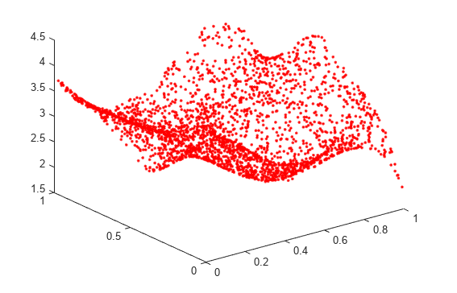 |  |

Using the datasets that can be seen above, we will train and test 4 networks with 4 different training algorithms:

- Levenberg-Marquardt algorithm (trainlm)
- BFGS quasi Newton algorithm (trainbfg)
- Gradient descent (traindg)
- Gradient descent with momentum and adaptive learning rate (traingdx)

For each of these networks, we will use a hidden layer of size 2 with 20 and 10 neurons respectively. The networks are trained for 100 epochs. This seemed an adequate amount of epochs and neurons because the model complexity is relatively low and we want to avoid overfitting. A higher number of epochs seemed to pass a point of diminishing returns after 100.

#### Levenberg-Marquardt

The image above shows us the MSE over the amount of epochs. The algorithm quickly converges to a satisfactory error of $1.5569 * 10^{-6}$.

| Interpolated surface                                         | Output of the network using the test data                    | Test data                                                    |
| ------------------------------------------------------------ | ------------------------------------------------------------ | ------------------------------------------------------------ |
|  |  |  |

The network training appears successful as the output closely matches the test data. However, a drawback of the Levenberg-Marquardt algorithm is its reliance on the Hessian matrix, which can introduce computational complexity and high memory requirements. Fortunately, this is not an issue for our relatively small dataset.

#### BFGS quasi Newton

Here, the algorithm converges to an error of $0.00087467$. 

| Interpolated surface                                         | Output of the network using the test data                    | Test data                                                    |
| ------------------------------------------------------------ | ------------------------------------------------------------ | ------------------------------------------------------------ |
|  |  |  |

Again, this looks like a success because the output closely resembles the test data. If we take a closer look, however, we can spot some differences. This could allow us to conclude that BFGS may not be the most optimal algorithm for the problem.

#### Gradient descent 

The algorithm converges to an error of $2.2828*10^{-6}$. 

| Interpolated surface                                         | Output of the network using the test data                    | Test data                                                    |
| ------------------------------------------------------------ | ------------------------------------------------------------ | ------------------------------------------------------------ |
|  |  |  |

Gradient descent also does very well, with a small error and a good prediction. Since our model is relatively simple we also don't have the problem of the vanishing gradient.

#### Gradient descent with momentum and adaptive learning rate

The error is relatively large at $0.01882$

| Interpolated surface                                         | Output of the network using the test data                    | Test data                                                    |
| ------------------------------------------------------------ | ------------------------------------------------------------ | ------------------------------------------------------------ |
|  |  |  |

Of all the algorithms used, this one is by far the worst. The reason that it is so much worse than its counterpart Gradient Descent, might be because of the fact that it has far more hyperparameters to tune and that it is overshooting the data because of the momentum used.

#### Summary

Based on the analysis, it can be concluded that the Levenberg-Marquardt (LM) algorithm demonstrates superior performance, closely followed by Gradient Descent (GD). However, it has happened that in some instances, GD has shown better results than LM. It is worth mentioning that the performance of all algorithms may improve on larger datasets, but eventually, GD and GD with momentum and adaptive learning rate will end up outperforming LM and BFGS because these two do not perform well on larger datasets. Using the information we just extrapolated we might be able conclude that Gradient Descent is the most suitable algorithm for this specific problem.

#### Regression with Bayesian regularization

|  |  |
| ------------------------------------------------------------ | ------------------------------------------------------------ |

*(1) The figure on the right gives us the data in column order for: LM, BFGS and BR.*

Initially, Bayesian regularization shows lower performance compared to other algorithms with a small number of epochs. However, as the number of epochs increases, Bayesian regularization gradually improves its performance and becomes comparable to Levenberg-Marquardt. This behavior can be attributed to the incorporation of prior knowledge about the parameter distribution in Bayesian regularization. In the early stages of training, when the network has limited information about the underlying patterns in the data, the prior knowledge may not perfectly align with the true parameter distribution, leading to a slower start.

|  |  |
| ------------------------------------------------------------ | ------------------------------------------------------------ |

Adding noisy data clearly negatively impacts the performance of all algorithms, including Bayesian regularization. When we further increase the number of neurons to 200 or even 500, there are no significant drastic changes observed. Despite its initially poor performance, Bayesian regularization exhibits a remarkable improvement over time, highlighting its ability to adapt and learn from the data.

## Report 2

#### 2D Hopfield

Using the specified attractors $[1~ 1; -1 -1; 1 -1]^T$, we constructed a Hopfield network. During the simulation, we observed that approximately 30 randomly entered data points converged within around 30 timesteps. However, an unintended attractor, $[-1 ~1]$, emerged during this process. It is not uncommon for Hopfield networks to generate spurious states, which are patterns that were not explicitly included as attractor states. In the case of the additional attractor $[-1 ~1]$, the point exhibits a point of high symmetry. This means that the attractor can be reached by flipping the signs of the third attractor. The symmetry property of the network allows it to converge towards this unintended attractor.

Considering the storage capacity of a Hopfield network, it depends on the number of neurons and the symmetry of the attractors. If we assume perfect recall, the maximum capacity can be estimated using the formula $p_{max} = \frac{N }{ (4 * log(N))}$, where N represents the number of neurons. In our Hopfield network with 2 neurons, the capacity is calculated to be $1.660$. This capacity is clearly not sufficient to store all 3 attractors, which also contributes to the generation of spurious states.

|  |  |
| ------------------------------------------------------------ | ------------------------------------------------------------ |

The attractors seem to be quite stable because they are symmetric and we see no oscillations after reaching convergence. One of the interesting initial values in this case is the point $[0 ~0]$. The point will not converge in one of the given attractors and instead create a spurious state in the same place as can be seen above on the right. This is probably because the point $[0~0]$ does not closely resemble any of the specified attractors and thus it will not converge to any of them and seek out a local minimum which might be exactly in the point $[0~0]$.

#### 3D Hopfield

We proceed to construct a 3D Hopfield network with the attractors $[1 ~~1~~ 1; -1 -1~ 1; 1 -1 -1]^T$. As we enter 50 data points into the network, we observe convergence within approximately 45 timesteps. However, considering the storage capacity of the network using the previously mentioned formula, we find a capacity of $1.572$. This indicates that the network does not have sufficient capacity to store all the attractors without introducing spurious states. Interestingly, contrary to our expectations, no additional attractors are generated despite the indications that suggest otherwise. The existing attractors demonstrate stability and do not exhibit any oscillations. Furthermore, they possess a high degree of symmetry.

|  |  |
| ------------------------------------------------------------ | ------------------------------------------------------------ |

There is some other curious behaviour. When we enter the point $[0~0~0]$, a seemingly random attractor is created at the point $[0.365758~ -0.365758~ 0.365758]$ , as can be seen above on the right. It is plausible that the energy landscape of the network contains a local minimum that was unintentionally created during the network's construction. This local minimum may be influencing the convergence of our extra point towards the unintended attractor.

#### Hopdigit

Hopfield networks excel at recognizing numbers when the data is noise-free. However, as we introduce noise into the input, the network's accuracy in digit classification starts to decline. To mitigate this issue, we can increase the number of iterations during the network's learning process. This helps improve the network's ability to handle moderately noisy data. Nevertheless, there is a limit to the effectiveness of iteration-based improvement. As the level of noise reaches a certain threshold, the Hopfield network struggles to classify the digits correctly. This outcome is not surprising, considering that digits with a noise level of 10 lack distinct features, as illustrated below.

|  |  |  |
| ------------------------------------------------------------ | ------------------------------------------------------------ | ------------------------------------------------------------ |

#### MLP (multilayer perceptron) with sequential data

Upon examining the training data, we can observe patterns, albeit with some inconsistencies, particularly in the occurrence of crashes. This may pose challenges for our MLP model in accurately approximating the data. A similar pattern is found in the test data, indicating that the MLP will need to predict crashes that occur infrequently, which could result in less accurate predictions. The limited amount of data available is likely a significant factor influencing the model's accuracy.

|  |  |
| ------------------------------------------------------------ | ------------------------------------------------------------ |

We trained the MLP using the BFGS training algorithm for 250 epochs. Exploring other algorithms that are recommended for sequential data, yielded significantly poorer results. As can be seen below, the performance of these alternative algorithms varied widely, with some coming close to the desired outcome while others falling far off the mark. Notably, when comparing the MLP with 30 neurons to its counterpart with 20 neurons, we observed a significant drop in performance. This could potentially be attributed to overfitting, where the model becomes too specialized to the training data.

In our case, the term "lag" refers to how far back we look to compare our current data point. Increasing the lag has a positive impact on performance, as demonstrated by the results. When we reached a lag of 50, the approximation came remarkably close to the desired outcome, indicating the effectiveness of considering a larger historical context in the sequence. This might be because the larger lag allows the model to consider a longer history of data and enabling it to better capture the infrequent crashes(long-term dependencies) that happen in the data.

|            | 20 neurons                                                   | 30 neurons                                                   |
| ---------- | ------------------------------------------------------------ | ------------------------------------------------------------ |
| **10 Lag** |  |  |
| **20 Lag** |  |  |
| **50 Lag** |  |  |

ChatGPT was used to assist me with writing code for this exercise. Model Name: GPT-3.5, (ChatGPT) Model Version: 3.5

#### LSTM (Long short term memory)

As expected, the LSTM outperformed the MLP in learning sequential data. LSTM networks are specifically tailored for sequential tasks, and their superiority is evident in the results obtained. In this case, we trained the network using 500 neurons and 250 epochs. By increasing the lag, we observed an improvement in the root mean square error (RMSE). As the lag increases, the LSTM can capture more information and better model the sequential patterns, leading to enhanced performance. During experimentation, adjusting the learning rate and the solver did not yield better results. Therefore, we opted to stick with the default values of 0.0005 for the learning rate and the Adam solver, as they provided the most favourable outcome.

| **5 Lag** **RMSE = 38.674**  |  |
| --------------------------------- | ------------------------------------------------------------ |
| **15 Lag** **RMSE = 49.650** |  |
| **30 Lag** **RMSE = 31.178** |  |
| **50 Lag** **RMSE = 12.231** |  |

The superiority of the LSTM over the MLP is evident from the results, making the choice between the two quite clear. Not only did the LSTM outperform the MLP, but it also exhibited faster training times. This combination of superior performance and efficient training makes working with the LSTM a much more favourable experience.

Considering all the evidence and observations, it's clear that the LSTM is the preferred choice. Its effectiveness and efficiency align with our expectations and make it the recommended option.

ChatGPT was used to assist me with writing code for this exercise. Model Name: GPT-3.5, (ChatGPT) Model Version: 3.5

## Report 3

#### PCA (Principal component analysis)

PCA aims to find a lower-dimensional representation of the data by capturing the maximum amount of variance in the original dataset. Here we use PCA on the threes dataset to see how close we can get to reconstructing it with as small as error as possible. Below you can see what the mean three of the dataset looks like

Below you can see what the threes dataset looks like when projected on 1, 2, 3 and 4 principal components. Because we take the eigenvectors with the largest magnitude as principal component we can still notice a distinct 3, even with only 1 principal component. We see some major improvements with each extra principal component which is only logical as this increases the quality of the reconstruction.

|  |  |  |  |
| ----------------------------------------------------------- | ----------------------------------------------------------- | ----------------------------------------------------------- | ----------------------------------------------------------- |

When observing the image below and on the left, we can clearly observe a rapid decrease in the reconstruction error. By incrementally adding principal components, starting from 1 to 50, we witness significant improvements in the error. As we include the eigenvectors with the largest magnitudes, the error drops substantially . In theory, if we were to compute the reconstruction error between the original data and the reconstructed data using all 256 principal components, the error should ideally be zero. However, in practical scenarios, the reconstruction error may not reach absolute zero but rather converge to a very small value, approaching zero. In our specific case, the obtained error was $6.0287*10^{-16}$, which aligns with our initial expectations.

|  |  |
| ----------------------------------------------------------- | ----------------------------------------------------------- |

The insight that the reconstruction error is proportional to the eigenvalue of the unused principal components plays a crucial role in PCA for dimensionality reduction. By selecting principal components with substantial eigenvalues, we can reduce the dimensionality of the data while minimizing the loss of information. The cumulative sum of the eigenvalues provides a useful measure to determine the number of principal components to retain. Our goal is to retain enough components to capture a significant portion of the total variance while disregarding components with negligible impact on the data representation.

#### Stacked autoencoders

Stacked auto encoder class accuracy = $99.7200$

Neural net with 1 hidden layer class accuracy= $ 95.8400$

Neural net with 2 hidden layers class accuracy= $96.5800$

Neural net with 3 hidden layers [100 50 50] class accuracy = $97.1400$

Neural net with 3 hidden layers [100 50 25]  class accuracy= $97.2200$

Neural net with 3 hidden layers [100 50 25] without validation class accuracy = $98.4400$

After conducting experiments with different configurations such as varying epochs, neurons, and hidden layers, we have determined that our regular neural network achieves its best performance with three hidden layers consisting of 100, 50, and 25 neurons respectively. However, even with this optimal configuration, the performance of the regular neural network still falls short of the stacked autoencoder. It appears that the capabilities of our shallow neural network are limited compared to the stacked autoencoder. Interestingly, the number of epochs does not seem to have a significant impact on performance, as the desired gradient target value is reached relatively quickly even with a limit set higher than 100 epochs.

The process of finetuning the deep neural network, which includes the autoencoder layers and the softmax layer, proves to be beneficial for optimizing the overall model. During finetuning, the parameters of all the layers are adjusted together, enabling better alignment and coordination among them. This collaborative optimization allows the model to function more effectively as a cohesive unit, leading to improved performance. 

Both the unsupervised training of the stacked autoencoder and the subsequent supervised finetuning are crucial for achieving optimal results. The unsupervised training captures deeper patterns and representations, while the finetuning phase refines and enhances these representations. Together, these stages contribute to the overall improvement in performance.

Below, we can observe the accuracy comparison between the stack without finetuning on the left and the accuracy with finetuning on the right. This highlights the significant impact of finetuning on the model's accuracy, demonstrating the importance of both unsupervised training and finetuning in achieving the best possible performance.

|  |  |
| ------------------------------------------------------------ | ------------------------------------------------------------ |

#### CNN

**Weight representation**

In the CNN we used, the second layer or convolution layer has a few weights, namely $[96 ~11~ 11~ 3]$.  The "96" in this case means the amount of filters used. The 2 elevens are the dimensions of the filter so in this case 11 x 11 pixels. The 3 defines in what colour space we are working. 3 is for RGB and 1 is for grayscale.

**Input dimension**

After passing the fight layer within the CNN, the dimension will be $27\times27$. We found this by using the following formula $(W – F + 2P) / S + 1$ where 

- $W$ is the dimension of the input
- $F$ is the size of the filter
- $P$ is the size of the padding 
- $S$ is the size of the stride

We apply the formula twice because the data goes through a convolution layer and a max pooling layer. We could also just use the command `analyzeNetwork` but this would not give us an explanation as to why the dimension are a certain size.

**Input dimension of fully connected layer**

The input dimension right before it enters the fully connected layer is $1 \times 1$. This reduction in dimensionality occurs as the original $227 \times 227$ input undergoes a series of convolutional and pooling operations. By reaching a dimension of $1 \times 1$, the input size for the fully connected layer becomes significantly smaller. This reduction is beneficial as it allows the fully connected layer to efficiently process and classify the data.

If we were to retain the original input size, the fully connected layer would require an enormous number of weights to balance, resulting in a computationally expensive and impractical model. This is one of the reasons why convolutional neural networks (CNNs) outperform fully connected networks in image classification tasks. The CNN architecture, with its convolutional and pooling layers, enables effective feature extraction and dimensionality reduction, leading to improved performance and efficiency in image classification.

**CNNdigit**

Based on the provided code, we can observe that the model with an additional convolutional layer and ReLU activation performs significantly poorer compared to the model with a single convolutional layer. This drop in performance could be attributed to the increased complexity of the model, which can lead to overfitting. The model's performance can be visualized on the left.

Furthermore, when we replace the max pooling layer with an average pooling layer, we observe a slight improvement in performance. This could be attributed to the fact that average pooling retains more information compared to max pooling, which can result in better representation of the underlying patterns.

| Extra convolution layer                                     | Single convolution layer                                    | Single convolution layer + averagePooling                   |
| ----------------------------------------------------------- | ----------------------------------------------------------- | ----------------------------------------------------------- |
|  |  |  |

## Report 4

#### **RBM and Gibbs sampling**

When the number of components and epochs is low in our RBM, the RBM has a hard time recognizing the digits even when increasing the amount of Gibbs steps. As can be seen below.

| 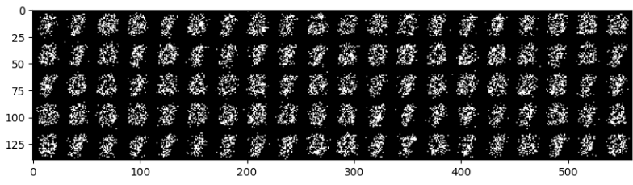 |
| ------------------------------------------------------------ |
| 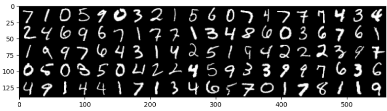 |

When we now increase these numbers to 25 components and 50 epochs, we get considerably better results. We can again increase the amount of Gibbs steps but at some point the improvement stops and the reverse happens. The accuracy of the RBM drops.

| 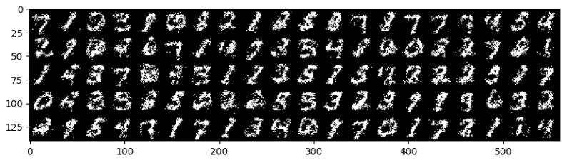 |
| ------------------------------------------------------------ |
|  |

**RBM reconstruction**

The number of hidden units, learning rate and number of epochs all affect the performance. When we increase these, the performance increases till at some point, all of the learning parameters reach a cut off point and the performance starts to drop again. A too large number of hidden units leads to overfitting, too high a learning rate could lead to overshooting and instability while the number of iterations may hit a point of diminishing returns.

| 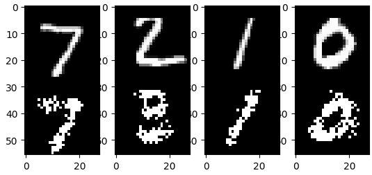 | 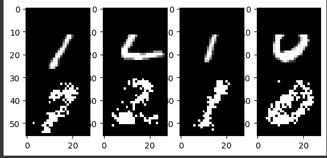 |
| ------------------------------------------------------------ | ------------------------------------------------------------ |

The amount of rows we remove and the amount of Gibbs steps have a large influence into the RBM's capability of reconstructing the original image. As you can see in the image on the right the RBM is clearly struggling, barely finding the original images.

#### DBM

The filters in a Deep Boltzmann Machine (DBM) are capable of capturing more complex and abstract patterns compared to Restricted Boltzmann Machines (RBMs). This is primarily due to the deeper architecture and learning process employed in DBMs. In a DBM, each layer possesses its own set of filters, which serve as representations of the learned features. The multi-layered design of DBMs enables them to capture higher-level patterns and features by building upon the lower-level representations learned in preceding layers. The difference in the visualization of filters between an RBM and a DBM can be attributed to the increased complexity and depth of the DBM model.

| RBM                                                          | DBM first layer                                              | DBM second layer                                             |
| ------------------------------------------------------------ | ------------------------------------------------------------ | ------------------------------------------------------------ |
|  | 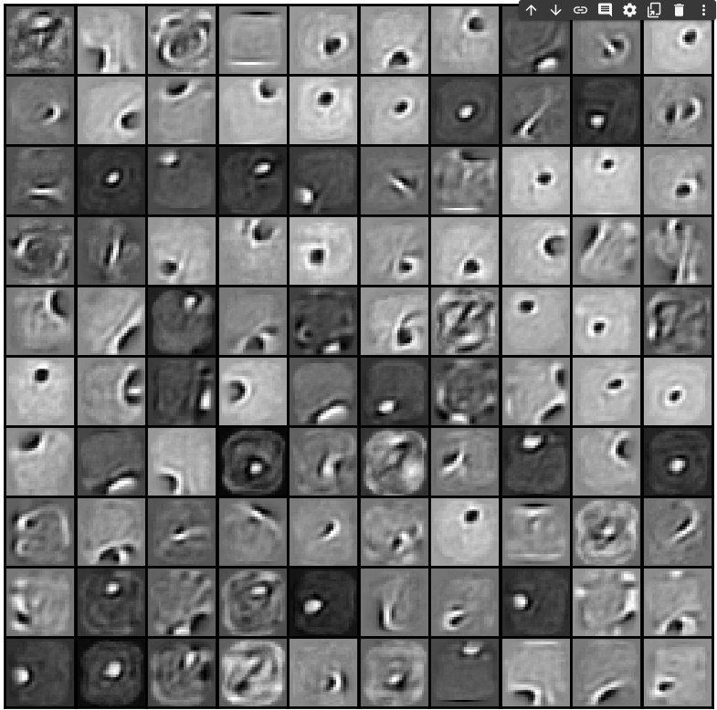 | 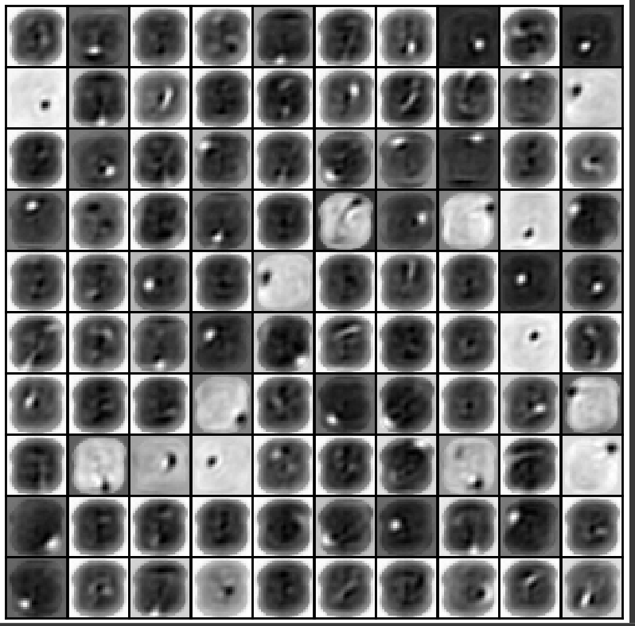 |

Considering the earlier discussion, it is clear that the Deep Boltzmann Machine (DBM) surpasses the Restricted Boltzmann Machine (RBM) in terms of proficiency. This assertion is strongly supported by the visual representation provided below. While the DBM may encounter some challenges with certain digits, its overall performance is notably improved. The incorporation of multiple layers, with each layer capturing distinct aspects of the features, enables the DBM to achieve greater success.

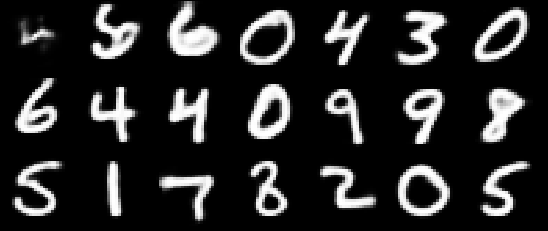

#### DCGAN (Deep convolutional generative adversarial network)

|  | 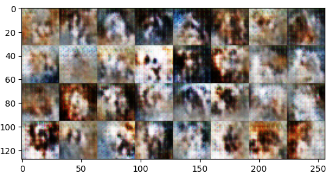 |
| ------------------------------------------------------------ | ------------------------------------------------------------ |

Unfortunately, despite our efforts, the DCGAN fails to generate satisfactory "real" images. The best results obtained are depicted on the right. However, the image generation process exhibits significant instability, with certain batches deviating considerably from the desired outcome. Both the discriminator and generator's accuracy fluctuates widely, indicating potential mode collapse. Mode collapse occurs when the generator fails to encompass the full range of diversity in the target distribution. This situation may arise if the generator exploits specific patterns or lacks meaningful gradients from the discriminator. The graph below illustrates these fluctuations, which can also be attributed to the constant oscillations as the generator and discriminator strive to outperform each other.

#### Optimal transport

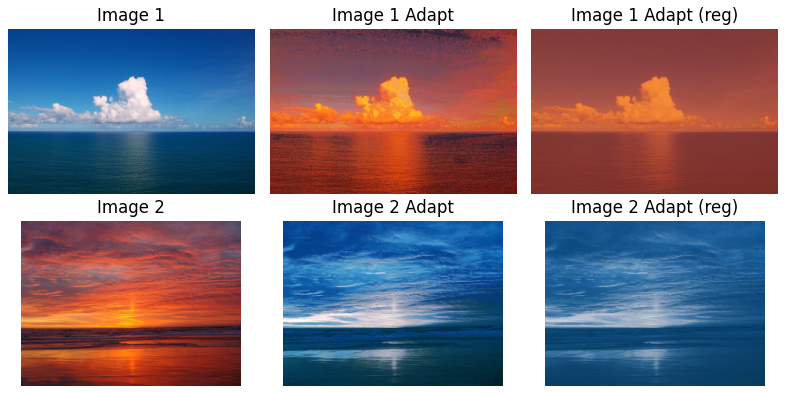

Both **EMD (Earth's Mover's Distance)** and **Sinkhorn** transport take into account the inherent structure and properties of the distributions being compared. They aim to calculate the optimal transportation that minimizes the overall cost or distance. On the other hand, non-optimal color swapping, such as simply swapping pixels, lacks any optimization criteria and may result in arbitrary assignments without considering the distribution characteristics.

**EMD** calculates the minimum cost to transform one distribution into another. The use of EMD can be seen on the image in the middle. 

In contrast, the **Sinkhorn** algorithm scales a transportation matrix to approximate the optimal alignment between two probability distributions. This is why the colours of the sinkhorn images, which can be seen on the far right, look a little flat.

Overall, both EMD and Sinkhorn offer a more optimized approache for distribution comparison and transportation, making them superior choices compared to non-optimal color swapping techniques (like just swapping the pixels).

#### WGAN (Wasserstein GAN)

| Normal GAN                                                   | WGAN                                                         |
| ------------------------------------------------------------ | ------------------------------------------------------------ |
|  | 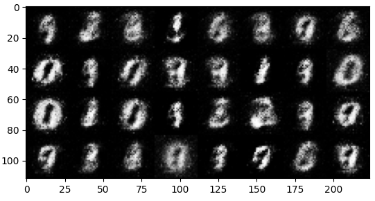 |

The Wasserstein GAN (WGAN) is a modified version of the traditional GAN that uses the Wasserstein distance to quantify the difference between generated and real data distributions. By utilizing the Wasserstein GAN, we aim to address issues encountered in standard GANs, such as mode collapse and training instability. As depicted in the comparison above, the regular GAN exhibits more noise compared to the WGAN. This improvement is attributed to the use of the Wasserstein distance, which promotes smoother and more stable learning, leading to less noisy generated samples. The overall quality of the generated samples has also improved.

| Normal GAN                                                   | WGAN                                                         |
| ------------------------------------------------------------ | ------------------------------------------------------------ |
| 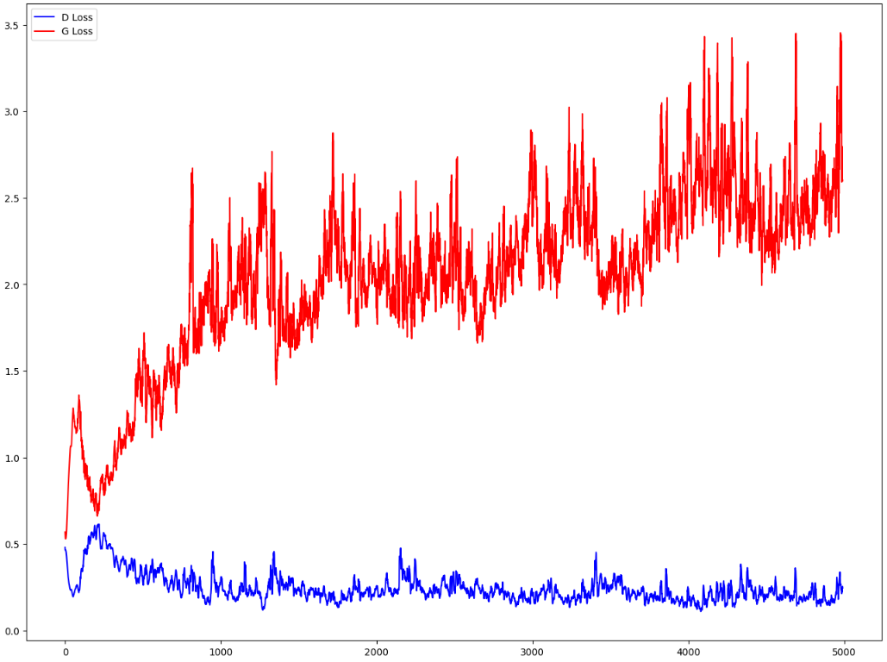 |  |

As previously mentioned, the WGAN is designed to offer improved stability and smoother training, and this is evident in the comparison above. The normal GAN exhibits far larger fluctuations than the WGAN. The fluctuations in the GAN's loss come from the adversarial nature of the game, where the discriminator aims to minimize its error while the generator seeks to maximize the discriminator's error. The WGAN addresses some limitations of the traditional GAN, but unfortunately it comes with a higher computational cost. 

#### Citation

In this report I used ChatGPT to assist me in the following things:

- Generate small parts of code used in matlab
- Further learning of the subjects covered in this report
- Spelling checker

Reference to ChatGPT:

- Model Name: GPT-3.5 (ChatGPT) 
- Model Version: 3.5 (May 12 2023)
- Model Architecture: Transformer 
- Model Developer: OpenAI 
- OpenAI. (2021). ChatGPT (Version 3.5) [Model]. https://openai.com

