# Summary

## 1. Introduction

### Explain a classical IR Pipeline

**Query:** The IR process start with a user query, which is a representation of what information the user needs. The query can be a set of keywords, a sentence or any other form of input that tells us what the user wants.

**Query Processing:** The query is processed and enhanced to increase the effectiveness in retrieving relevant documents. Techniques like query expansion, where we add additional terms or synonyms to capture a broader range of relevant documents. Other techniques like, query normalization, stop-word removal or stemming are used to improve the accuracy of the query.

**Indexing:** This stage indexes the documents in the collection. This the process of creating a structured representation of the documents that allows for efficient retrieval. Typically, an inverted index is created, which maps terms to the documents that contain them. The inverted index is a fundamental data structure used in IR systems for fast retrieval.

**Search (Vector space or probabilistic:** Once the query is processed and the documents are indexed, we can retrieve our data. In vector space models the documents and the query are represented as vectors in a high-dimensional space, where each dimension corresponds to a term. The relevance of a document to a query is measured by computing the similarity between the vectors.

In probabilistic retrieval models, such as the Okapi BM25 model. The relevance of a document is estimated based on probabilistic principles. The model considers factors such as term frequency, inverse document frequency and document length to compute a relevance score for each document.

**Ranked Documents:** After the previous stage, the retrieved documents are ranked according to their relevance to the query. The ranked is based on the similarity scores or relevance scores computed in the previous stage. The most relevant documents are presented to he user at the top of the list.

### Explain and compare retrieval paradigms and weighting functions

#### Paradigms

**Set-theoretic retrieval paradigm (e.g. Boolean)**

This paradigm treats documents and queries as sets of terms. It operates based on boolean logic using operators like AND, OR and NOT to combine query terms and match them against documents. Documents that have all the query terms are relevant while others are not. The paradigm is based on the idea of exact matching and is effective for precise queries.

**Algebraic (e.g. Vector Space)**

This paradigm converts documents and queries to vectors in a high-dimensional space. The relevance of a document to a query is determined by measuring the similarity between their respective vectors. One of the metrics used is cosine similarity. This paradigm allows for flexible retrieval by considering the degree of relevance rather than exact matching.

$similarity(A,B) = cos(\theta) = \frac{A.B}{||A||.||B||}$

**Probabilistic (e.g. Language Model, Inference Network)**

The probabilistic retrieval paradigm is based on probabilistic models that estimate the relevance of the documents to queries. Models like language models and inference networks use statistical methods to estimate the probability of generating a document given a query. These models incorporate various factors, such as term frequency, document length, and collection statistics, to compute relevance scores. The probabilistic retrieval paradigm allows for more nuanced retrieval by considering the probabilistic relationships between queries and documents.

**Linked-based (e.g. PageRank)**

The link-based retrieval paradigm focuses on the hyperlink structure of the web. Algorithms like PageRank asses the important and relevance of documents based on the analysis of link patterns. PageRank assigns higher relevance scores to document that receive many inbound links from other highly-ranked pages.

**Neural**

This paradigm encompasses approaches that utilize neural networks for information retrieval tasks. These models use deep learning techniques and neural architecture to learn representations of queries and documents, capturing semantic and contextual information. They have demonstrated strong performance in capturing complex relationships between queries and documents and handling large-scale retrieval tasks.

#### Weighting functions

- **Term** **frequency**: $w_{ij}=tf_{ij}$
  - Frequency of occurence of the index term $i$ in document $j$
  - Assumption: High frequency content terms signal main topics in the document
-  **Inverse document frequency** of a term: $idf_i = log(\frac{N}{n_i})$
  - $N$ = number of documents in the reference collection
  - $n_i$ = number of documents in the reference collection having index term $i$
  - Assumption: Common words over numerous texts are poor indicators of a document’s content
- **Tfldf:** Product of the term frequency and inverse document frequency: $w_{ij}=tf_{ij}*log(\frac{N}{n_i})$
- **Length normalization:** $\frac{tf_{ij}}{max_{1<k<l}(tf_{kj})}$
  - $tf_{kj}$ = term frequency of an index term $k$ in document $j$
  - $l$ = number of distinct index terms in the document 
- **Augmented normalized term frequency:** $\alpha + (1-\alpha)*\frac{tf_{ij}}{max_{1<k<l}(tf_{kj})}$
  - weighted by $(1-\alpha)$ to decrease the difference in weights of frequent and of infrequent terms in the document smoothing term $\alpha$ (generally set to 0.5)

### Compute and explain evaluation metrics, as well as motivate which ones are appropriate in which context

#### **Accuracy**

we can evaluate an information retrieval model with accuracy but the following reasons make it only a subpar evaluation metric.

- Imbalanced Data: In many information retrieval scenarios, the number of relevant documents is significantly smaller than the number of non-relevant documents. This can skew accuracy results and make it misleading. Even if a system retrieves a small fraction of relevant documents, it may still have a high accuracy because of the dominance of non-relevant documents.
- Ignoring Ranking: Accuracy does not consider the order or ranking of the retrieved documents. It only focuses on whether a document is classified correctly or not. However, the order of the results is crucial in information retrieval, as users typically examine the top-ranked documents first.

#### **Precision**

Relevant is the amount of relevant data within the retrieved data so not the relevant data in the document collection.

Precision is, of all the documents you retrieved, how many are relevant.

Again we can evaluate a model using precision but again there are a few pitfalls.

- Limited view: Precision provides a measure of the correctness of the retrieved documents, but it does not consider the entire set of relevant documents that were not retrieved. It only focuses on the retrieved documents, giving an incomplete picture of the system's performance.
- Sensitivity to Imbalanced Data: Precision can be sensitive to class imbalance, especially when the number of relevant documents is much smaller than the number of non-relevant documents. In such cases, even a small number of false positives (non-relevant documents retrieved) can significantly impact precision.

#### **Recall**

Here there is an important distinction to make. The relevant in the top part is the amount relevant data within the retrieved data and the relevant in the bottom part is the total of relevant data in the document collection.

Recall is, of all the documents in the document collection, how many of those did you retrieve.

**Pitfalls**

- Limited View: Recall focuses on the number of relevant documents retrieved, but it does not consider the correctness or quality of the retrieved documents. It only measures the system's ability to retrieve relevant documents, irrespective of any false positives (non-relevant documents retrieved).
- Ignoring Precision: Recall does not take into account the number of non-relevant documents retrieved. It ignores the false positives, which can be important in scenarios where the presence of non-relevant documents is undesirable.

#### **Trade-off measure**

'

The F-measure is trade-off measure that combines precision (P) and recall (R) into a single metric.

**Pitfalls**

- Bias towards Precision or Recall: The F-measure with a specific beta value (B) favors either precision or recall, depending on the value chosen. For example, when B < 1, more weight is given to precision, whereas when B > 1, more weight is given to recall. This means that the F-measure may not provide a balanced view of the system's performance if both precision and recall are equally important.

**Advantage**

- Balanced Evaluation: The F-measure offers a way to balance the evaluation of precision and recall by considering both metrics in a single measure. It provides a trade-off between precision and recall and can help identify a system's performance that achieves a reasonable balance between the two.

#### **Recall and precision at a given document cutoff value λ**

Fixed Cutoff: Using a specific document cutoff value λ limits the evaluation to a fixed number of top-ranked documents. This approach ignores the potential relevance of documents beyond the cutoff point, which may lead to an incomplete assessment of the retrieval system's overall performance.

Arbitrary Selection: Choosing a specific cutoff value can be arbitrary and may not reflect the actual needs or expectations of users. Different tasks or scenarios might require different cutoff points, and using a fixed value may not capture the nuances of the specific information needs.

#### **R-precision: precision (or recall) at the Rth position in the ranking**

Ranking Sensitivity: R-Precision is highly sensitive to the ranking of documents. Even a small change in the order of documents in the ranking can significantly impact the R-Precision value. When using R-Precision, it is important to consider the limitations and ensure that the specific ranking position (R) aligns with the requirements and objectives of the evaluation task. 

#### **Breakeven point: point in the recall versus precision graph where recall equals precision**

The breakeven point, also known as the equal precision-recall point, is the specific point on the recall versus precision graph where the precision and recall values are equal. In other words, it is the intersection point of the precision and recall curves.

**Pitfall**

- Limited Information: The breakeven point only provides information about the specific recall and precision values at the intersection. It does not capture the performance characteristics of the system at other points on the precision-recall curve, limiting the overall evaluation and understanding of the system's behavior.

**Advantage**

- Balanced Evaluation: The breakeven point represents a balanced trade-off between precision and recall. It indicates a specific operating point where the system achieves equal precision and recall, implying a reasonable balance between the two measures.

## 2. Information retrieval models

### Boolean model

The Boolean model is an information retrieval paradigm that represents documents and queries using a set-theoretic approach. It treats documents and queries as sets of terms and applies Boolean logic operations (AND, OR, NOT) to match and retrieve documents based on exact term matching.

#### Extended Boolean model

Takes into account partial fulfilment of the query and sorts documents by relevance. 

##### $p$-norm model

The p-norm model is a model an extended boolean model that combines the boolean paradigm and the vector space paradigm. In this model, boolean operations are used to filter and refine the initial set of documents and then a similarity measure from the vector space paradigm can be applied to rank the remaining documents. The p-norm model can also process more general queries ($q = (k1 ∧ k2) ∨ k3$). 

### Vector space model

#### BOW vector space model

This is a model where documents and queries are represented as vectors in a high-dimensional space. It disregards the order and structure of the terms, focusing solely on their occurrence. The problem is that it treats document as a collection of independent terms, so in essence a bag of words (BOW), without considering their order or semantic relationships. This results in a loss of contextual information and meaning. It also assumes that the term vectors (so the vectors representing the words) are pair-wise orthogonal as can be seen below. The term vectors being car and insurance. 

Its advantages are that it is simple, efficient and does partial matching.

### Probabilistic retrieval model

Views retrieval as a problem of estimating the probability of relevance given a query, document, collection. Ranks the retrieved documents in decreasing order of this probability.

**Models**

- Generative relevance models
  - Classic probabilistic model
  - Language retrieval model
- Inference network model

#### Generative relevance models

Generative relevance models aim to capture the generative process of documents based on queries, estimating the joint probability of documents and queries. They assume a latent variable representing relevance. These models provide a probabilistic framework but can suffer from overfitting and computational complexity.

##### Classic probabilistic model

Makes estimates from the set of relevant and the set of non-relevant documents by maximum likelihood estimation. 

The "cold start problem" in classic probabilistic models refers to the challenge of handling new or previously unseen queries and documents that do not have sufficient information or relevance judgments available. It occurs when the retrieval system encounters queries or documents for which it has limited or no prior knowledge. It makes an initial guess and then improves these initial estimates by relevance feedback. Forms the basis of the famous Okapi BM25 retrieval model.

##### Language retrieval model

A language retrieval model ranks a document D according to the probability that the query generates the document. Further information on slides.

##### Smoothing

Smoothing of probabilities = reevaluating the probabilities: assign some non-zero probability to query terms that do not occur in the document. 

### Inference network model

An inference network model calculates the probability of generating a query given a document or subset of documents. It treats each document-query pair independently and estimates the relevance score based on the likelihood of the query given the document. These models are effective in handling the cold start problem and can provide relevance estimates even when there is limited or no prior data available.

**Advantages**

- Combines multiple sources of evidence and probabilistic dependencies
- Good retrieval performance

**Disadvantage**

- Computationally not scalable for querying large collections.

### Neural network-based retrieval

Neural network-based retrieval is an information retrieval approach that leverages the power of neural networks for improving the effectiveness of document retrieval. It involves using neural network architectures and techniques to model the complex relationships between queries and documents, and to estimate the relevance of documents to a given query.

In this approach, neural networks are trained using large-scale datasets that consist of query-document pairs with relevance judgments. The neural network learns to map the query and document representations into a similarity or relevance score. Various neural network architectures can be employed, such as convolutional neural networks (CNNs), recurrent neural networks (RNNs), or more advanced models like transformer-based architectures.

### Recap

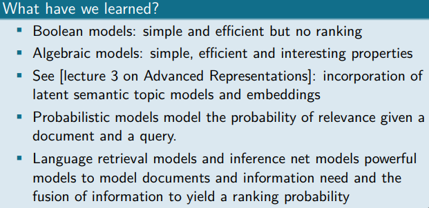

## 3. Advanced probabilistic representations

Advanced probabilistic representations of text using topic models. Topic modeling is a statistical modeling technique used to discover latent topics or themes in a collection of documents. It is an unsupervised learning approach that aims to identify the underlying topics that are prevalent in a document corpus.

The goal of topic modeling is to automatically extract and uncover the hidden thematic structure within the documents, without any prior knowledge or explicit labeling of topics. It assumes that each document is a mixture of multiple topics, and each word in the document is associated with one or more of those topics.

### Probabilistic Latent Semantic Analysis (pLSA)

Probabilistic Latent Semantic Analysis (pLSA) is a probabilistic topic model that aims to discover latent topics in a collection of documents. It is an extension of the Latent Semantic Analysis (LSA) method that incorporates probabilistic principles to estimate the topic distributions.

The training process of pLSA involves the following steps:

1. Initialization: The model is initialized with random topic-word distributions and document-topic distributions.
2. Expectation-Maximization (EM) Algorithm: The EM algorithm is employed to iteratively estimate the topic distributions. In the E-step, the model estimates the posterior probabilities of the latent topics given the observed data. In the M-step, the model updates the topic distributions based on the weighted counts of word occurrences in each document.
3. Convergence: The EM algorithm is repeated until the model converges, typically based on a convergence criterion such as maximizing the likelihood or the number of iterations.
4. Estimating Topic Distributions: After convergence, the model provides the estimated topic distributions, which represent the probability of each word belonging to each topic and the probability of each document being associated with each topic.

**Disadvantages**

- EM: risk of getting stuck in a local maximum
- pLSA learns the probability only for those documents on which it is trained.

### Latent Dirichlet Allocation

Latent Dirichlet Allocation (LDA) is a probabilistic topic model that is widely used for discovering latent topics in a collection of documents. It assumes that each document is a mixture of multiple topics, and each word in the document is associated with one of those topics.

The training process of LDA involves the following steps:

1. Initialization: Initialize the model by randomly assigning topics to words in each document.
2. Gibbs Sampling: Use Gibbs sampling, an iterative algorithm, to estimate the topic assignments for words in each document. In each iteration, the model samples a new topic assignment for each word based on the current topic assignments in the document and the overall topic-word distributions.
3. Burn-in and Sampling: After a certain number of initial iterations (burn-in period) to allow the model to converge, additional iterations are performed to obtain stable estimates of the topic assignments.
4. Estimating Topic Distributions: Once the Gibbs sampling process is completed, the model uses the obtained topic assignments to estimate the topic-word distributions and document-topic distributions. These distributions represent the likelihood of each word belonging to each topic and the likelihood of each document being associated with each topic.
5. Post-processing: After training, the model can be used to infer the topic distribution for new or unseen documents. This involves estimating the topic proportions in the new document based on the learned topic-word and document-topic distributions.

LDA is typically trained on a large corpus of documents. The more data available, the better the model can capture the underlying topic structure. It is important to preprocess the text by removing stop words, performing stemming or lemmatization, and other text normalization techniques to improve the quality of the learned topics.

LDA has become a popular method for topic modeling due to its ability to discover meaningful topics from unstructured text data. It has applications in various fields such as information retrieval, text mining, recommendation systems, and document clustering.

## 4. Advanced algebraic representations

### Vector representations

**Local representations**: one-hot encoding or vector of a word or other content item (used in bag-of-words representation of document): 

- sparse representation
- One-hot = 1-of-t:
  - Word is represented as a vector with t (=size of vocabulary) components with one component activated and the others zero
  - No notion of similarity between words
  - Simple way to encode discrete concepts, such as words.
  - 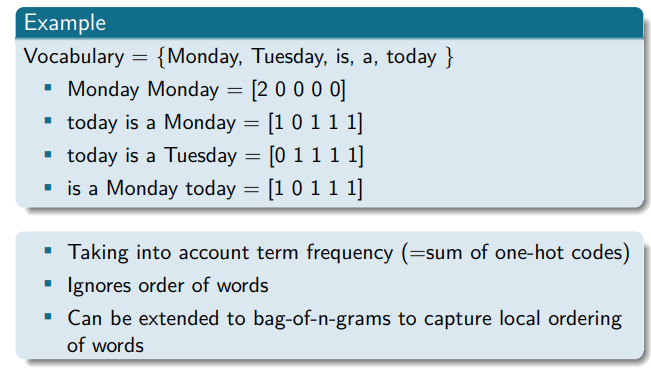

**Distributed representations**: representing a word or other content item by its attribute vector that usually integrates context: 

- Sparse distributed representations 
  - Sparse distributed representations (SDRs) are a type of encoding where most elements are zero and only a few are active.
  - 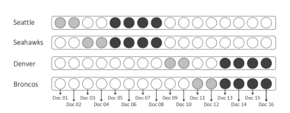
- Dense distributed representations
  - Each word is represented by a dense vector, a point in a vector space
  - The dimension k of the semantic representation is usually much smaller than the size of the vocabulary t, and all dimensions contain real-valued numbers
  - Methods to obtain them (vectors?):
    - Latent Semantic Indexing
    - Neural networks
  - 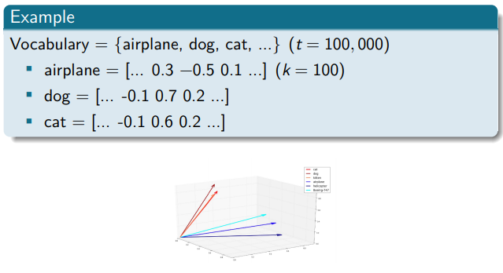

### LSI (Latent semantic indexing or Latent semantic analysis)

Latent Semantic Indexing (LSI), also known as Latent Semantic Analysis (LSA), is a technique used for information retrieval and text analysis. It aims to capture the latent semantic structure of a collection of documents by creating a low-dimensional representation of the document-term matrix.

The process of Latent Semantic Indexing involves the following steps:

1. Document-Term Matrix: Construct a matrix where rows represent documents and columns represent terms. The values in the matrix typically represent the term frequencies or some other measure of the term's importance within the document.

   - 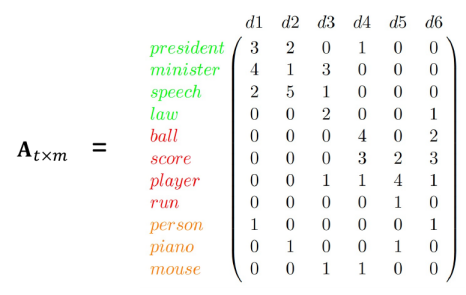

2. Singular Value Decomposition (SVD): Perform a Singular Value Decomposition on the document-term matrix. SVD decomposes the matrix into three separate matrices: U, Σ, and V. The matrix U represents the left singular vectors, Σ represents the singular values, and V represents the right singular vectors. (similar to principal component analysis)

    

3. Dimensionality Reduction: Keep only the top k singular values and their corresponding singular vectors. This step reduces the dimensionality of the document-term matrix and captures the most important latent semantic relationships between documents and terms.

4. Document Representation: The reduced-dimensional representation of the document-term matrix can be used to represent each document as a vector in the reduced semantic space. These document vectors capture the latent semantic information of the documents and can be used for various information retrieval and text analysis tasks.

Latent Semantic Indexing has several advantages:

1. Dimensionality Reduction: LSI reduces the dimensionality of the document-term matrix, making it more efficient for computational operations and reducing the impact of noise and sparsity in the data.
2. Semantic Similarity: LSI captures the semantic relationships between documents and terms, enabling similarity calculations and retrieval of semantically related documents.

However, LSI also has some limitations:

1. Lack of Interpretability: The reduced-dimensional representation of documents and terms in LSI does not provide explicit interpretation or labeling of topics or semantic concepts. It can be challenging to interpret the underlying latent semantic structure.
2. Sensitivity to Corpus Size: LSI performance may vary depending on the size and diversity of the document corpus. Small or highly specific corpora may not yield robust latent semantic representations.

Overall, Latent Semantic Indexing is a technique for capturing latent semantic relationships in text data. It has been widely used in information retrieval, document clustering, text classification, and other applications where understanding the underlying semantic structure is important.

### Neural network-based representations

The main motivation is to come up with more precise way to represent words, documents and other content. Inspired by the success in computer vision and natural language processing.

Neural network-based representations, such as word embeddings, capture the distributed representation of words as vectors. These vectors are trained by considering the local contexts of words and are typically of dimensionality d, ranging from 50 to 1000.

Word embeddings are learned through unsupervised training using neural networks, particularly language modeling tasks. The goal is to map each word to a real-valued vector in a high-dimensional space. The vectors are trained to capture semantic and syntactic relationships between words. In the vector space, similar words, either in meaning or usage, tend to be closer together.

There are different architectures used to train word embeddings. "Static embeddings" like word2vec, which includes CBOW (Continuous Bag-of-Words) and Skip-gram models, learn word vectors by predicting surrounding words given a target word. This approach helps capture the local context of words.

On the other hand, "contextual embeddings" models like BERT (Bidirectional Encoder Representations from Transformers) take into account the entire context of a word within a sentence. BERT-based models consider both the left and right context to learn embeddings that are sensitive to the context in which the word appears.

Neural network-based representations offer a powerful way to capture rich and context-aware word representations. They have been widely adopted in natural language processing tasks, including language understanding, machine translation, sentiment analysis, and information retrieval, among others.

#### CBOW model

The Continuous Bag-of-Words (CBOW) model is a neural network architecture used for word embeddings. The CBOW model takes the context words within a short window, without considering their position, as input. It predicts the current word as the output. The hidden layer of the model uses a linear function to process the input and generate the predicted word. CBOW is trained on large amounts of text data and learns to capture the contextual information of words, allowing for more efficient word representations that capture semantic relationships.

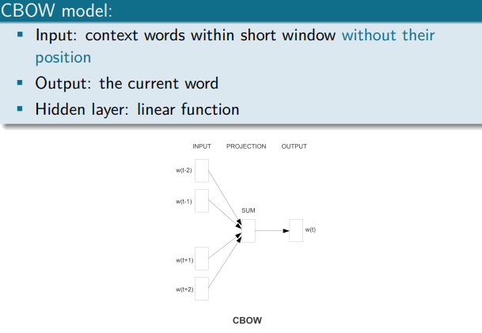

#### Skip-gram NNLM:

The Skip-gram Neural Network Language Model (NNLM) takes the current word as input and aims to predict the surrounding context words within a short window, without considering their position. The model's output consists of these predicted context words. The hidden layer of the model utilizes a linear function to process the input and generate the context word predictions.

The Skip-gram model is a neural network architecture used for word embeddings. In this model, the input is represented using one-hot coding, where each word is represented by a neuron in the input layer. The input is then passed to a hidden layer, often referred to as the projection layer, without using an activation function.

The hidden layer typically consists of around 300 neurons, representing a high-dimensional space (dimension N = 300). The output layer of the model has the same size as the vocabulary and is connected to a softmax layer. The softmax function normalizes the outputs, ensuring that the probabilities of the output neurons sum up to 1.

However, the computation of the softmax function can be computationally expensive, as it involves summing over the entire vocabulary. To address this, an approximation called negative sampling is often used. Negative sampling generates negative examples by randomly selecting surrounding words for each positive training example. The objective of training the Skip-gram model is to maximize the probability of correct samples (word and its surroundings) and minimize the probability of negative samples.
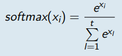

Overall, the Skip-gram model learns word embeddings by predicting the context words given a target word. It uses a softmax layer for output normalization and can employ negative sampling to reduce computational complexity.

#### Subsampling

Subsampling is a technique used in natural language processing to reduce the impact of frequent words, such as stopwords, during training. It randomly discards words based on their frequency of occurrence.

In subsampling, each word is assigned a probability of being discarded, denoted as Pdiscard(wi). This probability is determined by the frequency of the word, freq(wi), in the training collection. The threshold frequency (trh) is a parameter that determines the importance given to frequent words. Higher values of trh lead to more aggressive subsampling, discarding words with higher frequencies.

Alternatively, a modified formula can be used, where the frequency of the word is added to the denominator. By applying subsampling, frequent words are more likely to be discarded during training, while less frequent words have a higher chance of being retained. This helps in reducing the impact of common words that do not carry much semantic or contextual information in the training process.

#### Word vectors

**Advantages**

- Simple and effective
- Trained model can also be used as language/prediction model: output probabilities

**Disadvantages**

- Cannot handle polysemy
- Black box (gave rise to the field of interpretability, see Belinkov and Glass (2019))

#### Contextualized word embeddings

- ELMo (Peters et al., 2018): recurrent neural network architecture
- BERT (Devlin et al., 2019): transformer architecture
- GPT-3 (Brown et al., 2020): generative transformer 

Impressive results on various Natural Language Processing tasks (natural language inference, question answering, etc.)

##### BERT

BERT is trained with 2 main objectives

- Masked language modelling 
- Next sentence prediction

**Masked language modelling**

15% of random input tokens in each sequence are masked and the system has to predict the masked token

**Next sentence prediction**

Choosing two sentences A and B from the training corpus:

- 50% of the cases: B is the actual next sentence of A
- 50% of the cases: B is just a random sentence from the corpus

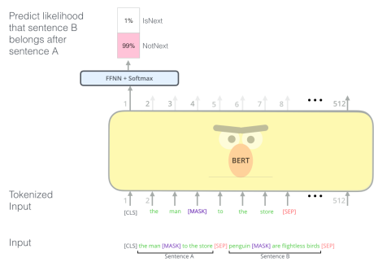

There is also a variation that instead of word vectors uses sentence vectors. 

##### Issues

How many dimensions should we allocate for each word?

- There are no theoretical bounds or even established best-practices (Levy et al., 2015).
- In current research, the dimensionality of word-embedding vectors range between about 50 to hundreds, and, in some extreme cases, thousands
- Dimension is a hyperparameter that can be optimized, typically the aim is a good trade-off between speed and task accuracy

##### Use of word vectors in IR

Vector Space Model: In the vector space model, documents and queries are represented as term vectors in a high-dimensional space. Each term vector consists of term weights that are greater than or equal to zero. The dimensionality of the space is determined by the number of features, which are typically words in this context. For each word, we learn a corresponding word vector denoted as vi.

**Centroid Model**: In the centroid model used within the vector space model, documents and queries are represented as term vectors in a reduced-dimensional space. The term vectors are formed by summing up the corresponding word vectors. For a document vector dj, the sum is taken over p words, and for a query vector q, the sum is taken over q words. This approach allows for a compact representation of the documents and queries.

Combining with Bag-of-Words: The centroid model can be combined with a traditional bag-of-words model by using a weighted average. 

**Word Mover's Distance**: Word Mover's Distance is a distance metric that treats text documents as point clouds of embedded words. In this approach, non-stop words from both documents are embedded into a word2vec space. The distance between the two documents is calculated as the minimum cumulative distance that all words from one document need to travel to exactly match the point cloud of the other document. Word Mover's Distance is a special case of the Earth Mover's Distance and can be considered as a form of the Wasserstein distance.

## 5. Multimedia information Retrieval

- Modality: a certain type of information and/or the representation format in which information is stored.
- Medium: means whereby this information is delivered to the senses of the interpreter.
- Multimodal: coming from multiple information sources, which consist of multiple types of content, i.e., multimedia content
- Cross-modal: bridging several modalities

### **Media properties, processing and representation**

#### **FFNN (fully connected feedforward neural network**

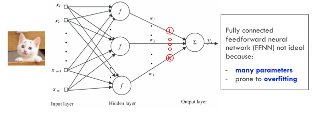

#### Convolutional Neural network (CNN)

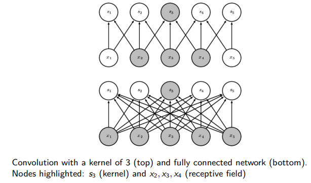

The receptive field of the units in the deeper layers of a convolutional network is larger than the receptive field of the units in the shallow layers. This means that even though direct connections in a convolutional net are very sparse, units in the deeper layers can be indirectly connected to all or most of the input image.

#### CNNs and their use for building image and text representations

Convolutional Neural Networks (CNNs) are a type of neural network architecture that is particularly effective for analysing and processing structured grid-like data, such as images and text. CNNs have been widely used in computer vision tasks for image recognition, object detection, and image generation. However, they can also be applied to text data for tasks such as text classification, sentiment analysis, and natural language processing.

In the context of image representation, CNNs leverage their ability to capture local patterns and hierarchical features. They consist of multiple layers, including convolutional layers, pooling layers, and fully connected layers. The convolutional layers apply a set of learnable filters to the input image, performing local feature extraction and capturing spatial dependencies. The pooling layers down sample the feature maps, reducing their spatial dimensionality while preserving important features. Finally, the fully connected layers combine the extracted features and produce the final image representation.

For text representation, CNNs can be used in a similar way. Instead of operating on image pixels, they process text inputs as sequences of words or characters. The text is usually represented using word embeddings or character embeddings, which capture the semantic and syntactic relationships between words. The convolutional layers in the CNN perform convolutions over the input sequence, capturing local n-gram features and detecting patterns in the text. Pooling layers can be used to summarize the extracted features and reduce the dimensionality. The resulting feature maps are then fed into fully connected layers for further processing and classification.

The use of CNNs for image and text representations offers several advantages. Firstly, CNNs can automatically learn hierarchical and abstract representations from raw data, reducing the need for handcrafted features. Secondly, they can capture local patterns and dependencies, enabling them to capture fine-grained details and relationships within images and texts. Finally, CNNs are highly scalable and can handle large datasets efficiently, making them suitable for both small-scale and large-scale applications.

##### Multimedia retrieval models and corresponding query types

## 6. Learning to rank

#### Ranking evaluation:

**Average precision (AP):**

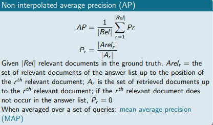

**Discounted cumulative gain:**

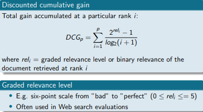

**Mean Reciprocal Answer Rank (MRAR or MRR)**

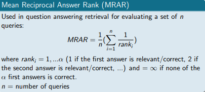

Training approaches

- The **pointwise** approach
  - Input: single document
  - Output: score or class
- The **pairwise** approach:
  - Input: document pairs
  - Output: partial order preference
- The **listwise** approach:
  - Input: document set
  - Output: ranked document list

#### **Pointwise approach**

The pointwise approach in information retrieval simplifies ranking by treating it as a regression or classification problem. Each query-document pair is independently predicted for its relevance degree or class. Training involves optimizing a model to predict relevance scores or labels. Training data consists of query-document pairs with relevance annotations. This approach offers a straightforward way to rank documents based on relevance.

**Training:**

In the pointwise approach, the training process involves a set of query-document pairs (qi, dij) and their corresponding relevance annotations yi,j. The goal is to optimize the ranking model by predicting the relevance scores f(qi, dij) for each pair independently. This is done by minimizing the loss function L(f ; Q, D, Y), which sums over all query-document pairs and calculates the loss L(yi,j, f(qi, dij)) between the predicted relevance score and the true relevance annotation. The training algorithm aims to find the optimal parameters for the ranking model that minimize the overall loss.

**Loss function used:**

- For binary relevance labels: cross entropy
- For numerical labels: mean squared error

**Advantages and disadvantages**

- Simple, easy to scale
- Transparent: model supervised by user clicks can directly predict the probability of a user click
- But less effective in ranking tasks:
  - Assumption: relevance is absolute: a document is judged independently to the other documents for a given query
  - The model does not consider documents preference or order information

#### **Pairwise approach**

In the pairwise approach, the training process involves pairs of query-document pairs, where one document is considered more relevant than the other. The goal is to learn a ranking model that can correctly order the documents within each pair. The training algorithm optimizes the model by minimizing the loss function, which measures the discrepancy between the predicted rankings and the true rankings. This approach directly models the pairwise preferences and aims to learn the relative ordering of documents, rather than predicting absolute relevance scores.

**Loss function used:**

- Hinge loss
- Pairwise(binary) cross entropy
- Loss based on Kendall-$\tau$: $\frac{P-Q}{Q+P}$ with P being the concordant and Q discordant

**Advantages and disadvantages**

- We no longer assume absolute relevance
- Ranked based on document pairs and their relevance order
- Usually effective but:
  - In practice, often not possible to satisfy all found pairwise preference relationships to find the best global ranking.
  - Usually not all pairs are considered equally important

#### Listwise approach

In the listwise approach, the training process involves entire lists or ranked sets of documents for each query, rather than pairs or individual documents. The goal is to learn a ranking model that can accurately rank the entire list of documents for each query. This approach considers the overall ordering of the documents and aims to directly optimize the ranking of the entire list, taking into account the interactions and dependencies among the documents.

**Loss functions used:**

- Measure specific: SVM^MAP^, etc, see slide 36
- Non-measure specific: ListNet, ListMLE

### Neural architecture

- Symmetric vs asymmetric architectures:
  - Symmetric network structure: query and documents inputs are homogeneous
  - Asymmetric network structure: query and documents inputs are heterogeneous
- Representation- vs interaction-focused architectures

#### Symmetric network architecture

In this architecture the query and document are homogeneous so we can use a symmetric network structure (meaning that q and d can exchange position without changing the output). We can use CNNs, RNNs, LSTM or transformer architecture.

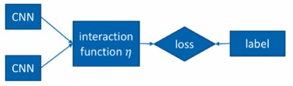

#### Asymmetric network architecture

In an asymmetric network architecture, the inputs q and d are heterogeneous. The query is split into terms, and an interaction function η captures the mapping between each query term and the document. The architecture includes a neural network for 

- term relevance computation
- score aggregation. 

This approach considers the differences between the query and document to accurately evaluate relevance and generate a ranking.

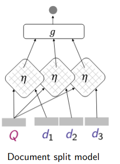

#### Representation-focused architectures

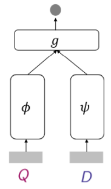

Representation-focused architectures are neural network models designed to primarily focus on learning effective representations of input data. These architectures aim to capture the underlying structure and patterns within the data, enabling better feature extraction and representation learning. They typically consist of multiple layers of neurons that transform the input data into higher-level representations, which are then used for downstream tasks such as classification or regression.

#### **Interaction focused architectures**

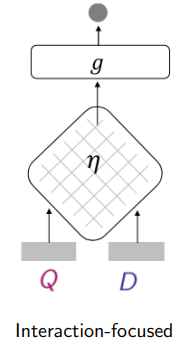

Interaction-focused architectures are neural network models designed to emphasize the interactions between different elements or components of the input data. These architectures aim to capture the dependencies and relationships among the input elements to enhance the representation learning process. They are particularly useful when the interactions between elements are critical for the task at hand.

## 7. Web information retrieval

#### Crawling architecture

Crawlers are software agents that traverse the Web sending new or updated pages to a main server for indexing.

The crawler starts with a set of URLS called seeds. It follows the links using different kinds of searches.

- Breadth or depth-first search
- Structural: use organization page to determine best links
- Priority criteria: PageRank, popularity

One of the difficulties faced are visiting the same URL more than once which is inefficient. 

In practice we use **distributed crawling** meaning that we split up domains to minimize latency and other parameters. A few example are

- Geography: US page crawler in US, Belgian page crawler in Belgium
- By site because DNS lookups are costly, our solution for that are cache DNS lookups

To further expand on that we use Incremental crawling. This uses strategies to making crawling far more efficient. Several strategies used:

- Duplicate detection with shingling
- Mirror site detection
- Link spam detection
- Link quality estimator

#### Ranking

##### PageRank

The page rank of a page p simulates the probability that a random surfer (one who follows links randomly from page to page) will be on that page at any given time (random walk on the web graph) At each step, the random surfer can : 

- Either click on a link on a page (browsing/follow step) 
- Or jump at random to a different page (teleportation step)

The PageRank algorithm uses the following formula
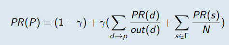

It uses recursive calculations to calculate the page rank of page $p$. You need to know the page rank of very page pointing to $p$ so we use a simple iterative algorithm that iterates until convergence.

##### HITS (Hyperlink-Induced Topic Search) algorithm

The HITS (Hyperlink-Induced Topic Search) algorithm is an algorithm used to assess the authority and hubness of web pages in a network of interconnected pages. It is an alternative approach to ranking web pages, particularly in the context of analyzing topics or themes within a network. The algorithm considers two key roles that web pages can play in a network:

- **Authority**:  In the HITS algorithm, the authority score represents the importance or quality of a page based on the number and quality of incoming links it receives from other authoritative pages.
- **Hub:** A hub page is one that serves as a good hub or gateway to other relevant pages on a particular topic. It is seen as a page that can direct users to valuable resources. In the HITS algorithm, the hub score represents the ability of a page to provide links to other authoritative pages on the same topic.

Here are the steps:

Algorithm iteratively propagates authority weight and hub weight across links of the web graph, converging simultaneously to steady states for both types of weights

1. Initialization: Each web page is assigned an initial authority score and hub score. These scores can be initialized to the same value for all pages.
2. Iterative Calculation: The HITS algorithm iteratively updates the authority and hub scores of each page based on the following principles:
   - Authority Calculation: The authority score of a page is calculated by summing the hub scores of the pages that link to it.
   - Hub Calculation: The hub score of a page is calculated by summing the authority scores of the pages it links to.
   - Normalization: After each iteration, the authority and hub scores are normalized to ensure they maintain relative proportions and prevent scores from becoming too large.
3. Convergence: The iterative process continues until the authority and hub scores converge, meaning they reach a stable state where further iterations do not significantly change the scores. At this point, the authority and hub scores represent the estimated importance and hubness of each web page within the network.
4. Ranking: The web pages can be ranked based on their authority or hub scores. Pages with higher authority scores are considered more authoritative, while pages with higher hub scores are considered better hubs or gateways to relevant content.

## 8. Indexing, compression and search 

**Explain inverted files and different types of distributed indices** 

Inverted files are meant to compress documents by indexing their word counts. 

Distributed indices are inverted files spread on servers. When querying a server might return his results if it the prediction results meet the threshold or pass the query to a different server.

**Explain and compute Huffman codes**

When using a limited size of vocabulary we can encode words to consist of fewer bits, this way we can compress our data. The concept is that using the shortest notation for the most occurring words gives us the biggest compression ( so the smallest files ). When using encodings its important to note that the decoding might take a long time and there has to be an index table that explains the encodings, which makes encoding not always a smart choice.

 

## 9.**Clustering**

Proximity function uses to express how similar clusters are.

- **Maximum proximity**: defines proximity based on their most similar pair of objects
- **Minimum proximity**: defines proximity based on their least similar pair of objects
- **Average proximity**: defines proximity based on the average of the similarities between all pair of objects
- **Mean proximity**: defines proximity based on the similarity of the representative (centroid,medoid) of each cluster

**Explain and be able to compute the different clustering types and their objective functions including the computation of the number of clusters** 

- Sequential clustering
- hierarchical clustering
- Clustering based on cost/objective function optimization

**Sequential clustering**

Builds the clustering by adding data points in a sequential manner, one at a time or in batches. So this means that the algorithm does not require all data points upfront. An extreme version of sequential clustering is the **Single pass algorithm**. In one pass, assign all $n$ objects to their closest cluster based on a threshold similarity value.

**Hierarchical clustering**

Two kinds of hierarchical clustering

- Agglomerative hierarchical clustering
  - Here we are going to start with putting each data point in its own cluster and then we iteratively merge similar clusters together to form bigger clusters
    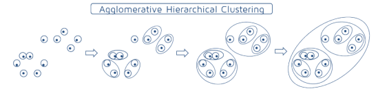
  - Within agglomerative clustering we have several methods to define the proximity between the clusters
    - **Single link(age)** (nearest neighbour) clustering. Uses the maximum proximity function
    - **Complete link(age)** (furthest neighbour) clustering. Uses the minim proximity function
    - **Group average link(age)**: Uses the average proximity function. Efficient variant
- Divisive hierarchical clustering
  - Here we start with one huge clusters with all the data points and then divide it into smaller clusters with similar data points.
    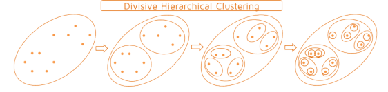
  - Iteratively split clusters in a few clusters by means of a partitioning algorithm
  - Distinct advantage: possible to generate few large clusters early in the clustering process.

**Describe the scalability of the different algorithms on a high-level** 

1. Single pass: all objects get assigned to their closest cluster in a single pass. Highly scalable because of the simple assignments
2. Hierarchical clustering: harder to scale because of multiple rounds through the data

**Compute and explain contrastive loss functions**

Contrastive loss functions are meant to group similar labels together and push dissimilar data points farther apart. By using this we can use more meaningful representations between data points

 **Apply clustering in different retrieval settings** 

By using the fact that similar documents are clustered together we can create a retrieval model that retrieves a cluster instead of separate documents and then returns the documents in that cluster.

 

## 10. Categorization 

**Explain and compute feature selection and extraction methods** 

To extract features we can take documents, remove stopwords and clean up the data (see terms used in first lessons to adjust words to their base thing like flies -> fly ) afterwards we can look at words appearing often in documents while absent in others to categorize them. For example a document containing words like: “Engine, wheels, spoiler” can be categorized as CAR as the words are all related to cars.

In a supervised environment we can compute the relevance of the selected features to their categories by using things as information gain.

**Explain and compute a Naive Bayes and (approximate) k-NN model**

We can use naïve bayes to predict the most probable categories, this can be done by clustering terms and then looking at how much “chance” there is that a term would be assigned to a cluster. For example we can look at how close the term: “Wheels” would be to a cluster consisting of car terms. Doing this for a couple of the nearest clusters we can then return the most likely category/cluster.

**Explain and compute the different types of cross-entropy losses** 

Cross-entropy losses are often used in neural networks to compute how far away our training predictions are from the actual value, decreasing the loss will result in a more accurate neural net with better retrieval results. But trying to reduce it too much might result in overfitting which is why neural nets use validation sets.

**Explain the different models for multilabel and hierarchical classification and their scalability** 

For hierarchical classification we can use multiple techniques we could use flat classification to train on the leaf nodes but we can also use local classifiers that each train on their level, by doing this we train local models that increase the accuracy in classes and are easier to train

**Explain the principle of extreme classification** 

Extreme classification is about finding the right label out of a huge amount of possibilities. Since there are so many labels training a model on it would result in all extremely low and close by predictions values. To counter this we can use Nearest Neighbour to find the most likely couple of categories and then using classifier on it. The reason why this works is because documents tend to only be close to only a couple of categories, so we don’t need to know how close they are to all of them.

 

## 11. Dynamic IR 

**Explain the principles of relevance and pseudo-relevance feedback** 

The relevance is computed when retrieving documents and can be calculated for example by regression, the pseudo relevance involves how the user later interacts with the initial query, for example slightly changing the query. 

**Compute the Rocchio algorithm** 

The Rocchio algorithm uses multiple queries and computes the relevance of a document by computing the relevance based on the query and substracting the non relevant documents from the previous query. For example a first query: “Find me all the doctors in Leuven” which then evolves in the query “Find me all the doctors in Gent”. Here we can substract the result which have a relevance to Leuven because this got changed in the queries.

**Formally describe a language retrieval model for session search** 

In session search we can use query context to adjust the final results, knowing the query changed from containing a word for example Leuven, to Gent we can put extra weight on the Gent part and lessen the chance of getting documents containing Leuven

**Explain and compute the different multi-armed bandit algorithms, and apply them in retrieval and recommendation** 

We have seen 3 different multi-armed bandit algorithms:

1. Stochastic bandit algorithms where we just try to maximize the return by calculating the regret and try to pull the best arm
2. Upper Confidence bound where we give a confidence based on how often the arm gave a good result divided by the times it got pulled. Having an arm that was right 1 out of 2 times and an arm that was right 50 out of 100 times we will prefer the second one since it has proven to be more consistently right.
3. Contextual bandit algorithms where we use the context of the query to improve the results.

 

## 12. Question Answering, Conversational Search and Recommendation 

 

**Explain RNNs and their use for building text representations** 

By using the RNN structure we can encode documents/texts/words in a vector feature notation, as for example we could encode “bat” as a vector like : [0.8,0.8,0] with Bird, Night creature, and car as column values. Meaning the word bat has a close association with the first 2 columns and a very low or association with the last column.

**Describe (a combination of) suitable neural architectures for (V)QA and conversational search** 

We could use a LTSM/BiLTSM to process the conversation and ask extra info if needed. Afterwards we could use a CNN to process the most important factors in the conversation like: “Red”, “Dress”, “Short” and return a fitting image.

**Explain and compute loss functions for (V)QA and conversational search**

We could create a loss function that computes the difference between the expected outcome images and the retrieved ones. In the example above this could be done by looking at the encodings of the retrieved images and comparing them to a set that we would expect the model to give back. There are multiple loss functions for this.

Since we have a conversational search we could also use the user input to see how well our models are performing, if the user clicks on the images we could see this a good retrieval, and if the user continues their queries with more details we could “punish” the model.
