# Information Retrieval and Search Engines

## Les 1 Introduction

**Information Retrieval (IR)** is finding material  (usually documents) of an unstructured nature (usually text) that satisfies an information need from within large collections (usually stored on computers).

The aim of the course is to study the **current techniques and algorithms** commonly used in information retrieval, search and recommendation and the challenges of the field.

### Word Vectors

Word vectors are an approach to representing words in information retrieval. A word vector is mathematical representation of a word that captures its meaning in **high-dimensional vector space**. Each dimension in the vector corresponds to a different aspect of the word's meaning.

For example. Given this following text, we can analyse certain nouns and create a vector for each and place them in our vector space.

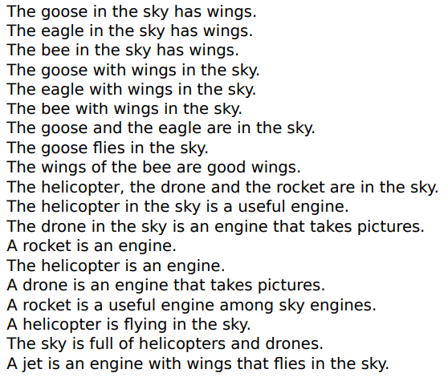

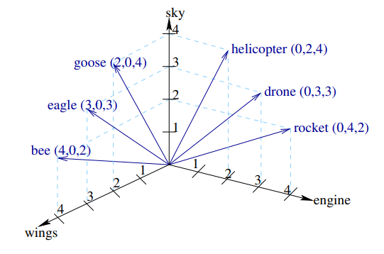

### Conversion of text

To convert such a text to something we can use for vectors we will use the following steps:

1. **Preparation** of the document: e.g., removal of tags
2. **tokenization**: lexical analysis
   - The text is split into individual words or tokens.
3. **Removal** of stopwords (optional)
   - Commons words such as "the" and "and" are removed.
4. **Stemming** (optional): Porter algorithm
   - Different word forms are reduced to a common base form.
5. **Term weighting** (optional)
   - See further down

Some of these steps have been applied to the text:

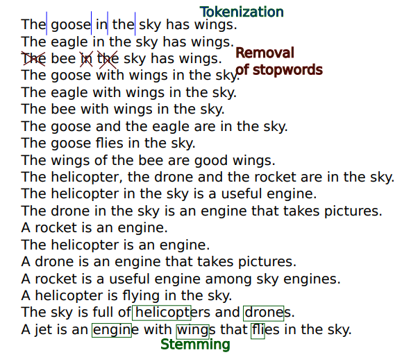

### Bag-of-words

The bag-of-words is a common approach to representing text in information retrieval. The idea is to represent a piece of text as a "**bag**" (unordered set) of its words, ignoring grammar and word order but **preserving information** about word frequency. A bag-of-words is created using the conversion of text steps given above.

Once a bag-of-words representation has been created for a piece of text, it can be compared to other pieces of text using techniques like cosine similarity (cos). For example:

- D1: The good in the sky has wings
  - |goose| + |sky| + |wings|

- D2: The eagle in the sky has wings
  - |eagle| + |sky| + |wing|

- D3: The goose with wings in the sky
  - |goose|+|wing|+|sky|

sim(D1, D2) = cos(D1, D2)

### Sidenote

**Law of Zipf**

Zipf's law state that the frequency of a word in a text is **inversely proportional** to its rank in the frequency table. That is, the most frequent word appears **twice** as often as the second most frequent word, three times as often as the third most frequent word, and so on. The implications of this for **information retrieval** are significant.

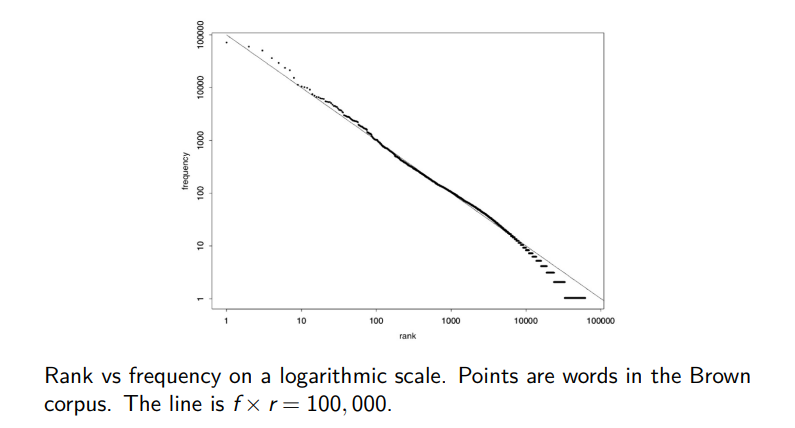

### Classical weighting functions

**Weight**: importance indicator of a term regarding content

**Term frequency**

$w_{ij}=tf_{ij}$  -> frequency of occurrence of the index term $i$ in document $j$

This function is based on the assumption that the more frequently a term appears in a document, the more important it is to the meaning of the document.

**Inverse term frequency**

Inverse document frequency of a term:

$idf_i = log(\frac{N}{n_i})$ where:

- $N$ = number of documents in the reference collection
- $n_i$ = number of documents in the reference collection having index term $i$

This function is based on the assumption that terms that are rare in the text are more informative than terms that are common.

**Tfldf**

Product of the term frequency and inverse document frequency:

$w_{ij} = tf_{ij}.log(\frac{N}{n_i})$

This function combines the term frequency and inverse document frequency to calculate a weighted score that reflects its importance in a document.

**Length normalization**

This function is used to adjust for differences in the length of the documents. The idea behind length normalization is to penalize longer documents by diving the raw score by the length of the document. This is because longer documents may have more occurrences of a given term simply due to their length, rather than their relevance to the query.

**Augmented normalized term frequency**

This function is similar to term frequency but incorporates a saturation effect to prevent over-weighting of terms that occur frequently in a document.

### IR evaluation

To evaluate information retrieval we need know if the information provided is relevant. We can get some annotated data, so query document pairs that have clear answers to the question, is the information provided relevant, yes or no.

 A common measure to evaluate is **accuracy**. This is bad in this case because the distribution of relevant to non relevant documents will be highly skewed. For a query only a small percentage of the documents will be relevant. The consequence of this is that if the system treats all documents as irrelevant then the accuracy will be very high while returning no useful documents. This is not what we want. Below an example of what we just talked about.

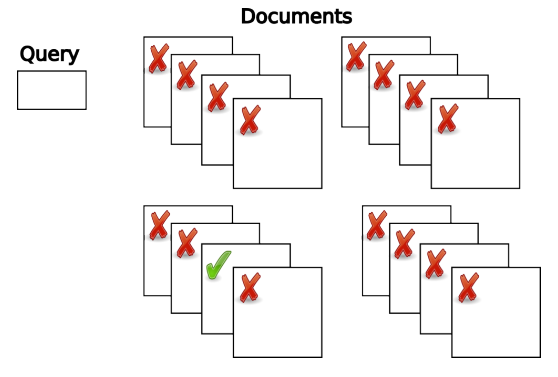

So the green check mark is the a relevant document. Below you can see that if the system says that all these documents are irrelevant then the accuracy will be very high.

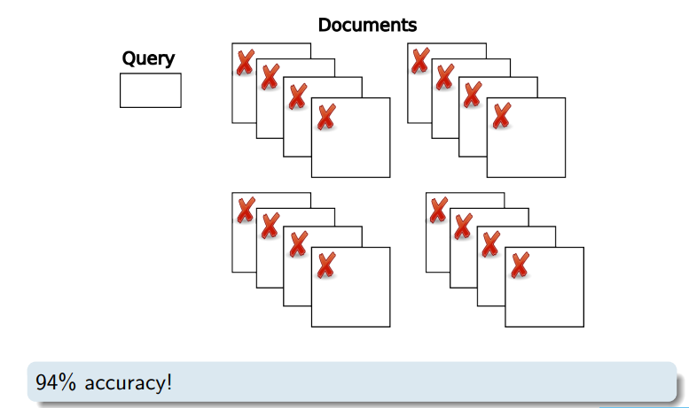

A better measure of this can be found below

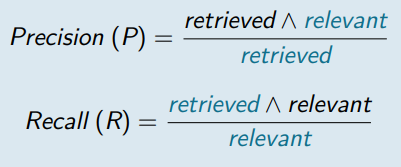

This is useful as can be seen below. The precision is undefined because we retrieve no documents.

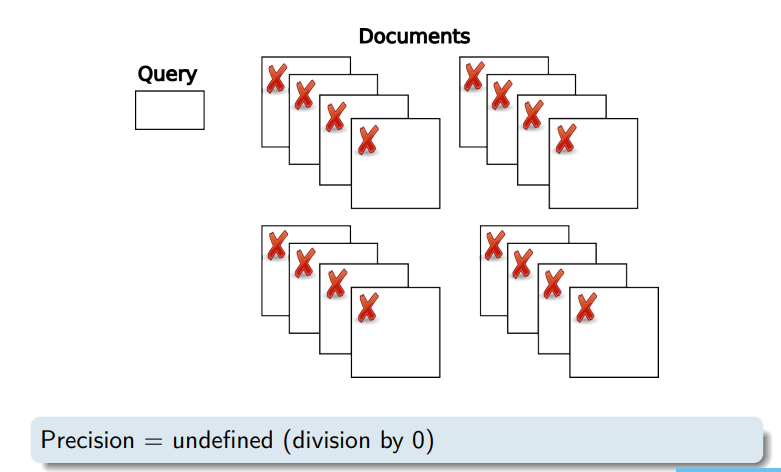

The recall is 0 because we retrieve no documents

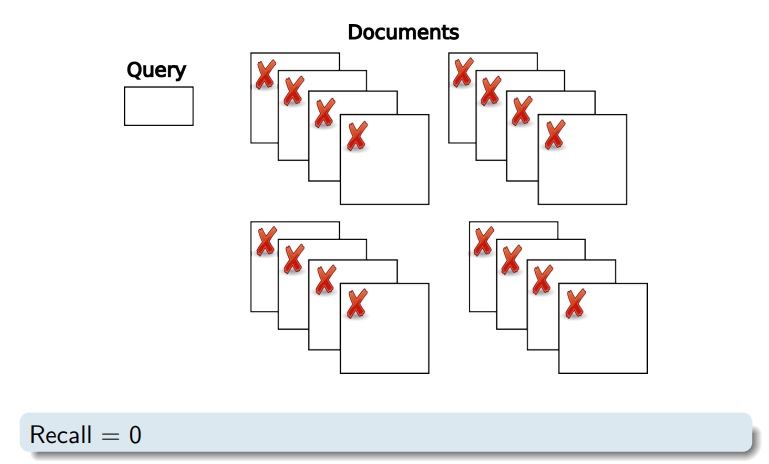

In the following example the system retrieved 2 documents of which only 1 was relevant.

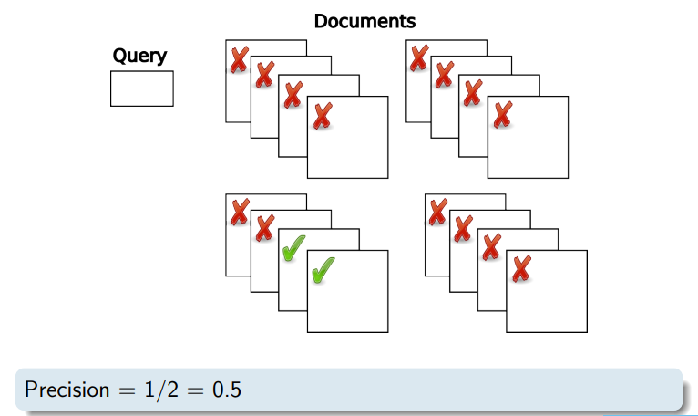

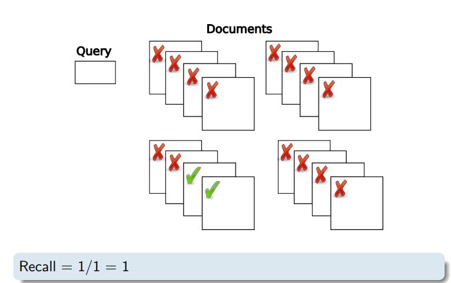

## Les 2 Models

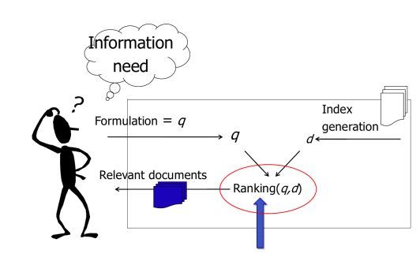

Information retrieval models (also called ranking or relevance models) is defined by:

- The presentation of the document d and the query q
- By the ranking function that uses these representations q and d as arguments.

**Relevance feedback**

A better representation of the information need is learned from the retrieved documents judged relevant or non-relevant by the user

- Directly
- Indirectly

### Boolean Models

Boolean models are a class of information retrieval models that are based on set theory and Boolean algebra. In this model, documents and queries are represented as sets of terms, and a query is evaluated against a collection of documents to find those that contain all of the terms in the query.

The boolean models is based on three main operators: AND, OR and NOT. These operators are used to combine terms in a query to create a set of documents that satisfy the query. An example can be seen below.

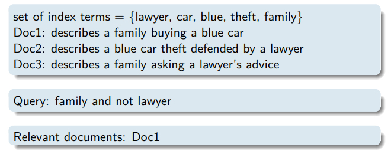

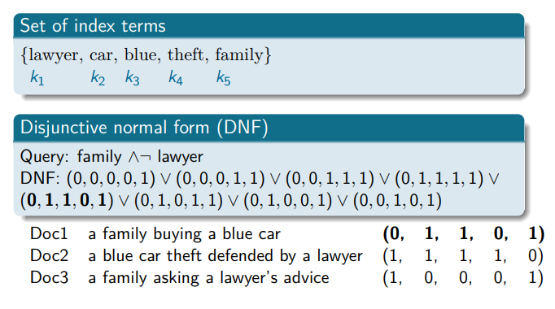

**Advantages**

- Simplicity: in the past was popular in commercial systems.

**Disadvantages**

- Difficult for the user
- Relative importance of index terms ignored
- No ranking

#### Extended Boolean model

Extended Boolean models are an extension of the basic Boolean model of information retrieval. Unlike the basic boolean model, which only allows for exact term matching, extended boolean models allow for the use of **term weighting** and **similarity measures** to rank documents by relevance.

In the extended Boolean model, documents and queries are still represented as sets of terms, but there terms are assigned weights that reflect their importance to the query. The weights can be based on a variety of factors, including frequency of the term in the document or corpus.

**Summary**:

- Takes into account **partial fulfillment** of conjuctive and disjunctive queries.
- **Results**: ranking of documents
- **Hybrid model**: properties of set theoretic and algebraic model

### Vector Space Models

Vectors space models (**VSMs**) are a popular class of information retrieval models that represent documents and queries as vectors in high-dimensional space. In VSMs, each dimension in the space corresponds to a term in the document or query, and the value of each dimension represents the weight of the corresponding term.

Similarity between documents d and query q is measured by the distance between the d and q with the following options

- Manhattan distance
  - 
- Euclidean distance
  - 
- Inner product similarity
  - 
- Cosine similarity
  - 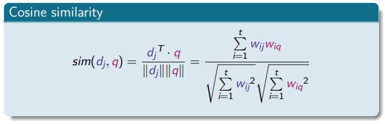
- Dice similarity
  - 

**Result:** ranking of documents.

#### BOW vector space model

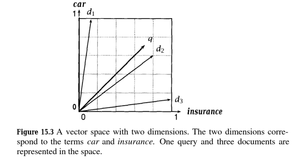

**Disadvantage**

- Simplifying assumption that terms are not correlated and term vectors are pair-wise orthogonal

**Advantages**

- **Term weighting** scheme (e.g tf x idf) improves performance over naive model
- **Partial matching**: retrieval of documents that approximate the query conditions
- **Simple, efficient model** with relatively good results: popular (e.g. SMART system)
- **Easy re-weighting** of query terms in relevance feedback

### Probabilistic retrieval model

Probabilistic retrieval models are a class of information retrieval models that estimate the **probability** that a document is **relevant** to a query, given the information available in the document and the query. These models assume that documents are generated from a probabilistic model that captures the **likelihood** of **observing** the words in the document given the underlying topic or theme of the document. It aims at **ranking** the retrieved documents in **decreasing** order of this probability.

**Models**

- Generative relevance models:
  - Classic probabilistic model
  - Language retrieval model
- Inference network model

#### Generative relevance models

In generative relevance models, we assume that both queries and documents are generated from a **common generative process** that involves latent variables representing the underlying themes or topics in the documents and queries. The probability of a document being relevant to a query is estimated based on the probability of generating both the query and the document from the same generative process. These models capture the **underlying themes or topics** in the documents and queries that are **not** captured by classic probabilistic models.

#### Classic probabilistic model

Classic probabilistic models are a class of information retrieval models that estimate the probability being relevant to a query based on the **frequency and distribution of query terms** in the document collection. The most commonly used model is the **Okapi BM25 model**. 

**TODO**

#### **Language retrieval model**

A language retrieval model ranks a document D according to the probability that the document generates the query. The simplest estimation is by maximum likelihood. 

#### Smoothing

Smoothing is a technique used to address the problem of sparsity, which arises when a term in a query does not occur in some or all of the documents. The idea of smoothing is to redistribute probability mass from the observed events to the unobserved events, so that the probabilities of all events sum to one.

#### Inference network model

Inference network models are a class of probabilistic retrieval models that represent a document as a set of nodes and edges, where each node represents a term in the document and each edge represents a relationship between two terms. The basic idea behind these models is to compute the relevance score of a document to a query by propagating the evidence from the query to the document through the network.

The model consists of two components: a query network and a document network. The query network represents the query as a set of nodes and edges, and the document network represents the document as a set of nodes and edges. The nodes in the query network are connected to the nodes in the document network through the edges that represent the relationships between the terms.

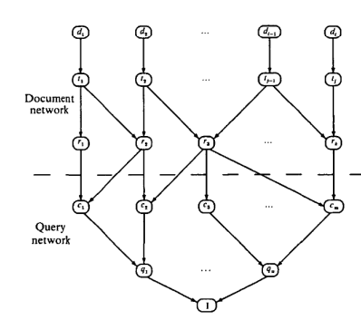

**Advantages**

- Elegantly combines multiple sources of evidence and probabilistic dependencies.
- Easy integration of representations of different media, domain knowledge and semantic information.
- Good retrieval performance

**Disadvantage**

- Computationally not scalable for querying large collections.

### Recap

- Boolean models: simple and efficient but no ranking
- Algebraic models: simple, efficient and interesting properties
- See [lecture 3 on Advanced Representations]: incorporation of latent semantic topic models and embeddings
- Probabilistic models model the probability of relevance given a document and a query.
- Language retrieval models and inference net models powerful models to model documents and information need and the fusion of information to yield a ranking probability

## Les 2 Advanced Text Representations

**TODO introduction**

### pLSA - plate model

Probabilistic latent semantic analysis is a type of generative probabilistic model used in information retrieval to identify the hidden topics that underlie a set of documents. It is based on the assumption that each document in a corpus is generated from a mixture of underlying topics, and that each word in a document is generated from one of those topics. 

To apply pLSA to a corpus of documents, the first step is to represent each document as a bag-of-words, or a vector of word frequencies. Then, pLSA estimates the probability of each topic given the entire corpus and the probability of each word given a topic. These probabilities are used to estimate the probability of each topic given a document, which is a measure of the degree to which each topic is present in the document. Finally, pLSA uses these probabilities to estimate the relevance of each document to a given query.

To train this model we use the EM algorithm. In the E-step of EM, we compute the posterior probabilities for the latent variables based on the current estimates of the parameters. In the M-step of EM, we re-estimated the parameters in order to maximize the likelihood function. We then iterate the E-step and M-step until convergence.

pLSA has several advantages over other retrieval models, such as its ability to capture the underlying topics that are not explicitly represented in the document collection. Various modifications to the pLSA model have been proposed, such as the Latent Dirichlet Allocation (LDA) model, which incorporates a prior distribution over the topic probabilities to help regularize the model and reduce overfitting.

**Advantages:**

- Can capture the underlying topics that are not explicitly represented in the document.

**Disadvantages**

- EM: risk of getting suck in a local maximum
- pLSA learns p only for those documents on which it is trained.

### Latent Dirichlet Allocation (LDA)

Latent Dirichlet Allocation (LDA) is a generative probabilistic model that assumes that a corpus of documents is generated from a set of latent topics. Each document is seen as a mixture of these topics, and each word in a document is generated from one of the topics. LDA generates a document collection by first defining the number of topics in the corpus, and then generating a set of topic probabilities for each document and a set of word probabilities for each topic.

The generative process for LDA can be summarized as follows:

1. For each topic k, sample a distribution over words from a Dirichlet distribution with parameter beta. This defines the set of word probabilities for each topic.
2. For each document d, sample a distribution over topics from a Dirichlet distribution with parameter alpha. This defines the set of topic probabilities for each document.
3. For each word w in document d: a. Sample a topic z from the distribution over topics for document d. b. Sample a word from the distribution over words for topic z.

Steps 1-3 are repeated for each document in the corpus, resulting in a collection of documents where each document is represented as a bag-of-words vector, and each word is associated with a topic.

After generating the document collection, the LDA model is trained using an iterative algorithm called Gibbs sampling. The goal of training is to estimate the parameters alpha and beta that maximize the probability of observing the document collection given the LDA model. Once the model is trained, it can be used to perform various tasks such as topic modeling, document clustering, and information retrieval.

#### Priors 

Allows us to integrate some initial knowledge

In information retrieval, Multinomial distributions are often used to model the distribution of terms in documents or queries. Specifically, the Multinomial distribution is used as a prior distribution over the probability of observing each term in a document or query, where the goal is to estimate the probability of a document or query being relevant to a given information need.
