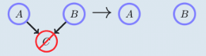

# Uncertainty in AI

## Probability and probabilistic reasoning

To be able to write the independent sign ($\indep$)you should add the following command in $$ to your file.
$\newcommand{\indep}{\perp \!\!\! \perp}$

$\newcommand{\indep}{\perp \!\!\! \perp}$

$\newcommand{\dep}{\not{\perp \!\!\! \perp}}$

### **Discrete probability**

Values between 0 and 1 represent the degree of certainty of state occupancy. The domain ($dom(x)$) denotes the states x can take. For example, $dom(c) =$ {heads, tails}.

$\sum_{x \in dom(x)}p(x)=1$

Discrete probability distribution of a loaded dice:

### **Continuous probability**

The probability distribution always adds up to one, in symbols:

for $f(x) \ge 0,$     $\int_{-\infin}^{+\infin} f(x)dx = 1$

and the probability that x falls in an interval $[a,b]$ is given by:

$p(a\le x \le b)= \int_a^b f(x)dx$

**remark:**

$f(x)$ can be greater than 1!!

### Marginal and conditional probability

**AND:**

$p(x $ and $y) \equiv p(x,y) \equiv p(x \cap y )$ 

**OR:**

$p(x$ or $y) \equiv p(x\cup y)$

$p(x$ or $ y) = p(x)+ p(y)-p(x,y)$

**NOT:**

$p($ not $x) = 1-p(x)$

### Marginalisation

$p(x) = \sum_yp(x,y)$

### Conditional probability and Bayes' rule

**Definition (conditional probability)**

$p(x|y) \equiv \frac{p(x,y)}{p(y)}$

Consequence of the above: $p(x,y)\equiv p(x|y)p(y)$

**Theorem (Bayes' rule)**

$p(x|y)= \frac{p(y|x)p(x)}{p(y)}$

 **Arbitrary rule:**

$p(b=false|a,c) = 1-p(b=true|a,c)$

### Conditional Independence

**Conditional independence**

$X \indep Y|Z$ means that the two sets of variables $X$ and $Y$ are independent of each other given the state of the set of variables $Z$. This mean that

$p(X,Y|Z) = p(X|Z)p(Y|Z) \equiv p(X|Y,Z)=p(X|Z)$

for all states of $X,Y,Z$

**Independence**

In case the conditioning set is empty we may also write $X \indep Y$ for $X \indep Y|\empty) $ in which case $X$ is (unconditionally) independent of $Y$

**(Conditional) dependence**

if $X$ and $Y$are not conditionally independent, they are conditionally dependent. This is written $X$$Y|Z$ 

**Prior**

The initial probability of a hypothesis before any evidence is observed.

**Likelihood**

The probability of the observed evidence given the hypothesis

**Posterior**

The updated probability of the hypothesis after the evidence has been taken into account.

For example, you got a coin and you say that the prior probability of the coin landing on heads is $0.5$. You then observe the coin being flipped and landing heads 10 times in a row, the likelihood of this outcome given the hypothesis of fair could would be $0.5^{10}=0.00097$

Using Bayes' theorem, you compute the posterior probability of the hypothesis. In this case you see that the coin is not fair because your posterior probability is lower than your prior.

**The Max Likelihood assignment**

## Introduction to graphs and Bayesian networks

### Basic graph concepts

- **Path** is a path from node A to B is a sequence of nodes that connect A to B
- **Directed path** is path that follows the direction of the arrows
- **Cycle** is a directed path that starts and ends at the same node
- **Loop** is path that starts and ends at the same node but does not care about the direction of the edges
- **Direct Acyclic Graph** is a graph in which by following the directions of the arrows, a node will never be visited more than once 
  
- **Ancestors** of a node X are the nodes with directed path ending at X
  
- **Descendants** of X are the nodes with a directed path beginning at X
  
- **Parent** of X are the nodes with a directed link to X
  
- **Children** of X are the nodes with a directed link ending in them coming form X
  
- **Markov blanket** of a node is its parents, children and the parents of its children but not does not include the node itself
  
- **Neighbours** of X are the nodes directly connected to X
  
- **Clique** is a fully connected subset of nodes
  
- **Maximal clique** is a clique which is not a subset of a larger clique
  
- **Connected graph** means that there is path between every pair of vertices
- **Singly-connected graph (tree)** means that there is only one path from any node to another node
- **Multiply-connected (loopy)** means that the graph is not singly-connected 
- **Belief network** is a DAG in which each node has associated the conditional probability of the node given its parent. The joint distribution has structured factorization: product of the conditional probabilities
  
- **Factorization:** The process of representing a joint probability distribution over multiple random variables as a product of smaller conditional probability distributions

### Belief networks

**Conditional independence **$\indep$ **in belief networks**

- In (a),(b) and (c), $A, B$ are conditionally independent given $C$

- In (d) the variables $A,B$ are conditionally dependent given $C$

**(Unconditional) independence ** $\indep$ **in belief networks**

 

- In (a), (b) and (c), the variables $A,B$ are marginally dependent
- In (d) the variables $A,B$ are marginally independent

## Bayesian networks

### Belief networks

**Collider:**

A collider contains two or more incoming arrows along a chosen path.

- If $C$ has more than one incoming link, then $A \indep B$ and  $A \dep B |C$. In this case C is called a collider
  
- If $C$ has at most one incoming link, then $A \indep B|C$ and $A \dep B$. In this case $C$ is called non-collider
  

**Influence of marginalization of a collider**

- Given the image below one would find the following factorization $p(A,B,C) = p(C|A,B) p(A)p(B)$
  
- **Marginalising** over $C$ makes $A$ and $B$ independent. As can be seen below.
  
- **Conditioning** on $C$ makes $A$ and $B$ dependent. As can be seen below.
  
- **Conditioning** on $D$, a descendant of a collider $C$ makes $A$ and $B$ dependent
  

**Influence of conditioning of a non-collider**

- Given the image below $A$ and $B$ are dependent and $C$ is a non-collider
  
- **Marginalising** over $C$ makes $A$ and $B$ dependent
  
- **Conditioning** on $C$ makes $A$ and $B$ independent
  

Given three set of nodes $X,Y,C$ , if all paths from any element to $X$ to any element of $Y$ are blocked by $C$, then $X \indep Y|C$. We can also say that any node in $X$ is d-separated from any node in $Y$ given all nodes in $C$

**Blocked path**

A path $P$ is blocked by $C$ if at least on the following conditions is satisfied:

1. There is a collider  in the path $P$ such that neither the collider nor any of its descendants are in the conditioning set $C$
2. There is a non-collider in that path $P$ that is in the conditioning set $C$

### **Markov equivalence**

Two graphs are **Markov equivalent** if they both represent the same set of conditional independence statements

**Skeleton:** formed from a graph by removing the directions on arrows

**Immorality**: An immorality in a **DAG** is a configuration of three nodes $a,b,c$ such that $c$ is a child of both $a$ and $b$, with $a$ and $b$ not directly connected.

### Uncertain evidence

**Hard evidence:** We are certain that a variable is in a particular state. For example dom(y)={red, blue, green}, the vector (0,0,1) represents hard evidence that y is in the state green

**Soft/uncertain evidence:** The variable is in more that one state, with the strength of our belief about each state being given by probabilities. For example, dom(y) = {red,blue,green}, the vector (0.6,0.1,0.3) represents probabilities of respective states 

## Markov Nets, Independence maps

### Looking for I-, D- and P maps

**Method:**

1. For proving that the given graph is not a **dependence** map, we need to find if an element from $L_p$ that does not belong to $L_g$, $L_p \not\subseteq L_g $
2. For proving that the given graph is not a **independence** map, we need to find if an element from $L_g$ that does not belong to $L_p$, $L_g \not\subseteq L_p$
3. For proving that the given graph is not a perfect map, it is sufficient to prove either of the above.

## Inference

### Sum product algorithm

The sum product algorithm is an algorithm to calculate the marginals more efficient than the marginalization we have seen previously. We called that variable elimination, that variable elimination can be seen as message passing.

- messages from one node to the other
- messages are $\gamma_i(j)$, unnormalized potentials in general

This is the essence of what we do in the sum-product algorithm. So how do we do it?

**Procedure:**

1. Pick one node as the root node
2. initialize:
   - message from leaf factor nodes initalized to factors
   - message from leaf variables node set to unity
3. **Step 1:** propagate messages from leaves to root
4. **Step 2:** propagate messages from root to leaves

This is a lot of work so how could we be more efficient if we only need one specific marginal?

- Yes, if we choose variable of marginal as the root node. This way we might be able to calculate the marginal in just one message pass, instead of maybe double the work.

**Normalization for calculating marginals:**

$Z = \sum_x\prod_f\phi(x_f)$ as $Z =\sum_x\prod_{f\in ne(x)} \mu_{f\rightarrow x})x$

### Max-product algorithm

What if we wanted to calculate the most probable joint configuration (a\*,b\*,c\*,d\*) = argmax~a,b,c,d~ p(a,b,c,d)?

## Learning from fully observable data

$P(\theta|D)=\frac{P(D|\theta)P(\theta)}{p(D)}$

**Maximum likelihood (ML)**

The maximum likelihood is method to estimate the parameters given some observation. So it estimates the parameters that are most likely to give the given observation

The Max Likelihood assignment

- $\theta_* = argmax_{\theta}p(D|\theta,M)$

**Maximum a posteriori (MAP)** estimation is a method for estimating the parameters

The MAP assignment (mode of posterior)

- $\theta_* = argmax_{\theta}p(\theta|D,M)$

**Important to know**

(can be found on exercise session 5)

The Maximum likelihood estimate for a binomial with beta priors are computed as

$\theta_{MLE}=argmax_\theta P(D|\theta)= \frac{\#H+ \alpha } {\#H+\#T + \alpha + \beta }$

The MAP estimates for a binomial with Beta priors are computed as

$\theta_{MAP} = arg~max_{\theta} p(\theta|D)= argmax_\theta p(D|\theta)p(\theta)= \frac{\#H+ \alpha -1} {\#H+\#T + \alpha + \beta -2}$

## Learning from partially observable data

**MCAR:** Missing completely at random is a statistical assumption that if data is missing that this is completely at random. Meaning that the probability of any value being missing is independent of both the observed and unobserved data.

MCAR states that $x \indep m$ where x is the data and m is the data missing in x. So if $x$ is independent from $m$, the data is MCAR.

**MAR:** Missing at random is a statistical assumption that if data is missing that this is at random. Meaning that the probability of any value being missing is independent of the unobserved data but dependent on the observed data. In a dataset that follows MAR assumption, the missing data can be explained by other observed variables.

MAR states that $x_m \indep m|x_0$ where x is the data and m is the data missing in x. So if x is independent from m given some x~0~, the data is MAR.

**MNAR:** Missing not at random is a statistical assumption that data is missing not at random, meaning that the probability of any value being missing is dependent on both the observed and unobserved data. Considered most realistic

MNAR states that $x \dep m$ meaning that if m is dependent on x, the data is MNAR.

## Logic and probability

**Decomposable**

A circuit is said to be decomposable if the conjuncts do not share any variables (conjuncts = and).

**Deterministic**

A circuit is said to be deterministic if the disjuncts are logically disjoint, meaning the two children of an **OR** node cannot be true at the same time (XOR basically)

**Smooth**

A circuit is said to be smooth if the disjuncts have the same set of variables, not considering the $\theta$ ones.

**Probabilistic logic circuits**

Given a PLC, say we want to compute the **MAP** assignment for the joint probability, replace the AND by the product and OR by the max.

## Lecture 10 Approximate inference

### Basic sampling techniques

#### Random samples from (U[0,1])

Just a basic random number generator with 2 possibilities

1. **hardware random number generators:** Real random numbers by harvesting entropy
2. **pseudo random number generators:** The generated numbers only look random but are actually deterministic given an initial seed.

#### Univariate sampling

**discrete distributions**

Given  $p(x)\left\{
    \begin{array}{ll}
        0.6~x=1\\ 0.1 ~x=2 \\ 0.3 ~x=3    \end{array}
\right.$

Create cumulant:

$c(x)\left\{
    \begin{array}{ll}
        c_0~0\\ c_1~p(x=1)=0.6 \\ c_2~p(x=1)+p(x=2)=0.7 \\ c_3~p(x=1)+p(x=2)+p(x=3)=1.0    \end{array}
\right.$

If we then draw a sample uniformly from [0.1], say y = 0.47. Then the sampled state would be state 1 because this is in the interval $[c_0,c_1]$

**continuous distributions**

First calculate the cumulant density function

$C(y=\int_{-\infin}^yp(x)dx)$

Then we sample u uniformly from [0,1] and obtain the corresponding sample x by solving $C(x) = u => x= C^{-1}(u)$

**Rejection sampling**

Say we have an efficient sampling procedure for $q(x)$. Can we use this to help us sample from another distribution $p(x)$?

Look for a proposal $q(x)$ that we can sample from and that when scaled with factor $M$ such that $\forall x:p^*(x) \leq M~q(x)$

Drawing from p(x)

- We draw a candidate $x^{cand}$ from $q(x)$
- Draw a value $u$ uniformly between 0 and 1
- Calculate $a=\frac{p^*(x^{cand})}{Mq(x^{cand})} \left\{
      \begin{array}{ll}
          if ~u<a~accept ~x^{cand}\\ else~ reject~x^{cand}    \end{array}
  \right.$ 

###  

Overal rejection rate is related to the area between $p^*(x)$ and $Mq(x)$

Useful method in low dimensions, impractical in higher.

#### Multi-variate sampling

Impractical so we use alternative techniques: ancestral sampling, Gibbs sampling, Markov Chain Monte Carlo Sampling (MCMC)

### Ancestral sampling

- Without evidence
- With evidence

#### Ancestral sampling without evidence

##### **Ancestral sampling for Belief Nets**

One way to more efficiently sample from a multivariate distribution $p(x_1,x_2,...,x_n)$

- Use the conditional independencies encoded in the belief net.
- First generate sample from root, then children given the sampled root.

If you can sample the conditional probabilities of the belief net exactly, this is NOT an approximate inference algorithm.

**Example:**

Uniform samples 

$u={0.634,0.022,0.700,0.880,0.171,0.419,..}$

Sample from roots $a$  and $b$

1. $p(a):u^1=0.634 \rightarrow a^1=0$ (use univariate sampling with a cumulant as seen before)
2. $p(b):u^2=0.022 \rightarrow b^1=1$

Sample from variables of which all parents are sampled

3. sample $c^1$ from $p(c|a^1=0,b^1=1): $
   - $u^3=0.700 \rightarrow c^1=0$

What we do in step 3 is we take $a^1=0$ and $b^1=1$ and go look at the value in the table above where this is true. we find $p(c=0|a=0,b=1)=0.5$ and $p(c=1|a=0,b=1)=0.5$ so we again create a cumulant of these values for c. We get the interval $[0,0.5]$ for $c=1$ and $[0.5,1]$ for $c=0$. $u^3$ is $0.700$ which means it will end up in the second interval so $c$ is equal to 0.

=>First sample $[a^1,b^1,c^1]=[0,1,0]$

**What can we do with the samples?**

Say we have retrieved a sample set of 10 by using the algorithm above:

$X=\{[0, 1, 0], [0, 1, 1], [0, 0, 0], [0, 0, 1], [0, 1, 1], [0, 1, 1], [0, 1, 0], [0, 0, 0], [0, 0, 1], [1, 1, 1]\}$

You can use these samples to **approximate** queries

**Example:**

- What is $p(a=0,b=0,c=0)$?
  - fraction of samples that satisfy the query
  - two samples $[0,0,0]$ out of 10 => $p(a=0,b=0,c=0)=0.2$
- What is $p(a = 1)$?
  - fraction of samples that satisfy the query
  - one sample with $a=1~([1,1,1])$ out of 10 =>$0.1$

#### Ancestral sampling with evidence

**Example:**

Uniform samples 

$u={0.634,0.022,0.700,0.880,0.171,0.419,..}$

Sample from roots $a$  and $b$

1. $p(a):u^1=0.634 \rightarrow a^1=0$ (use univariate sampling with a cumulant as seen before)
2. $p(b):u^2=0.022 \rightarrow b^1=1$

Sample from variables of which all parents are sampled

3. sample $c^1$ from $p(c|a^1=0,b^1=1): $
   - $u^3=0.700 \rightarrow c^1=0$

What we do in step 3 is we take $a^1=0$ and $b^1=1$ and go look at the value in the table above where this is true. we find $p(c=0|a=0,b=1)=0.5$ and $p(c=1|a=0,b=1)=0.5$ so we again create a cumulant of this values for c. We get the interval $[0,0.5]$ for $c=1$ and $[0.5,1]$ for $c=0$. $u^3$ is $0.700$ which means it will end up in the second interval so $c$ is equal to 0.

=>First sample $[a^1,b^1,c^1]=[0,1,0]$

Same thing as before but now we know that $c=1$ so if a sample doesn't correspond to the value we **discard** the sample.

This is not recommended since the probability that a sample will be consistent with the evidence is very small

### Gibbs sampling

One way to approximately generate samples from a multivariate distribution. Useful if the joint distribution is not known but the conditional distribution of each variable is known or easier to sample from.

- Generate sample of the condition of each variables, given the already sampled values of the other variables
- iterate

Samples are not independent

#### **Example 1**

$u = \{0.634, 0.022, 0.700, 0.880, 0.171, 0.419, 0.366, 0.310, 0.130, 0.100\}$

we are only given the joint probability and we calculate the condition probabilities from those

start with initial sample $x^0=[a^0=0,b^0=0]$

- sample $b^1$ from $p(b|a^0=0)$
  - $u^1=0.634 \rightarrow b^1=0$ (again use the cumulant we saw before using the conditional tables. $[0,0.33]$ for $b=1$ and $[0.33,1]$ for $b=0$)
  - $x^1=[a^0=0,b^1=0]$
- sample $a^2$ from $p(a|b^1 = 0)$
  - $u^1 = 0.022 → a^2 = 1$ 
  - $x^2 = [a^2 = 1, b^1 = 0]$
- sample $b^3$ from $p(b|a^2=1)$
  - $u^1 =0.700 \rightarrow b^3=0$
  - $x^3=[a^2=1,b^3=0]$

**What can you do with the samples?**

Same thing as before

Sample set (example of 10 samples):
$X = \{[0, 0], [1, 0], [1, 0], [0, 0], [0, 1], [0, 1], [0, 1], [0, 0], [0, 0], [1, 1]\} $ are all samples from $p(a, b)$ (obtained trough Gibbs sampling)

Example:

- What is $p(a=0,b=0)$
  - fraction of samples that satisfy query
  - 4 samples [0,0] out of 10 $⇒ p(a = 0, b = 0) ≈ 0.4$
- What is $p(a=0|b=1)?$
  - fraction of samples that satisfy query
  - 3 samples with $a = 0$ and $b=1$ out of four with $b=1 ⇒ p(a = 0|b = 1) ≈ 0.75$

#### **Example 2**

multivariate Gaussian $N(\theta_1,\theta_2|\mu =(0,0),Q)$

start with initial sample $\theta^0=[\theta^0_1=2,\theta^0_2=-2]$

- sample $\theta^1_2$ from $p(\theta_2|\theta^0_1=2)$
  - $⇒ θ^1 = θ ^0_ 1 = 2, θ^ 1_ 2$

### Importance sampling

It is **NOT** a sampling technique. It is a technique to approximate averages with respect to an intractable distribution $p(x)$ using samples $X$ from another distribution $q(x)$

**Example**

Calculate expected value for $p(x)$ using importance sampling

- choose proposal (red line)
  - $q(x) = N(x| µ = 0, σ^2 =2) $
- draw $L$ samples from proposal $x^l$ (blue circles)

The rest is very technical, I doubt this has to be known.

## Dynamic models

Why do we need dynamic models? Real-life examples often involve evolution over time to model temporal data.

### Inference in dynamic models

**goal**: estimate state from sensor data

**but:**

- sensor data corrupted by noise
- processes are uncertain
- state often not fully observable

**result:** uncertain estimate

**Markov property/assumption**

The conditional probability distribution of future states of the process depends only upon the present state, not on the sequence of events that preceded it. So in simple words, the future is independent of the past given the present

$P(x_{t+1:T}|x_{0:t})=P(x_{t+1:T}|x_t)$

**3 kinds of inference**

- **Smoothing:** inferring the past $P(x_t|x_0,y_{1;T})$ with $t \leq T$
- **Filtering:** inferring the present $P(x_t|x_t,y_{1:t})$
- **Prediction:** inferring the future $P(x_t|x_0,y_{1;T})$ with $t\geq T$

### Discrete-state Markov models

a first order Markov chain is a dynamical model in which the following conditional independence assumption holds:

$p(x_t|x_{1:t-1})=p(x_t|x_{t-L:t-1})$

- L is the order of the markov chain
- $x_t = \emptyset$ for $t<1$

### Continuous dynamical models

#### Kalman Filter

The Kalman filter is the earliest tractable implementation of the Bayes filter for continuous space. It is popular despite shortcomings.

**Assumptions:**

- Linear Gaussian system
- Linear Gaussian measurement
- Prior is Gaussian

**Advantages**

- Simple and efficient
- Optimality under assumptions
- Uncertainty on estimate

**Limitations**

- Only suited for linear Gaussian system and measurement models.

### Particle Filter

particle filters use sequential importance sampling to estimate (averages of) the filtering distribution. Example of a particle filter is a bootstrap filter

The basic idea behind it is that we assign a weight to each particle based on how well it represents the true state of the system. Once the weights have been assigned, the particles are resampled based on their weights. By focusing the estimation effort on particles that are most likely to represent the true state of the system.

**General**

Particle filter recursively constructs particle set $X_t$ from the set $X_{t-1}$

**Advantages**

- No assumptions on posterior density, well-suited to represent complex multimodal beliefs

**Limitations**

- High computational cost
- Bad scaling to higher dimensions

**Problems**

- Degeneracy problem, particle deprivation/depletion or sample impoverishment: after some iterations all but one particles will have negligible weights.

## Recheck exercises

- Exercise 2.2, exercise session 2
- uitzonderingen die brian zei op sumproduct of max product?

**TB:** $A \indep C | A,D \rightarrow P(B|A,C,D) = P(B|A,D)$

**Bewijs:** 
$$
P(B|A,C,D) = \frac{P(A,B,C,D)}{P(A,C,D)}
=\frac{P(A,B,C,D)}{\sum_BP(A,B,C,D)}\\=\frac{\phi(A,B)\cancel{\phi(A,C)}\cancel{\phi(A,D)}\cancel{\phi(C,D)}\phi(B,D) }{\sum_B\phi(A,B)\cancel{\phi(A,C)}\cancel{\phi(A,D)}\cancel{\phi(C,D)}\phi(B,D) } \\= \frac{\phi(A,B)\phi(B,D)}{\sum_B\phi(A,B)\phi(B,D)} = P(B|A,D)
$$

$\sum_E\gamma_C(B,E,D,G,F=1)$

$\sum_G\gamma_E(B,D,G,F=1)$

$\gamma_GP(B,D,F=1)$

$\frac{P(B)\sum_{C,E,G}P(C|B)P(E|C,D)P(F=1|E,C)P(G|F=1,C)}{P(B)\sum_{B,C,G,D,E}P(C|B)P(E|C,D)P(F=1|E,C)P(G|F=1,C)} = \frac{\gamma_G(B,D,F)}{\sum_{B,D}\gamma_G(B,D,F)}$

$\frac{1}{2}$

| P(F_i\|C) | Fair | 2H   | 2T   |      |      |                                                     |
| --------- | ---- | ---- | ---- | ---- | ---- | --------------------------------------------------- |
| H         | 0,5  | 1    | 0    |      |      | asdsdasdasdasdasdasdasdasasdasddddddddddddddddddddd |
| T         | 0.5  | 0    | 1    |      |      |                                                     |
|           |      |      |      |      |      |                                                     |

$P(C=F|F_1=H,F_2=H,F_3=H) = \frac{P(C=F,F_1=H,F_2=H,F_3=H)}{P(F_1=H,F_2=H,F_3=H)}=\frac{P(F_1=H|C=F)P(F_2=H|C=F)P(F_3=H|C=F)P(C=F)}{\sum_CP(F_1=H|C)P(F_2=H|C)P(F_3=H|C)P(C)} = \frac{(\frac{1}{2})^4}{(\frac{1}{2})^4 + \frac{1}{4}}$
$$
P(C=F|F_1=H,F_2=H,F_3=H) = \frac{P(C=F,F_1=H,F_2=H,F_3=H)}{P(F_1=H,F_2=H,F_3=H)}\\=\frac{P(F_1=H|C=F)P(F_2=H|C=F)P(F_3=H|C=F)P(C=F)}{\sum_CP(F_1=H|C)P(F_2=H|C)P(F_3=H|C)P(C)}\\ = \frac{(\frac{1}{2})^4}{(\frac{1}{2})^4 + \frac{1}{4}} = \frac{1}{5}
$$
P(p) = P(q) + P(t1) + P(t2) - P(q and t1) - P(q and t2) - P(t1 and t2) + P(q and t1 and t2)

​		= 0.5 + 0.3 + 0.3 - 0.15 - 0.15 - 0.09 + 0.045

​		=	0.755

$P(p|\neg t1) = P(q) + p(t2) - P(q~ \cap~t2 ) = 0.5 + 0.3 - 0.15 = 0.65$