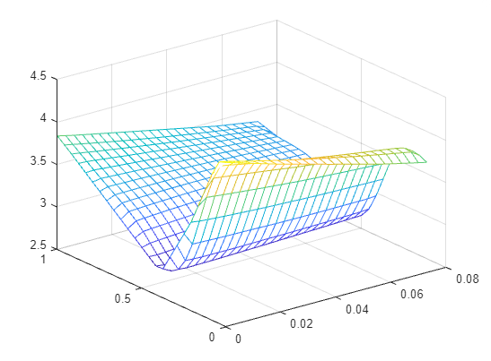

## Exercise 2

Splitting the data

```matlab

%r0748760 8 7 7 6 4
Tnew = (8*T1 + 7 *T2 + 7*T3 + 6*T4 + 4*T5)/(8+7+7+6+4);

X1training = X1(1:1000);
X1validation = X1(1001:2000);
X1test = X1(2001:3000);

X2training = X2(1:1000);
X2validation = X2(1001:2000);
X2test = X2(2001:3000);

T3training = Tnew(1:1000);
T3validation = Tnew(1001:2000);
T3test = Tnew(2001:3000);
```

Creating a scattered interpolant graph to show us the surface

```
%linspace creates a vector of values, take three arguments: 'start', 'stop' and 'n'. Start and stop are selfexplanatory, n is the number of evenly spaced values that are generated between start and stop.
X = linspace(min(X1training),max(X1training),25); 
Y = linspace(min(X2training),max(X2training),25); 
%meshgrid creates a gird of coordinates for given range x and y.
[xq, yq] = meshgrid(X,Y); 
%scatteredInterpolant takes a set of scattered data points and constructs a surface that passes throught these points. This surface can then be used to interpolate values at new points within the range of original data
F1 = scatteredInterpolant(X1training,X2training,T3training);

zq = griddata(X1training,X2training,T3training,xq,yq); 
plot3(X1training,X2training,T3training,'mo')
hold on
figure
vq1 = F1(xq,yq);

mesh(xq,yq,vq1)
%mesh(xq,yq,zq)
%xlabel('x')
%ylabel('y')
hold off
```



