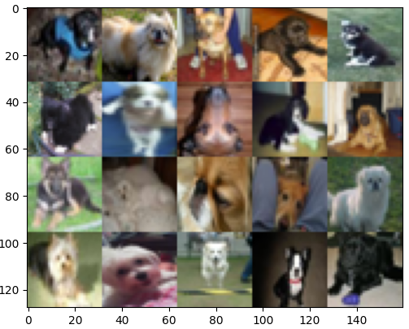
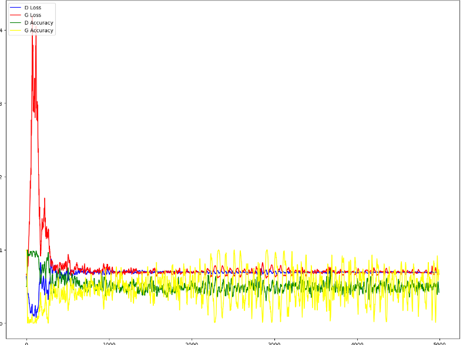
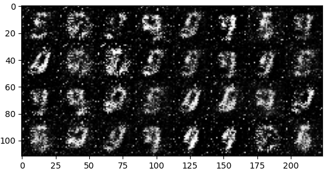
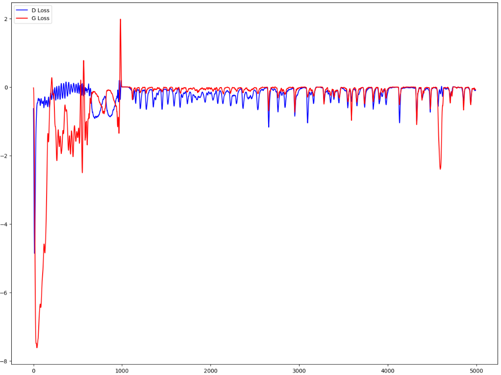

#### CNN

**Weight representation**

In the CNN we used, the second layer or convolution layer has a few weights, namely[96 11 11 3].  The "96" in this case means the amount of filters used. The 2 elevens are the dimensions of the filter so in this case 11 x 11 pixels. The 3 defines in what color space we are working. 3 is for RGB and 1 is for grayscale.

**Input dimension**

After layer 5 in our CNN the dimension will be $27\times27$. We found this by using the following formula $(W – F + 2P) / S + 1$ where 

- $W$ is the dimension of the input
- $F$ is the size of the filter
- $P$ is the size of the padding 
- $S$ is the size of the stride

We apply the formula twice because it goes through a convolution layer and a max pooling layer. We could also just use the command `analyzeNetwork` but this would not give us an explanation as to why that is.

**Input dimension of fully connected layer**

The input dimension right before it enters the fully connected layer is $1 \times 1$. This reduction in dimensionality occurs as the original $227 \times 227$ input undergoes a series of convolutional and pooling operations. By reaching a dimension of $1 \times 1$, the input size for the fully connected layer becomes significantly smaller. This reduction is beneficial as it allows the fully connected layer to efficiently process and classify the data.

If we were to retain the original input size, the fully connected layer would require an enormous number of weights to balance, resulting in a computationally expensive and impractical model. This is one of the reasons why convolutional neural networks (CNNs) outperform fully connected networks in image classification tasks. The CNN architecture, with its convolutional and pooling layers, enables effective feature extraction and dimensionality reduction, leading to improved performance and efficiency in image classification.

**CNNdigit**

Based on the provided code, we can observe that the model with an additional convolutional layer and ReLU activation performs significantly poorer compared to the model with a single convolutional layer. This drop in performance could be attributed to the increased complexity of the model, which can lead to overfitting. The model's performance can be visualized on the left.

Furthermore, when we replace the max pooling layer with an average pooling layer, we observe a slight improvement in performance. This could be attributed to the fact that average pooling retains more information compared to max pooling, which can result in better representation of the underlying patterns.

|      |      |      |
| ---- | ---- | ---- |
|      |      |      |

## Report 4

#### **RBM and Gibbs sampling**

When the number of components and epochs is low in our RBM, the gibbs sampling has a hard time recognizing the digits even when upping the amount of gibbs steps. As can be seen below.

|      |
| ---- |
|      |

When we now up these numbers to 25 components and 50 epochs. We get considerably better results. We can again increase the amount of gibbs step but at some point the improvement stops and the reverse happens, it gets worse.

|      |
| ---- |
|      |

**RBM reconstruction**

The number of hidden units, learn rate and number of epochs all affect the performance. When we increase these the performance goes up till at some points we hit for each of these a cut off point. A too large number of hidden units leads to overfitting, too high a learning rate could lead to overshooting and instability while the number of iterations may hit a point of diminishing returns.

|      |  |
| ---- | ------------------------------------------------------------ |

The amount of rows we remove and the amount of gibbs steps has a big influence into the RBM's capability of reconstructing the original image. As you can see in the image on the right the RBM is clearly struggling, barely finding the original images.

#### DBM

The filters in a Deep Boltzmann Machine (DBM) are capable of capturing more complex and abstract patterns compared to Restricted Boltzmann Machines (RBMs). This is primarily due to the deeper architecture and learning process employed in DBMs. In a DBM, each layer possesses its own set of filters, which serve as representations of the learned features. The multi-layered design of DBMs enables them to capture higher-level patterns and features by building upon the lower-level representations learned in preceding layers. Consequently, the difference in the visualization of filters between an RBM and a DBM can be attributed to the increased complexity and depth of the DBM model.

| RBM  | DBM first layer | DBM second layer |
| ---- | --------------- | ---------------- |
|      |                 |                  |

Considering the earlier discussion, it is evident that the Deep Boltzmann Machine (DBM) surpasses the Restricted Boltzmann Machine (RBM) in terms of proficiency. This assertion is strongly supported by the visual representation provided below. While the DBM may encounter some challenges with certain digits, its overall performance is notably improved. The incorporation of multiple layers, with each layer capturing distinct aspects of the features, enables the DBM to achieve greater success.

#### DCGAN (Deep convolutional generative adversarial network)

|  |  |
| ------------------------------------------------------------ | ------------------------------------------------------------ |

Unfortunately, despite our efforts, the DCGAN fails to generate satisfactory "real" images. The best results obtained are depicted on the right. However, the image generation process exhibits significant instability, with certain batches deviating considerably from the desired outcome. Both the discriminator and generator's accuracy fluctuates widely, indicating potential mode collapse. Mode collapse occurs when the generator fails to encompass the full range of diversity in the target distribution. This situation may arise if the generator exploits specific patterns or lacks meaningful gradients from the discriminator. The graph below illustrates these fluctuations, which can also be attributed to the constant oscillations as the generator and discriminator strive to outperform each other.

#### Optimal transport

Both **EMD (Earth's Mover's Distance)** and **Sinkhorn** transport take into account the inherent structure and properties of the distributions being compared. They aim to calculate the optimal transportation that minimizes the overall cost or distance. On the other hand, non-optimal color swapping, such as simply swapping pixels, lacks any optimization criteria and may result in arbitrary assignments without considering the distribution characteristics.

**EMD** computes the minimum cost required to transform one distribution into another by identifying the optimal assignment of mass between corresponding elements.

In contrast, the **Sinkhorn** algorithm iteratively scales the rows and columns of a transportation matrix to compute the optimal coupling between two probability distributions. This scaling process helps balance the mass assignments and achieve an optimal transport plan.

Overall, both EMD and Sinkhorn offer more sophisticated and optimized approaches for distribution comparison and transportation, making them superior choices compared to non-optimal color swapping techniques.

#### WGAN (Wasserstein GAN)

| Normal GAN                                                   | WGAN                                                         |
| ------------------------------------------------------------ | ------------------------------------------------------------ |
|  |  |

The Wasserstein GAN (WGAN) is a modified version of the traditional GAN that employs the Wasserstein distance to quantify the difference between generated and real data distributions. By utilizing the Wasserstein GAN, we aim to address issues encountered in standard GANs, such as mode collapse and training instability. As depicted in the comparison above, the regular GAN exhibits considerably more noise compared to the WGAN. This improvement is attributed to the utilization of the Wasserstein distance, which promotes smoother and more stable learning, leading to less noisy generated samples. Consequently, the overall quality of the generated samples has also improved.

| Normal GAN                                                   | WGAN                                                         |
| ------------------------------------------------------------ | ------------------------------------------------------------ |
|  |  |

As previously mentioned, the WGAN is designed to offer improved stability and smoother training, and this is evident in the comparison above. The normal GAN exhibits significant discrepancies, while the WGAN shows reduced fluctuations. The substantial fluctuations in the GAN's loss stem from the adversarial nature of the game, where the discriminator aims to minimize its error while the generator seeks to maximize the discriminator's error. The WGAN addresses some limitations of the traditional GAN, but it comes with a higher computational cost. Therefore, the choice between the two depends on the specific requirements and constraints of your task.