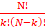
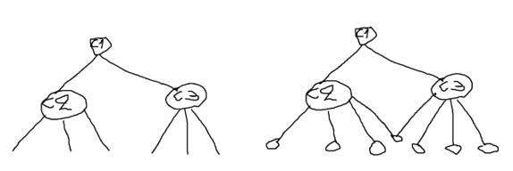

# Information retrieval and search engines

### Question 1.  Term similarities and term clustering 

In the course we have seen several methods to compute term or word similarities in a low dimensional representation space. Two of them regard singular value decomposition and non-negative matrix factorization of the term by document matrix. 

**a. For both methods explain how term similarities are obtained.** 

**SVD:**

term-doc matrix is decomposed into 3 matrices U, D and V^T^

- U describes the relationship between terms and latent concepts
  - Similarities between terms are obtained using the cosine similarity between the rows of U
- V^T^ describes the relationship between the documents and latent concepts
  - Similarities between terms are obtained using the cosine similarity between the rows of V^T^

**NMF:**

Term-doc matrix is decomposed into 2 non-negative matrices W and H

- W describes the relationship between terms and topics
  - Again, the similarities between terms are obtained using the cosine similarity between the corresponding rows of W
- H describes the relationship between terms and documents
  - Similarities between terms are obtained using the cosine similarity between the columns of H

**b. Explain the differences between the SVD and NMF methods.** 

With NMF we need the matrices to be all positive values and we split the original matrix up in 2 new matrices, and they are not unique.

With SVD we can have negative matrices and end up with 3 different unique matrices.

Also the solution for SVD is unique whilst for NMF, there are multiple solutions since NMF only approximates the original matrix by minimizing a loss function. 

To come to a solution with NMF it is necessary to (often randomly) initialize W and H and iterate until convergence is reached. 

**c. Once term similarities are computed how would you identify clusters of related terms?** 

NMF

The document-latent feature matrix W describes data clusters of related documents. We can then provide hard clustering of documents based on the values from matrix W. It is also possible to use SVD or NMF for dimensionality reduction and use this output in combination with a clustering algorithm like k-means.

### Question 2. Evaluation

The following list of Rs and Ns represent relevant (R) and nonrelevant (N) documents in a ranked list of twenty documents retrieved in response to a query from a collection of 10 000 documents. Assume there are 8 relevant documents in the collection. The ranked list is ordered from most relevant to less relevant (read from left to right): RRNNN NNNRN RNNNR NNNNR Assume a second query with the results: RRNNN NNRRR RNNNR NNNNN. What is the MAP of the system? 

Query1: (1 + 1 + 1/3 + 4/11 + 1/3 + 3/10 ) /8=0.42

Query2: (1 + 1 + 3/8 + 4/9 + ½ + 6/11 + 7/15) / 8 = 0.54

MAP: (0.42+0.54) / 2 = 0.48

### Question 3. Clustering 

**a. How many different clustering's into k clusters can be made out of N documents?** 

I think they want the amount of possible clusterings that can be made using N datapoints aka how much different groups of k values can be made. I think this is the same as the binomial coefficient = 

**b. When studying the k-means clustering, we have defined an objective function, which minimizes the distance of a cluster object to its centroid. Define two alternative objective functions for a clustering into k clusters.** 

| Maybe

- Centroids of newly formed clusters do not change
- Points remain in the same cluster
- Maximum number of iterations are reached

| Probably

- Spectral clustering: the collection of objects is seen as an undirected graph, and the task of clustering is to find the best cuts in the graph optimizing certain criterion functions (von Luxburg, 2007) 

- Clustering based on factorization and decomposition of a matrix or tensor: e.g. non-negative matrix factorization (see later in lecture) 

- K-mediod, minimizes the distance of a cluster object to its mediod

|Most probably

- Sum of squared distances: This is the most commonly used objective function for k-means clustering. It calculates the sum of the squared Euclidean distances between each data point and its assigned centroid. The goal is to minimize this sum. 
- Sum of absolute distances: Instead of using squared distances, this objective function calculates the sum of the absolute differences between each data point and its assigned centroid. Minimizing this sum leads to different cluster assignments compared to the sum of squared distances. 
- Silhouette coefficient: The silhouette coefficient measures the quality of a clustering solution by considering both the compactness of the clusters and the separation between them. It calculates the average silhouette score for all data points, where a higher score indicates better clustering. The goal is to maximize the silhouette coefficient.

**c. Two of the possible termination conditions for the k-means clustering are:** 

1) **assignment of objects to clusters does not change;** 
2) **centroids do not change. Do these two conditions imply each other? Comment.**

I think they do not imply each other. In the case of a datapoint that is equidistant from the centroids (that have converged) it is possible that the datapoint gets assigned a different cluster for each iteration.

### Question 4. Compression 

**a. Give the $\gamma$-encoding and variable-byte encoding of the following document ID list: L = <7,10,18,22>**

Gaps=<7,3,8,4>

$\gamma$-encoding=0011 1011 0001 0000 0100

v-byte-encoding= 1000101100000111000100010000100

 **b. When compressing gaps in a posting list (e.g., of document identifiers) it is important to recover the different compressed integers (i.e., which bits can be assigned to each integer). Show with an example for each of the above compression models how you recover the bits assigned to a next integer in the stream of bits.** 

$\gamma$-encoding-recovery = 7-00111 3-011 8-0001000 4-00100

v-byte-encoding-recovery= 7-0000111 3-0000011 8-0001000 4-0000100

### Question 5. Text categorization 

**Supervised text categorization has many applications (e.g., in making Web, legal or medical documents accessible). Most large sets of categories have a hierarchical structure, and your system wants to exploit the knowledge of this hierarchical structure of the category labels in the classification. In such a setting when training the classification model and when assigning the categories, scalability is often an issue.** 

**Design a categorization model that exploits the knowledge of this hierarchical structure of the category labels in the classification and that still is reasonably efficient during training and prediction.** 

Since we have hierarchical data, we can represent the categories as a tree. We can then train a classifier on each parent node to predict the classifier. As depicted in the very pretty drawning underneath we would have 3 different models because we have 3 different parent nodes. By doing this we don’t have to train 1 huge classifier but can split up the work in 3 separate ones which should be abled to create more accurate predictions with less complexity. A disadvantage from this is error propagation. An error made in the classifier C1 will be transferred through it’s children’s notes and will result in a faulty end result. A solution to this would be overlapping leaf nodes or connections like the second picture

